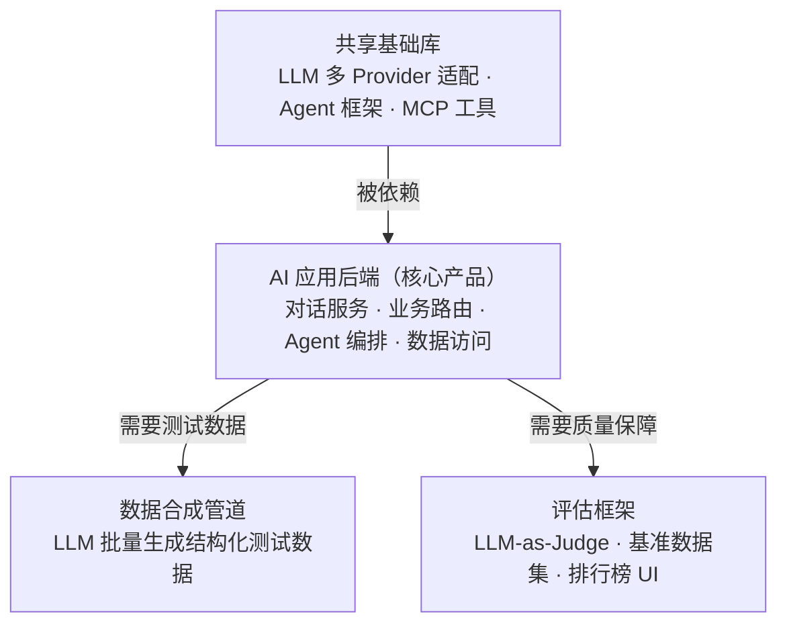
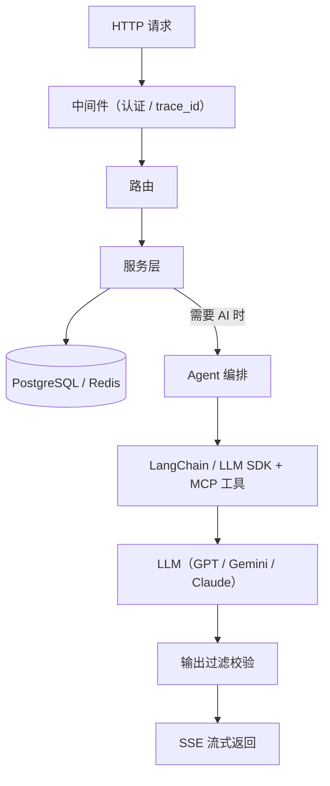
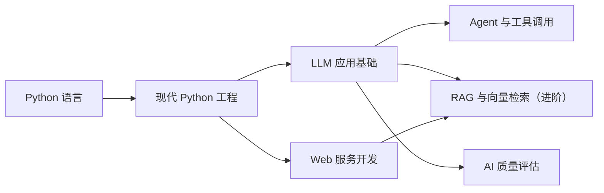
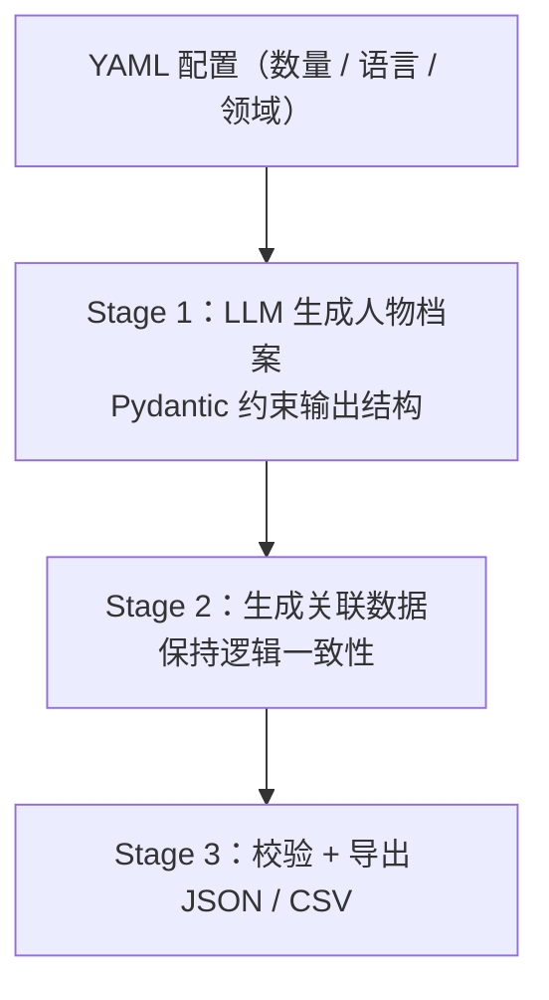
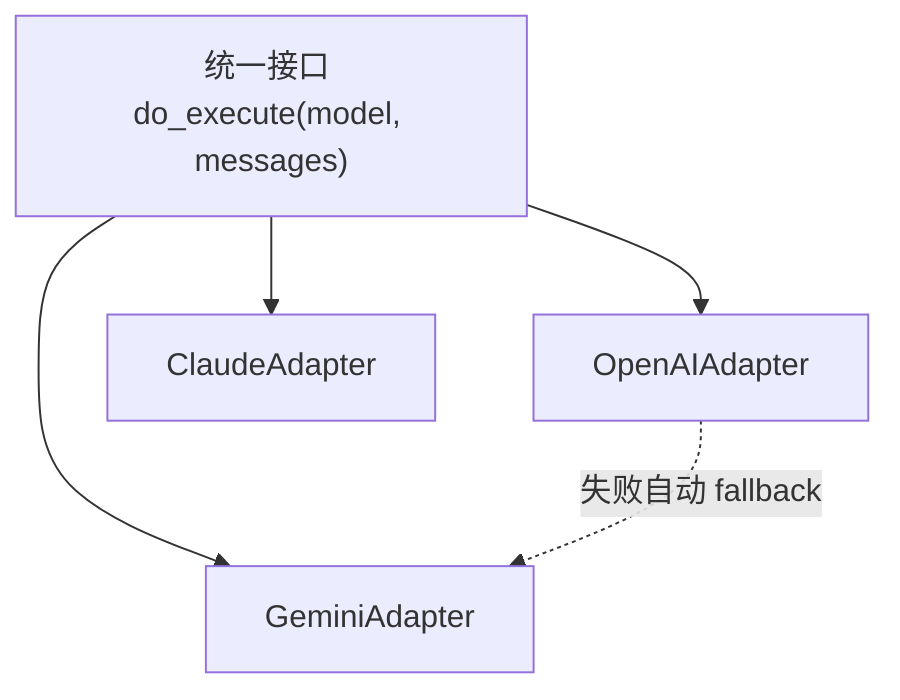
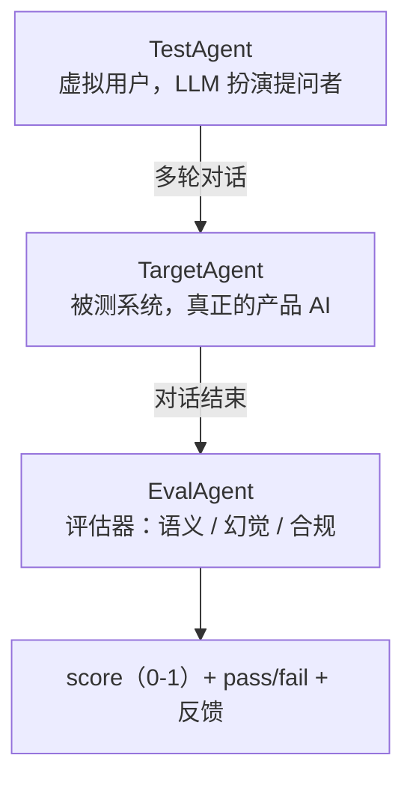

#AI #学习大纲 #Python #LLM #FastAPI

# AI 开发学习大纲（前端工程师版）

## TL;DR

**面向 JS/TS 前端工程师的 AI 应用开发知识大纲——项目驱动，按需学习。** 核心要点：

- **这是地图，不是闯关列表**：不必从头刷到尾——先用第 0 节的最小必备知识（3-5 个碎片日）做出第一个项目，卡住了再回来查对应板块
- **8 个知识板块**覆盖 Python 语言到 Agent/RAG/评估的全景，每块列出技术点清单、JS/TS 对照和「学会的标志」
- Python 语言部分的逐篇笔记展开见 [[Python 学习路线]]（含打卡清单，同样当字典用）
- 项目的每次升级恰好踩中一个板块（见第 0.3 节的升级路径）——知识由项目「需要」出来

---

## 0. 先跑起来：最小必备 + 第一个项目

学习策略：**不线性刷知识体系**。先掌握够用的最小集，立刻做一个对自己有用的东西——之后的每个知识点都是被项目「需要」出来的，带着问题学，记得牢也跑得快。

### 0.1 最小必备知识（3-5 个碎片日）

| 序 | 内容 | 够用的标准 | 去哪学 |
|----|------|-----------|--------|
| 1 | uv 环境 | `uv init` / `uv add` / `uv run` 跑通 hello world | docs.astral.sh/uv，半天 |
| 2 | Python 语法直觉 | 能对照 JS 读懂代码；先记两个坑：默认参数可变对象、没有块级作用域 | [[Python 教程总览]] 的 JS 对照表 + [[Python 学习路线]] Stage 1 扫读，1-2 天 |
| 3 | async 最小集 | 会抄着写：`async def` / `await` / `asyncio.run` / `gather` | 官方文档 Coroutines 一章，半天 |
| 4 | Pydantic 最小集 | 会用 `BaseModel` + `model_validate`，心里当 Zod 用 | docs.pydantic.dev 首页示例，半天 |
| 5 | 调通一次 LLM API | 拿到 API Key，流式打印一次回复 | OpenAI / Gemini quickstart，半天 |

到这里就够了，**别继续学，去做东西**。

### 0.2 第一个项目：挑一个对自己有用的

| 选题 | 做什么 | 妙处 |
|------|--------|------|
| **知识库问答助手（推荐）** | 读你 Obsidian vault 里的笔记回答问题（「Python 的 with 是干嘛的？」），并标注出自哪篇笔记 | 吃自己的狗粮，每天都会用；天然是 RAG 的前身，升级路径最完整 |
| 每日抽考卡片 | 每天从 vault 随机抽一篇笔记，LLM 出 3 道题考你、判卷、给解析 | 直接服务你的 Python 学习本身，学习器学习学习（禁止套娃） |
| 命令行翻译润色器 | 管道输入文本，LLM 翻译/润色后输出 | 最快见效，一天做完建立信心 |

### 0.3 学习循环与升级路径

学习循环：**做项目 → 卡住 → 查大纲对应板块 → 学最小必要的 → 回来继续做**。

项目每次升级恰好踩中一个板块（以知识库问答助手为例）：

| 版本 | 想要的功能 | 被逼学会 | 对应板块 |
|------|-----------|---------|---------|
| v1 | 把笔记全文塞进 Prompt 直接问答 | LLM API、上下文窗口 | LLM 应用基础 |
| v2 | 答案带出处、格式稳定 | Pydantic、Structured Output | LLM 应用基础 |
| v3 | 笔记太多塞不下 → 只塞相关的 | Embedding、pgvector、分块 | RAG 与向量检索 |
| v4 | 做成接口，手机上也能问 | FastAPI、SSE 流式 | Web 服务开发 |
| v5 | 「它答得到底准不准？」 | LLM-as-Judge、golden set | AI 质量评估 |
| v6 | 让它自己决定翻哪篇笔记 | Tool Calling、Agent 循环 | Agent 与工具调用 |

一路升级下来，大纲的板块自然全部点亮——**顺序由项目需求决定，不需要预先规划**。

---

## 1. 全景：终点长什么样

AI 应用团队的后端通常由四类系统组成，学完本大纲应能读懂并参与其中任何一类：



一条典型请求的路径（几乎所有 LLM 后端都是这个形状）：



---

## 2. 知识地图

全部知识一张图——**按需查阅的地图，不是闯关顺序**，做项目卡住时来这里定位缺什么：

![[AI开发学习计划-思维导图.svg]]

板块之间的**依赖关系**（查某个板块时，箭头起点是它默认你会的东西）：



「工程配套」不是独立阶段，学到哪儿用到哪儿就穿插进去。

| 板块 | 一句话 | 先学什么 |
|------|--------|----------|
| Python 语言 | 语法与心智模型，JS 直觉平移 | — |
| 现代 Python 工程 | typing / asyncio / Pydantic / uv / pytest / ruff | Python 语言 |
| LLM 应用基础 | 调 API、写 Prompt、结构化输出 | 现代 Python 工程 |
| Web 服务开发 | FastAPI + 数据库 | 现代 Python 工程 |
| Agent 与工具调用 | Tool Calling / MCP / LangChain | LLM 应用基础 |
| RAG 与向量检索 | Embedding + 向量库 + 检索策略 | LLM 应用基础、Web 服务开发 |
| AI 质量评估 | LLM-as-Judge、基准测试 | LLM 应用基础 |
| 工程配套 | 配置 / 可观测性 / 部署 | 随时穿插 |

---

## 3. Python 语言

详细阅读顺序与打卡清单在 [[Python 学习路线]]（46 篇笔记），此处列知识骨架：

- [ ] **环境与工具链**
    - 解释器与执行模型：CPython、字节码与 `.pyc`、GIL 的存在与影响
    - 虚拟环境原理：环境 = 一个文件夹、激活 = 改 PATH、多环境的磁盘去重（中央缓存 + 硬链接）
    - uv 与 conda 两条路线的取舍；`pyproject.toml` 项目元数据
- [ ] **语言核心（JS 直觉平移）**
    - 数据模型：一切皆对象、可变 vs 不可变、`tuple` 的意义、set/dict 的可哈希要求
    - 作用域：LEGB 查找、**没有块级作用域**、`global` / `nonlocal`
    - 推导式与生成器：列表/字典/集合推导、生成器表达式惰性求值、`yield`
    - 函数：五种参数形态、`*args` / `**kwargs` 解包、**默认参数是可变对象的经典坑**、闭包
    - 字符串与编码：str/bytes 之分（JS 没有）、f-string、编码解码
    - 模块系统：import 机制与缓存、`__init__.py`、循环导入的成因与破解
- [ ] **特有心智模型（JS 没有对应物）**
    - 装饰器：函数即对象 → `@` 语法糖 → `functools.wraps` → 带参装饰器三层嵌套
    - 上下文管理：`with` 协议（`__enter__` / `__exit__`）、`@contextmanager`——资源管理的统一范式
    - OOP：`self` 显式传递、多继承与 MRO、MixIn、`@property`、name mangling
    - dunder 协议：`__getitem__` / `__call__` / `__iter__` / `__getattr__`——「实现协议即获得能力」，Pydantic/ORM 的底层机制
    - 异常哲学：EAFP（先做再捕获）vs JS 惯用的先检查；自定义异常层级、`raise from`
    - 反射三件套：`type` / `isinstance` / `getattr`——读框架源码必备
- [ ] **按需查阅工具箱**
    - 正则 `re`、`datetime` 时区、`collections`（defaultdict/Counter/deque）、`itertools`、`argparse`、序列化（json/pickle）、调试（pdb / logging 分级）

**学会的标志：** 能把一段熟悉的 JS 工具函数徒手翻译成 Python；打开一个陌生 Python 文件，能说清每个 `@装饰器`、`with`、dunder 方法在做什么。

---

## 4. 现代 Python 工程

这是「会写 Python」和「能进工程项目」的分水岭。每项都列到生产级深度，不满足于会用：

- [ ] **typing 类型提示**（≈ TypeScript，但要先理解「类型擦除」的现实）
    - 基础：函数签名、`Optional` / `str | None`、泛型容器 `list[str]`
    - 结构化类型：`Protocol` + `@runtime_checkable`（≈ TS interface 的鸭子类型版）
    - `TypedDict`（≈ TS 对象字面量类型）、`Literal`、`Annotated`——FastAPI/Pydantic 靠它注入元数据，是现代框架 API 设计的基石
    - 泛型进阶：`TypeVar` 的约束与边界、`Generic` 类、`ParamSpec`（写装饰器不丢签名）
    - 类型收窄：`TypeGuard` / `TypeIs`、`@overload` 重载
    - 与 TS 的本质差异：**类型运行时完全擦除、不做任何校验**——这正是 Pydantic 存在的原因
    - 工具链：mypy `--strict` 与 pyright 的选型、老项目渐进式引入策略、`py.typed` 标记与 `.pyi` 存根文件
- [ ] **asyncio 异步编程**（语法 ≈ JS，运行时模型的差异才是重点）
    - 心智模型：单线程协作式调度，`await` 是唯一让出点；JS 事件循环内建，Python 要 `asyncio.run()` 显式启动
    - Task 生命周期：`create_task` 后必须持有引用，否则任务可能被 GC 中途回收（官方文档明示的著名陷阱）
    - 结构化并发（3.11+）：用 `TaskGroup` 替代裸 `gather`、`ExceptionGroup` 聚合子任务异常、`asyncio.timeout()` 超时控制
    - 取消语义：`CancelledError` 的传播路径、清理逻辑放哪、`shield` 保护关键段
    - 并发控制：`Semaphore` 限流——**批量调 LLM API 的标配模式**；`Queue` 生产者-消费者
    - 与同步世界互操作：`asyncio.to_thread` / `run_in_executor` 包住阻塞 IO；CPU 密集任务交进程池（GIL）
    - HTTP 客户端：httpx（同步/异步同一套 API、连接池复用、HTTP/2）
    - 调试：asyncio debug 模式、「协程未 await」告警、检测事件循环被同步代码卡住
- [ ] **Pydantic v2**（≈ Zod，校验核心 pydantic-core 是 Rust 写的）
    - 基础：`BaseModel`、`Field` 约束、`model_validate` / `model_dump`
    - 校验管线：strict vs lax 模式（默认宽松转换 `"42"` → `42`）、validator 的 `before` / `after` / `wrap` 三个挂载点
    - `model_validator` 跨字段校验、`computed_field` 派生字段、`PrivateAttr`
    - Discriminated Union 的真正价值：靠 tag 字段直接分派，校验从逐个尝试 O(n) 变成 O(1)，且报错信息精准
    - `TypeAdapter`：不定义 Model 也能校验任意类型——校验 LLM 返回的 `list[Item]` 时常用
    - 序列化控制：`include` / `exclude` / `by_alias`、JSON Schema 导出（FastAPI 自动文档的底层机制）
    - 自定义类型：`Annotated[str, BeforeValidator(...)]` 模式
    - pydantic-settings：环境变量 → 类型化配置对象
- [ ] **uv 包管理**（≈ pnpm，同样 Rust 编写）
    - 日常四件套：`uv init` / `add` / `run` / `sync`；`pyproject.toml` + `uv.lock` 确定性安装
    - dependency groups（dev / test 分组）与 optional extras
    - workspace 多包 monorepo（≈ pnpm workspace）
    - `uvx` 免安装执行工具（≈ npx）；`uv python` 直接管理解释器版本（可替代 pyenv）
    - 部署：Dockerfile 里 `uv sync --frozen` + 依赖层缓存的最佳实践
- [ ] **pytest**（≈ Jest/Vitest，fixture 是它的灵魂）
    - fixture 进阶：scope 层级（function / module / session）、yield 式 teardown、fixture 之间的依赖组合、`conftest.py` 分层共享
    - `parametrize` 参数矩阵、markers 标记 + `-k` 过滤、`xfail` / `skipif`
    - mock 体系：`monkeypatch`、`unittest.mock` / `AsyncMock`、respx 拦截 httpx 请求——**mock LLM API 的必备技能**
    - 异步测试：pytest-asyncio 的事件循环管理与常见坑
    - 工程实践：pytest-cov 覆盖率、单测 / 集成 / e2e 分层
    - LLM 应用特有：请求录制回放、快照对比、对非确定性输出的容差断言
- [ ] **代码质量工具链**
    - ruff：lint + format 一体（Rust 编写，一个工具替代 black + flake8 + isort，≈ Biome）
    - pre-commit：提交前自动跑 ruff + mypy
    - 项目结构：src 布局 vs 平铺、可编辑安装（`uv pip install -e .`）

**学会的标志：** 用 uv workspace 建一个双包项目，`mypy --strict` 零报错；用 `TaskGroup` + `Semaphore(10)` 并发限流调 LLM API 100 次，正确处理超时与取消；再用 respx mock 掉 LLM 接口，为上面的代码写出 pytest 测试。

---

## 5. LLM 应用基础

- [ ] **LLM API 调用**
    - Chat Completions 范式：messages 数组、`system` / `user` / `assistant` / `tool` 四种角色；**API 是无状态的，多轮上下文要自己拼**（和 REST 直觉一致，和「聊天」直觉相反）
    - 采样参数：temperature / top_p / max_tokens / stop；`seed` 与可复现性的边界
    - 流式输出：SSE chunk 的 delta 拼接、流式中途的 tool call 处理、首 token 延迟（TTFT）vs 总时长的取舍
    - 多模态输入：图片（base64 / URL）、PDF、音频
    - 错误与重试：429 限流的指数退避 + jitter、超时要分层设（连接 / 读取 / 总）、重试的幂等性前提
    - 多 Provider 差异：OpenAI / Gemini / Claude 的消息格式与 system 提示位置不同；OpenRouter 类聚合网关的取舍
- [ ] **Prompt 工程**
    - 结构化写法：角色设定 → 任务指令 → 约束条件 → 输出格式 → few-shot 示例（示例的选取和顺序都影响效果）
    - 核心技巧：思维链（CoT）、任务分步、用 XML/Markdown 标签分隔区块、明确「不要做什么」
    - 防注入：用户输入与系统指令隔离、界定符包裹不可信内容
    - 工程化：模板与代码分离、多语言模板、版本化管理、改动后跑回归对比（Prompt 是代码，要像代码一样管理）
- [ ] **Structured Output**
    - 三种拿结构化结果的方式与取舍：JSON mode（只保证合法 JSON）、function calling（借工具定义约束）、`response_format` + JSON Schema（最强约束）
    - 核心工作流：Pydantic 模型 → 导出 JSON Schema → 约束模型输出 → `model_validate` 校验回来
    - 校验失败的修复循环：把 `ValidationError` 原文喂回去让模型自纠，设最大重试次数
    - 用 `Literal` / 枚举字段收窄取值空间，显著减少幻觉
- [ ] **Token 与上下文管理**
    - tokenizer 原理（BPE）、tiktoken 计数、**中文比英文费 token** 的原因
    - 上下文窗口策略：对话历史截断、滑动窗口、旧轮次摘要压缩
    - 长上下文陷阱：中间信息丢失（lost in the middle），关键信息放头尾
    - 成本工程：输入/输出 token 计价差异、prompt caching（把稳定前缀放前面）、批量 API 折扣

**学会的标志：** 写一个脚本：读 YAML 配置 → 组装模板化 Prompt → 带退避重试地调 LLM → Pydantic 校验（失败自动喂回重试）→ 存 JSON，全程 async 并统计 token 成本。

---

## 6. Web 服务开发

- [ ] **FastAPI**（≈ Express / Nest.js）
    - 路由：`@app.get` / `@app.post` 装饰器、`APIRouter` 模块化拆分、路径/查询/请求体参数的自动解析
    - 请求/响应模型：Pydantic 自动校验、`response_model` 过滤敏感字段、422 错误的自动生成
    - 依赖注入 `Depends`：层级依赖、**yield 依赖**（请求结束自动清理资源，如数据库 session）、依赖缓存、全局依赖
    - 中间件与横切：认证、trace_id 注入、CORS、全局异常处理器统一错误格式
    - 流式：`StreamingResponse` 实现 SSE（LLM 对话的标准输出）、客户端断连检测与生成器清理、WebSocket 双向场景
    - 生命周期：`lifespan` 启动时建数据库/Redis 连接池、优雅关闭
    - 并发模型：`async def` 路由跑事件循环 vs `def` 路由进线程池——**选错会把服务卡死**；uvicorn worker 数量与部署
    - OpenAPI：自动文档的定制（标签、示例、鉴权按钮）
- [ ] **数据层**
    - SQLAlchemy 2.0（≈ Prisma）：declarative 模型、async engine / session、`select()` 新式查询、事务边界 → [[4.05 数据库访问]]
    - **async 下的懒加载陷阱**：关系字段必须显式 `selectinload`，隐式懒加载会直接报错
    - Alembic 数据库迁移（≈ `prisma migrate`）：自动生成、审查、回滚
    - 连接池：pool_size / max_overflow / pre_ping、asyncpg 驱动 → [[4.04 资源池与连接池]]
    - PostgreSQL 进阶：JSONB 存半结构化数据（LLM 输出常用）、索引选型、事务隔离级别
    - Redis：cache-aside 缓存模式、TTL 策略、分布式锁、滑动窗口限流器
- [ ] **会话与认证**
    - 多轮对话历史：存储 schema 设计、按 token 预算截断、软删除
    - JWT：签发/校验/过期、refresh token 轮换、FastAPI 内建 OAuth2 password flow
    - API Key 管理与接口级速率限制

**学会的标志：** 写一个 `/chat` 接口：SSE 流式输出、对话历史存 PostgreSQL（Alembic 管 schema）、JWT 鉴权、断连时正确释放资源，Swagger 文档完整可用。

---

## 7. Agent 与工具调用

- [ ] **Function / Tool Calling**
    - 工具定义：JSON Schema 描述参数、**描述文案的质量直接决定模型选对工具的概率**（描述也是 Prompt）
    - 调用循环的消息流：assistant 带 `tool_calls` → 执行 → `tool` 角色回传结果 → 模型继续——把这个裸流程走通一遍再用框架
    - 并行工具调用、`tool_choice` 强制指定、工具执行报错时如何反馈给模型
    - 工具结果的体积控制：大结果截断/摘要，避免撑爆上下文
- [ ] **MCP 协议**
    - 动机：M 个应用 × N 个工具的集成爆炸 → 标准化成 M + N
    - 架构：Host / Client / Server 三角色；stdio 与 HTTP 两种传输
    - 三种原语：Tools（模型可调用）、Resources（数据暴露）、Prompts（提示模板）
    - 实践：用官方 SDK / FastMCP 写 Server、用 Inspector 调试
    - 安全面：工具权限边界、恶意工具描述的注入风险
- [ ] **LangChain**
    - 核心抽象：ChatModel、PromptTemplate、OutputParser、Runnable / LCEL 管道组合
    - Tool 绑定、Agent 构建、流式事件（astream_events）
    - 对话历史管理（Memory 的现代替代：自己管历史 + trim）
    - **工程判断：什么时候不用 LangChain**——简单场景直接用 SDK 更清晰，框架税真实存在
- [ ] **Agent 循环与架构**
    - ReAct 循环剖析：思考 → 选工具 → 观察 → 再思考；终止条件、最大步数、死循环防护
    - 错误恢复：工具失败重试 vs 告知模型换路
    - LangGraph：把 Agent 建模成状态机——StateGraph、节点/边/条件路由、checkpoint 持久化（断点恢复）、human-in-the-loop 审批节点
    - 多 Agent 协作模式：supervisor 分发、Agent 间 handoff、共享状态
    - 上下文工程：动态工具加载（token 感知，工具多时只挂相关的）、工具结果裁剪
- [ ] **多 Provider 适配器模式**
    - 统一接口 + 工厂 + 故障转移（见第 12 节）；按任务路由不同模型（便宜模型干粗活、强模型干细活）

**学会的标志：** 先不用框架、手写一遍完整的 tool-calling 消息循环；再写 2-3 个 MCP 工具挂给 Agent，处理好工具报错和最大步数；能说出你的场景该不该上 LangGraph。

---

## 8. RAG 与向量检索（进阶）

- [ ] **Embedding**
    - 原理：文本 → 语义向量空间，距离即语义相似度；余弦 / 点积 / 欧氏距离的选择与归一化 → [[Embedding Service]]
    - 模型选型：维度大小、多语言能力、领域适配；OpenAI text-embedding-3 与开源模型（BGE 系）的取舍
    - 工程化：批量编码、Embedding 缓存（同文本不重复算钱）、模型升级时的全量重刷问题
- [ ] **向量存储**
    - pgvector：`vector` 类型、`<=>` 距离操作符、HNSW vs IVFFlat 索引的召回率/速度权衡
    - **与业务数据同库的优势**：一条 SQL 同时做向量相似 + 元数据过滤 + 权限条件
    - 专用向量库（Qdrant / Milvus / Chroma）什么时候才需要：数据量、QPS、运维成本三个维度
- [ ] **检索链路**
    - 分块（chunking）：固定长度 / 递归 / 按语义分块；chunk size 与 overlap 的权衡；保留标题层级等元数据
    - 混合检索：向量语义 + BM25 关键词全文，RRF 融合排序——**纯向量检索对专有名词和编号很弱**
    - 重排（rerank）：粗召回 top-50 → 精排 top-5，cross-encoder 重排模型
    - 查询改写：多查询扩展、HyDE（先让 LLM 假想答案再检索）
    - 注入与溯源：检索片段的组织方式、引用标注（带出处回答）、「查不到就说不知道」的幻觉抑制
- [ ] **RAG 质量评估**
    - 检索侧：命中率（recall@k）、排序质量（MRR）
    - 生成侧：忠实度（faithfulness，答案是否被检索内容支撑）、答案相关性；RAGAS 类评估框架

**学会的标志：** 把一批文档分块灌进 pgvector，实现「混合检索 → 重排 → 带引用回答」的问答接口，并用 20 个问题测出检索命中率和答案忠实度。

---

## 9. AI 质量评估

- [ ] **LLM-as-Judge**
    - 评分 Prompt 设计：明确的评分标准（rubric）、锚定示例（什么样算 0.3、什么样算 0.9）、要求先说理由再给分
    - Judge 的系统性偏差：位置偏差（A/B 对比时偏向先出现的）、自恋偏差（偏爱同款模型的输出）、长度偏差——以及各自的缓解手段
    - 稳定性工程：打分尺度选择（0-1 连续 vs Likert 五档）、多次采样取中位、多 Judge 投票
    - **与人工标注对齐**：抽样人审算相关性，Judge 不可信时先修 Judge
- [ ] **评估维度**
    - 语义正确性（对比参考答案）、指令遵循（格式/字数/语言约束）
    - 事实性与幻觉：声明抽取 → 逐条对外部证据核查
    - 安全与合规：红队对抗测试、拒答策略正确性、高风险领域（医疗类）的专用 rubric
    - 规则类兜底：关键词命中、正则、结构校验——便宜且稳定，能用规则就不用 LLM
- [ ] **三 Agent 评估循环**（见第 12 节）
    - 虚拟用户（TestAgent）的人设与目标脚本：LLM 驱动的自然行为 vs 脚本驱动的确定序列
    - 多轮对话的终止条件（目标达成 / 轮数上限 / 用户放弃）
    - 被测系统（TargetAgent)的接入抽象：通用 LLM API 与真实产品 API 两种适配
- [ ] **评估工程**
    - 数据集：构造与清洗、版本化、golden set（人工核验过的金标准）与回归集分离、用 LLM 合成测试数据
    - 批量运行：并发 + 限流（Semaphore）、断点续跑（checkpoint）、单次运行的成本预算
    - 报告与回归：指标聚合、与上一版对比、**Prompt/模型改动必跑回归**（评估进 CI）
    - 线上侧：采样人审、A/B 实验、用户反馈回流到数据集

**学会的标志：** 给自己在 RAG 部分做的问答接口建一套评估：golden set 20 题 + LLM Judge（带 rubric 和锚定示例）批量跑分出报告；改一版 Prompt 后跑回归，能读出哪些 case 变好变坏。

---

## 10. 工程配套（随时穿插）

- [ ] **配置与密钥**
    - 多环境配置：`APP_ENV` 总开关、`.env` 加载优先级、pydantic-settings → 已整理在 [[0.02 环境变量与配置]]
    - 密钥管理：API Key 永不进仓库、生产用平台注入 / secret manager、泄漏后的轮换流程
- [ ] **日志与可观测性**
    - 结构化日志：JSON 格式、分级（debug/info/warning/error）、trace_id 贯穿一次请求的全链路
    - **LLM 调用的专属观测**：每次调用落盘 prompt / completion / token 数 / 延迟 / 模型版本——排查「AI 怎么突然变笨了」全靠它
    - LLM 观测平台：LangSmith / Langfuse 类工具（trace 树、成本看板、失败样本收集）
    - 指标与告警：延迟分位数（p50/p95/p99）、错误率、token 成本日报
- [ ] **部署**
    - Dockerfile：多阶段构建、`uv sync --frozen` + 依赖层缓存、非 root 运行、镜像瘦身
    - docker compose：本地一键拉起 FastAPI + PostgreSQL + Redis 全家桶
    - 健康检查端点（liveness / readiness）、优雅关闭（处理完在途请求再退出）
- [ ] **CI/CD**
    - 最小流水线：ruff + mypy + pytest，任何一项红了不许合并
    - Prompt 回归测试进 CI：改 Prompt 如改代码，跑评估集对比
- [ ] **稳定性模式**
    - 限流与熔断：对外部 LLM API 的调用预算控制、连续失败后熔断
    - 降级：主模型挂了 fallback 到备用模型/缓存回复
    - 重活异步化：耗时任务（批量生成、文件解析）丢任务队列，接口只返回任务 ID

---

## 11. 实战项目阶梯

每个板块配一个小项目把知识点串起来（用 uv 新建、git 管理）。**不必等学完对应板块才动手——先做，卡住再查**（第 0.3 节的学习循环）；如果你从第 0 节的知识库问答助手一路升级上来，下面这些能力大多已经顺路点亮：

| # | 项目 | 对应板块 | 练什么 |
|---|------|---------|--------|
| 1 | CLI 聊天机器人 | Python 语言、现代工程、LLM 基础 | LLM SDK、流式输出、asyncio、环境变量 |
| 2 | 结构化数据生成器 | 现代工程、LLM 基础 | Structured Output、Pydantic、YAML 配置驱动 |
| 3 | MCP 工具 + Agent | Agent 与工具调用 | MCP SDK、Tool Calling、Agent 循环 |
| 4 | FastAPI 对话服务 | Web 服务开发 | SSE 接口、会话管理、SQLAlchemy |
| 5 | 文档问答（RAG） | RAG 与向量检索 | Embedding、pgvector、检索链路 |
| 6 | 评估器 | AI 质量评估 | LLM-as-Judge、批量运行、报告 |
| 7 | （可选）评估排行榜 | 前端本行 | Next.js + Prisma 读评估结果出榜单 |

项目 2 的形状（真实「数据合成管道」的缩影）：



---

## 12. 通用设计模式速览

真实 AI 项目里反复出现的形状，读代码前先认识：

### 12.1 多 Provider LLM 适配器



配置决定用哪家 Provider；一家挂了自动切换到备用（工厂模式 + 故障转移）。

### 12.2 插件自注册（`__init_subclass__`）

```python
class MyEvaluator(AbstractEvaluator, name="semantic"):   # 继承即注册
    async def evaluate(self, answer): ...

cls = AbstractEvaluator.get("semantic")                  # 按名称查找
```

前端对照：≈ DI 容器 / Webpack 插件系统，但用语言机制实现。

### 12.3 三 Agent 评估循环



### 12.4 其他高频模式

| 模式 | 一句话 |
|------|--------|
| 配置驱动 | YAML + pydantic-settings，改配置不改代码 |
| 断点续跑 | 批量任务记 checkpoint，崩了从断点继续 |
| 输出过滤器 | LLM 回复先过校验/合规层再返回用户 |
| 声明式测试 | 用 YAML 描述测试用例，框架执行 |

---

## 13. 推荐资源

| 主题 | 资源 | 说明 |
|------|------|------|
| Python 语言 | [[Python 学习路线]] | 本 vault 打卡清单，对照 JS 学 |
| typing | docs.python.org/3/library/typing.html | 会 TS 就成功 80% |
| asyncio | docs.python.org/3/library/asyncio-task.html | 只看 Coroutines & Tasks 一章 |
| Pydantic | docs.pydantic.dev | 对照 Zod，重点 Discriminated Union |
| uv | docs.astral.sh/uv | 包管理 |
| pytest | docs.pytest.org | Getting Started + fixture |
| ruff | docs.astral.sh/ruff | 配好 pyproject.toml 里的规则即可 |
| LLM API | platform.openai.com/docs | Chat Completions + Function Calling |
| LLM API | ai.google.dev | Gemini，AI Studio 可在线测试 |
| Prompt 工程 | www.promptingguide.ai | 系统的 Prompt 工程指南 |
| FastAPI | fastapi.tiangolo.com | 交互式文档，2 小时入门 |
| MCP | modelcontextprotocol.io | 官方规范 + SDK |
| LangChain | python.langchain.com/docs | 先 quickstart + tool calling |
| RAG | github.com/pgvector/pgvector | pgvector 文档 |

---

## 相关文章

- [vault-qa 学习日志](https://github.com/YuArtian/vault-qa/tree/main/docs) - 第 0 节路线的实战记录（维护在项目仓库里，每阶段一篇）
- [[Python 学习路线]] - 「Python 语言」板块的完整展开（6 阶段 + 打卡清单）
- [[Python 教程总览]] - Python 全部笔记索引
- [[0.02 环境变量与配置]] - 多环境配置管理
- [[Embedding Service]] - Embedding 服务设计模式
