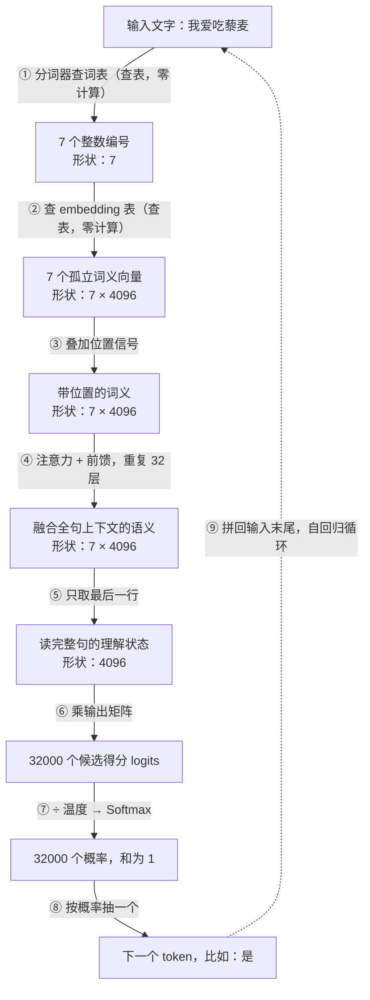
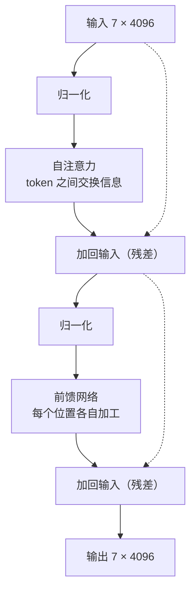

#AI #LLM #inference #map

# AI 知识地图：从一句话到一句话

> 把"我爱吃藜麦"发给一个 7B 大模型，看下一个字如何被生成——用这一次真实调用，把 Library/AI 的全部知识点串成一条线

> [!note] 定位
> 本文是 AI 知识树的**地图**（前身《推理全流程》）：以一次推理调用为主线，途经每个知识点时只做够用的说明，细节链接到对应笔记。目录式的学习顺序与知识树见 [[AI/Index|AI 知识索引]]。

> [!warning] 阅读前
> 全文会反复出现四类数字：**超参数**（4096、32 层）、**参数**（权重矩阵里的值）、**输入特征**、**激活值**。分不清就会处处卡壳——先读 [[模型里的四类数字]]，或至少记住第 1.4 节的速记。

## 核心流程概览

场景：输入 **"我爱吃藜麦"**，让模型续写下一个字。模型配置取 LLaMA-2 7B 的经典参数：

```text
词表大小 V = 32000     隐藏维度 d = 4096     层数 L = 32
```

整个过程分为以下阶段：

1. **模型加载** - 226 个矩阵、67 亿个参数被读进显存
2. **分词** - 文字 → UTF-8 字节 → token 编号
3. **Embedding 查表** - 编号 → 向量，文字正式变成数字
4. **位置编码** - 每个向量带上"我排第几"
5. **注意力子层** - token 之间互看、交换信息
6. **前馈子层** - 每个位置各自加工（就是经典的两层神经网络）
7. **重复 32 层** - 含义逐层抽象：孤立词义 → 融合全句的语义
8. **输出头** - 理解状态 → 32000 个候选得分（一个 32000 类的分类问题）
9. **Softmax 与采样** - 得分 → 概率 → 抽出一个字
10. **自回归循环** - 拼回输入末尾，从头再来



**把整条链路读成一句话**：编号 → 孤立词义 → 带位置的词义 → 融合上下文的语义 → 读完全句的理解状态 → 每个候选词的得分 → 概率 → 抽中的那个字。

### TL;DR

- 全程只有两类操作：**查表**（零计算）和**矩阵乘法 + 非线性**
- 数据在中间层的形状始终是 **序列长度 × 维度**，一路不变，直到最后一步才变成词表大小
- **形状一路不变，变的是含义**：从"孤立词义"逐层变成"融合全句的语义"，最后一行是"读完整句的理解状态"
- **输出层只取最后一个位置**，前面所有位置算出来的结果在生成时被丢弃（但训练时全都要用）
- **采样**才是随机性的唯一来源：模型本身完全确定，同样输入必得同样的概率分布
- **自回归**：生成 n 个 token 就要跑 n 次前向，靠 KV 缓存避免重复计算
- 注意力的代价是 $O(n^2)$ —— 这是上下文越长越慢越贵的根源
- 一个 7B 模型是 **226 个矩阵**的集合；一次前向做 **289 次矩阵乘法**
- 全程只有**两处**是「数据 × 数据」（注意力打分与加权），其余全是「数据 × 权重」

---

## 1. 出发前：14 GB 的文件里装着什么

### 1.1 一个模型只有四样东西

```text
config.json         几 KB   ← 说明书：226 个矩阵各是多大、按什么顺序用
tokenizer.json      几 MB   ← 词表
model.safetensors   14 GB   ← 那 226 个矩阵里的 67 亿个数
推理代码            几百行   ← 按说明书把这些矩阵依次乘起来
```

没有别的东西了（四类文件的分工见 [[模型里的四类数字]]）。

### 1.2 打开 safetensors：226 个矩阵

以 LLaMA-2 7B 的真实结构数一遍：

```text
model.embed_tokens.weight                    32000 × 4096      ← 1 个

┌─ 第 0 层 ────────────────────────────────────────────┐
│  self_attn.q_proj.weight        4096 × 4096          │
│  self_attn.k_proj.weight        4096 × 4096          │  注意力 4 个
│  self_attn.v_proj.weight        4096 × 4096          │
│  self_attn.o_proj.weight        4096 × 4096          │
│                                                       │
│  mlp.gate_proj.weight           4096 × 11008         │
│  mlp.up_proj.weight             4096 × 11008         │  前馈 3 个
│  mlp.down_proj.weight          11008 × 4096          │
│                                                       │
│  input_layernorm.weight              4096（向量）     │  归一化 2 个
│  post_attention_layernorm.weight     4096（向量）     │
└───────────────────────────────────────────────────────┘
   ⋮  第 1 层 …… 第 31 层，结构完全一样，数值各不相同

model.norm.weight                             4096（向量）
lm_head.weight                            4096 × 32000      ← 1 个
```

数一下：

```text
32 层 × 7 个矩阵 = 224
embedding 表 + 输出矩阵 = 2
──────────────────────────
共 226 个大矩阵，另加 65 个归一化向量
```

加起来正好是官方公布的参数量：

```text
每层 注意力 4 个 4096×4096      =    67,108,864
每层 前馈   3 个 4096×11008     =   135,266,304
每层合计                        =   202,375,168
× 32 层                         = 6,476,005,376
embedding 表  32000×4096        =   131,072,000
输出矩阵      4096×32000        =   131,072,000
归一化向量    65 × 4096         =       266,240
──────────────────────────────────────────────
合计                            = 6,738,415,616  = 6.74B
```

**所谓 "7B"，就是把这 226 个矩阵里的格子全部数一遍的结果。**

### 1.3 参数都在哪一块

```text
embedding 表   32000×4096   =   1.31 亿    1.9%
32 层的权重                 =  64.76 亿   96.1%   ← 大头
   其中：注意力 21.47 亿
         前馈   43.29 亿                          ← 前馈是注意力的两倍
输出矩阵      4096×32000    =   1.31 亿    1.9%
```

一个值得记的推论：**embedding 表只占 2%，说明模型的知识主要不存在那张表里，而存在 32 层的权重中**——尤其是前馈层。embedding 只负责"每个 token 的起始含义"，真正的语法、事实、推理能力都压在层里。

（有些模型让输出矩阵与 embedding 表共享同一份权重，叫 weight tying，能省 1.31 亿参数。所以同一个模型的参数量统计有时差个一两亿。）

### 1.4 分清四类数字

这 67 亿个数是**参数**（训练学出来的，推理时固定不动）；4096、32 这些是**超参数**（设计时人为定死的尺寸）；接下来输入的"我爱吃藜麦"会变成**输入特征**；而流经各层的中间结果全是**激活值**（每次输入都不同）。完整判别法见 [[模型里的四类数字]]。

一条速记：大写 $W$ 带下标的是**参数**（固定），$Q/K/V$ 是**算出来的**（每次不同）。

---

## 2. 分词：文字变成编号

### 2.1 计算机眼里没有"字"

计算机里根本没有"汉字"这种东西，只有字节。"我爱吃藜麦"先经 UTF-8 编码变成 15 个字节（每个汉字 3 字节），这是一切的起点。字符如何变字节见 [[1.05 字符编码]]。

### 2.2 分词器与词表

分词器拿着一张 32000 行的词表，把字节流切成 token：

```text
"我爱吃藜麦"
  → UTF-8 编码 → 15 个字节
  → 分词器切分 → 7 个 token（"藜"生僻，退化成 3 个字节 token）
```

常见字、常见词在词表里各占一条；生僻的"藜"不在词表里，触发**字节兜底**——拆成 3 个字节 token。这也是中文比英文费 token 的原因：词表以英文为主，汉字经常退化到字节级。完整机制见 [[Token 与 Embedding 表]]。

要记住的一点：**token 数不等于字数**（5 个字 → 7 个 token）。

### 2.3 得到什么：7 个整数

```text
[1, 1234, 5678, 910, 31234, 31567, 4321]
```

每个数是 token 在词表里的**行号**。此时编号的大小没有任何含义（4321 不比 910 "大"），不能直接参与计算——所以需要下一步。

---

## 3. Embedding 查表：编号变成向量

### 3.1 向量是 AI 的通用语言

AI 里表达"含义"的方式只有一种：**一排数字，即向量**。向量之间可以算距离、算相似度（点积 / 余弦），"词义相近"就体现为"向量相近"，甚至能做 king − man + woman ≈ queen 这样的语义算术。这套语言的完整入门见 [[向量与点积]]。

### 3.2 第二次查表：embedding 表

embedding 表是一张 32000 × 4096 的大表（第 1.2 节清单里的第一个矩阵）。拿上一步的 7 个编号，**按行号取出对应的 7 行**：

```text
[1, 1234, 5678, ...]  → 查表取行 →  7 个 4096 维向量，拼成 7 × 4096 的矩阵
```

这一步和分词一样是**纯查表，零计算**。取出的向量是每个 token 的**孤立含义**——"麦"只是泛指的麦，还不知道前面有个"吃"；"藜"的三个字节 token 此刻各自毫无意义。

### 3.3 形状的规则：7 × 4096

从这里开始到输出头之前，数据形状始终是 **序列长度 × 隐藏维度**：

- **行数（7）随输入长短变**——输入十个字就是更多行
- **列数（4096）是超参数，永远不变**

看不懂矩阵尺寸和 ∑、下标这类符号，从 [[线性代数入门]] 开始补；矩阵怎么乘见 [[矩阵与线性变换]]。

---

## 4. 位置编码：顺序不是天然的

### 4.1 问题：注意力对顺序完全无感

接下来的注意力机制只是让每个 token 去看别的 token，如果不额外告知位置，**"我爱吃藜麦"和"藜麦吃爱我"在它眼里是同一堆东西**。

### 4.2 序列模型的两条路线

处理"有顺序的数据"有两条历史路线（详见 [[序列模型]]）：

- **RNN**：按顺序一个一个吃 token，顺序天然编码在处理过程里——但串行慢、远距离容易遗忘
- **Attention**：一次看全场、完全并行——代价是丢失了顺序，必须**人为把位置加回去**

Transformer 选了后者，用并行换速度，再用位置编码补顺序。

### 4.3 做法：给每个向量叠加位置信号

```text
第 1 个 token 的向量  +  代表"第 1 位"的信息
第 2 个 token 的向量  +  代表"第 2 位"的信息
   ⋮
形状仍是 7 × 4096（加法不改变形状）
```

具体编码方案有好几种（原始 Transformer 用正弦函数，现代模型多用 RoPE 旋转位置编码），细节见 [[Transformer]]。这里只需知道：**位置不是天然存在的，是被人为加进去的**。

---

## 5. 注意力子层：token 互看

从这里开始进入 32 层中的第一层。**一层由两个子层组成**：注意力（本节）和前馈（第 6 节），各自外面包一层残差与归一化（第 7 节）：



### 5.1 Q、K、V 是什么

先分清记号——这是最容易混的一处：

```text
W_q、W_k、W_v、W_o   ← 4 个权重矩阵，训练学出来的，换输入不变    【参数】
Q、K、V              ← 用 X 乘上面的矩阵算出来的，每次输入都不同  【激活值】
```

$$Q = X W_q \qquad K = X W_k \qquad V = X W_v$$

**同一份输入 X，乘三个不同的权重矩阵，得到三份不同的东西。**

名字借自数据库/字典查询，Q、K、V 分别是 Query、Key、Value 的首字母：

```text
Query（查询）：我想找什么样的信息
Key  （键）  ：我这里挂着什么标签，供别人来匹配
Value（值）  ：如果匹配上了，我实际交出去的内容
```

普通字典是"用 key 精确匹配，命中就取那一条 value"。注意力是**软查询**：用 Q 和**所有** K 算匹配分，再按分数**加权取全部 V**——不是取一条，是按相关程度混合。

### 5.2 为什么要三个矩阵，不能直接用 X

如果不拆，直接拿 X 自己和自己做点积算分数，会有个硬伤——**分数矩阵必然对称**：

```text
不拆：S = X @ Xᵀ = ⎡ 5   5⎤
                   ⎣ 5  10⎦        ← 对角线两侧必然相等
```

对称意味着"token1 关注 token2 的程度必须等于 token2 关注 token1 的程度"。但语言里的关注关系天然有方向——形容词要看它修饰的名词，名词却未必要看形容词。

拆开就自由了：

```text
X  = ⎡1  2⎤     Q = X@W_q = ⎡1  2⎤     K = X@W_k = ⎡2  2⎤
     ⎣3  1⎦                 ⎣3  1⎦                 ⎣1  6⎦

S = Q @ Kᵀ = ⎡ 6  13⎤
             ⎣ 8   9⎦

  S[0,1] = 13   ← token1 对 token2 的关注度
  S[1,0] =  8   ← token2 对 token1 的关注度     不相等 ✓
```

**三个矩阵让同一个 token 的三种角色解耦**：作为查询方想找什么（Q）、作为被查方提供什么标签（K）、真正传递出去的内容是什么（V），各自由训练决定。

### 5.3 完整算一遍：「麦」如何读懂「吃」

以最后那个 token「麦」为例，它的 Q 和前面每个 token 的 K 做点积——这正是 [[向量与点积]] 里"点积衡量像不像"的直接应用：

```text
麦 的 Q  ·  我 的 K  =  1.2
麦 的 Q  ·  爱 的 K  =  0.4
麦 的 Q  ·  吃 的 K  =  3.1     ← 匹配度最高
麦 的 Q  ·  麦 的 K  =  2.0     ← 也看自己

过 Softmax 变成权重（和为 1）：
   我 9.7%    爱 4.3%    吃 64.5%    麦 21.5%

麦 的新向量 = 0.645×吃的V + 0.215×麦的V + 0.097×我的V + 0.043×爱的V
```

**"吃"的 V 占了六成多，于是"可食用"这层含义被大量混进了"麦"里。** 这就是"上下文重塑含义"的具体机制。

同样的道理，那三个孤立的字节 token（"藜"）单看毫无意义，但夹在"吃"和"麦"之间，加权求和之后自然带上了"可食用的粮食"这层意思。

### 5.4 因果掩码与多头

**因果掩码**：生成模型里每个位置**只能看自己和前面**，不能看后面。否则训练时就等于提前看到了答案。做法是把指向未来位置的分数强行设成负无穷，softmax 之后权重为 0。

**多头**：上面那套 Q/K/V 不是只做一遍，而是把 4096 维切成 32 组（各 128 维）**并行做 32 套**。不同的头可以关注不同类型的关系——语法搭配、指代、远距离依赖。

### 5.5 输出投影 W_o

32 个头各算各的，彼此没交流过。把它们拼回 4096 维之后，再过一次 $W_o$ 让各头的结果互相混合，然后送去做残差相加。没有它，32 个头的输出就只是简单并排。

（顺带一提：$Q/K/V$ 三个字母既指权重矩阵也指算出来的结果，靠有没有下标 $W$ 区分；而 **O 一般只指矩阵 $W_o$**，没有"O 向量"这种说法。）

---

## 6. 前馈子层：各自加工

### 6.1 这就是神经网络本尊

注意力负责 token 之间交换信息，前馈负责**每个位置各自把信息加工一遍**，彼此不交流：

$$\text{FFN}(x) = W_2 \cdot \text{ReLU}(W_1 x + b_1) + b_2$$

**这就是 [[神经网络]] 里那个两层网络，一字不差**——神经元 = 加权求和 + 偏置 + 激活函数，只是尺寸大：先用 4096×11008 扩宽，再用 11008×4096 压回。7 个位置各过一遍，互不影响。

（LLaMA 系用的是 SwiGLU，前馈是三个矩阵而非两个，多一个门控矩阵。这属于各家的具体设计差异，不影响整体图景。）

### 6.2 参数大头其实在这里

每层前馈约 1.35 亿参数，注意力约 6700 万——**前馈是注意力的两倍**。注意力更出名，但每层的参数和算力大头其实在前馈那三个大矩阵上（第 1.3 节的分布表也印证了这点）。

---

## 7. 残差与归一化：深度的工程学

### 7.1 残差连接：叠加而非替换

每个子层的输出要**加回它的输入**，即 $x + F(x)$ 而不是 $F(x)$：

- 梯度在反向传播时有一条"直通车道"，几十层也不会衰减消失
- 一个 token 走完 32 层，**它最初的词义一直都在**，只是被 32 轮上下文信息层层叠加、不断修正
- 要相加就必须同形（[[向量与点积]] 里"向量长度必须一致"）——**这条约束反过来把每层进出焊死在 7 × 4096**

### 7.2 层归一化

把每个位置的 4096 个数调整成均值 0、方差 1，防止数值在几十层里越滚越大或越缩越小。

这两样都不改变形状，纯粹是**让深层网络训得动的工程手段**——和 ReLU 一起，属于"深度学习"能深起来的配套技术（这类技术的全景见 [[机器学习基础概念]]）。

---

## 8. 重复 32 层：逐层抽象

### 8.1 一层内部的形状全追踪

把第 5、6、7 节全部串起来，每一步的尺寸都严丝合缝（$(m \times \underline{n})(\underline{n} \times p) = (m \times p)$，中间那个数消掉，规则见 [[矩阵与线性变换]]）：

```text
进入第 0 层：X = 7×4096

  ① Q = X @ W_q     (7×4096) @ (4096×4096) → 7×4096      数据 × 权重
     K = X @ W_k     同上                   → 7×4096      数据 × 权重
     V = X @ W_v     同上                   → 7×4096      数据 × 权重

  ② 分数 = Q @ Kᵀ    (7×4096) @ (4096×7)   → 7×7         数据 × 数据 ★
  ③ softmax（逐行）                         → 7×7
  ④ 加权求和 = 分数 @ V  (7×7) @ (7×4096)   → 7×4096      数据 × 数据 ★

  ⑤ 输出投影 = @ W_o  (7×4096) @ (4096×4096) → 7×4096     数据 × 权重
  ⑥ 残差：+ X                                → 7×4096

  ⑦ gate = @ W_gate (7×4096) @ (4096×11008) → 7×11008     数据 × 权重
     up   = @ W_up   同上                    → 7×11008     数据 × 权重
  ⑧ SiLU(gate) ⊙ up（逐元素相乘）            → 7×11008
  ⑨ down = @ W_down (7×11008) @ (11008×4096) → 7×4096      数据 × 权重
  ⑩ 残差：+ 上面的结果                        → 7×4096

出第 0 层：7×4096   ← 和进来时一模一样，原样送进第 1 层
```

把上面每一步**得到了什么**再过一遍：

```text
① Q/K/V   把每个 token 的向量翻译成三种角色：想找什么、能提供什么、实际带什么
② 分数     7×7 的表格：每个 token 对每个 token 的匹配度（原始分，未归一化）
③ softmax  同样 7×7，但每行加起来等于 1，成了"注意力权重"
④ 加权求和  每个 token 拿到一个"按相关度混合了全场信息"的新向量
⑤ 输出投影  把多个头各自的发现混合起来
⑥ 残差     新信息 + 原来的自己 —— 不是替换，是叠加
⑦⑧ 前馈中间 每个位置被拉宽到 11008 维，在更大的空间里做一次非线性加工
⑨ down     压回 4096 维，只保留有用的部分
⑩ 残差     再叠加一次，得到这一层的最终产物
```

**★ 标记的两步是全流程中仅有的「数据 × 数据」**，两边都不是权重矩阵。$QK^T$ 算的是这 7 个 token 彼此之间的匹配分，完全由这次输入决定——**这也正是 $O(n^2)$ 的来源**：序列长 7 时是 7×7，长 1000 时就是 1000×1000。

另外注意写法：这里用的是 $XW$（X 每行一个 token），而 [[神经网络]] 那篇用的是 $Wx$（x 是列向量）。**两者是同一件事的转置**——工程上一律用前者，一次能处理整批数据；教学上常用后者，单个向量更好画。看到哪种都不用慌，核对尺寸就知道是哪种约定。

### 8.2 原样重复 32 次

上面那一整块原样重复 32 次，**结构完全相同，参数各不相同**（每层有自己的 Q/K/V/O 和前馈权重——这就是第 1.2 节参数量要乘 32 的原因）：

```text
输入 7×4096 → 第1层 → 7×4096 → 第2层 → 7×4096 → … → 第32层 → 7×4096
```

### 8.3 形状不变，含义在变

形状全程不变，变的是每一行里那 4096 个数的含义——从"孤立的词义"逐层变成"融合了整句上下文的语义"：浅层通常先抓住局部搭配（"吃"和"麦"的关系），深层才形成"这是在说一种可以吃的、叫藜麦的粮食"这样的整句理解。

这和 [[神经网络]] 里"浅层学边缘、深层学整张脸"是同一种逐层抽象，只是对象从像素换成了词。**层不改变形状，只改变含义。**

---

## 9. 输出头：一个 32000 类的分类问题

### 9.1 只取最后一行

跑完 32 层拿到的还是 7×4096。要预测下一个 token，**只取最后一行**：

```text
7 × 4096  →  取第 7 行  →  4096 维向量
```

为什么只取最后一个？因为要预测的是"第 7 个 token 之后是什么"，而由于因果掩码，**只有最后那一行融合了全部 7 个 token 的信息**。前六行算出来的东西在生成时直接丢弃。

（训练时不一样：七行全都要用——原因见第 12.2 节。）

### 9.2 乘输出矩阵，得到 logits

```text
(4096,) × (4096 × 32000) → (32000,)
```

得到的 32000 个数叫 **logits**，是任意实数，可正可负，还不是概率。

### 9.3 这正是监督学习里的"分类"

退后一步看：模型此刻在做的，就是 [[监督学习任务]] 四大任务（回归、分类、搜索、推荐）里最经典的**分类**——只不过类别不是"猫/狗"两类，而是**词表里的 32000 类**。"预测下一个词"听起来神秘，本质是一个超大规模的分类问题。这个视角在第 12 节讲训练时还会用到：分类问题的标准打分法（交叉熵）正是大模型的损失函数。

---

## 10. Softmax 与采样：随机性的唯一来源

### 10.1 温度与 Softmax

先把 logits 除以**温度** $T$，再过 Softmax：

$$p_i = \frac{e^{z_i / T}}{\sum_j e^{z_j / T}}$$

Softmax 做两件事：把任意实数压成正数，再归一化使总和为 1。温度则控制分布的"尖锐程度"：

```text
logits = [3.2, 1.8, 1.1, 0.4]（只看前 4 个）

T = 0.2  →  [0.999, 0.001, 0.000, 0.000]   ← 几乎必选第一个，极度保守
T = 1.0  →  [0.699, 0.172, 0.086, 0.043]   ← 原始分布
T = 1.5  →  [0.557, 0.219, 0.137, 0.086]   ← 抹平差距，更容易选到冷门
```

**温度不改变排序，只改变差距**。低温更确定、更重复；高温更多样、也更容易胡说。

### 10.2 采样策略

拿到 32000 个概率后（"是" 0.31，"很" 0.12，"，" 0.09，……，"香蕉" 0.000001），怎么挑出一个 token：

| 策略 | 做法 | 特点 |
|---|---|---|
| 贪心 greedy | 永远选概率最大的 | 完全确定，但容易重复啰嗦 |
| 纯采样 | 严格按概率随机抽 | 多样，但偶尔抽到极低概率的怪词 |
| Top-k | 只在概率最高的 k 个里抽 | 掐掉长尾 |
| Top-p（核采样） | 按概率从高到低累加到 p（如 0.9），只在这些里抽 | 候选数量随分布自动调整，最常用 |

### 10.3 模型是确定的函数

**采样是整个流程中唯一的随机性来源。** 模型本身是完全确定的函数——同样的输入必然产生同样的 logits。所以"同一个问题两次回答不一样"不是模型不稳定，是采样掷了骰子；把温度设成 0（等价于贪心）就能复现。

---

## 11. 自回归循环：逐字往外蹦

### 11.1 拼回去，从头再来

采样出的 token 拼回输入末尾，整个流程从头再跑一遍：

```text
第 1 轮：输入 7 个 token  → 输出 "是"
第 2 轮：输入 8 个 token（"我爱吃藜麦是"）→ 输出 "一"
第 3 轮：输入 9 个 token → 输出 "种"
   ⋮
直到采样出结束符 <EOS>，或达到设定的最大长度
```

**生成 n 个 token 就要完整跑 n 次前向。** 你看到的逐字蹦出来，就是这个循环在转。顺带一提，模型"记得上文"也是假象——每轮都是把完整上下文重新喂了一遍。

### 11.2 KV 缓存：为什么第一个字慢、后面快

朴素做法每轮都把整个序列重算一遍，极其浪费——因为前面那些 token 的 K 和 V 每轮算出来都一样。

于是把它们**缓存**起来，每轮只算新增那一个 token 的 Q/K/V，和缓存里的 K/V 拼一起用。这带来了推理的两个阶段：

```text
Prefill（预填充）：把整个提示词一次性跑完，填满 KV 缓存
                  → 计算量大，所以"第一个字"等得久

Decode（解码）：  之后每轮只算一个新 token
                  → 快得多，所以后面刷刷往外冒
```

代价是显存：缓存大小正比于上下文长度，长上下文很吃显存。

### 11.3 O(n²)：为什么上下文越长越慢越贵

注意力要算"每个 token 对每个 token"的分数，是一个 $n \times n$ 的矩阵：

```text
序列长     10 → 分数矩阵    10×10 =         100 个数
序列长    100 → 分数矩阵  100×100 =      10,000 个数
序列长  1,000 → 分数矩阵  1000×1000 =  1,000,000 个数
序列长 10,000 → 分数矩阵 10000×10000 = 100,000,000 个数
```

**长度翻倍，注意力的计算量变四倍**——这个 $O(n^2)$ 是长上下文昂贵的根本原因，也是各种"高效注意力"研究要攻克的目标。上下文窗口有上限，一半原因在这，另一半是位置编码的训练范围有限。

---

## 12. 回望：这 67 亿个数是怎么来的

推理走完了。但整条链路成立的前提，是那 226 个矩阵里装着"对的数"——它们从哪来？

### 12.1 机器学习：参数不是人写的，是学出来的

这 67 亿个数没有一个是人填的。**机器学习的定义就是：从数据中自动找出参数，而不是人工编写规则**。找的办法是个三件套：

- **损失函数**：给当前参数打分——模型预测的概率分布和正确答案差多远（分类问题用交叉熵，正是第 9.3 节那个 32000 类分类的标准打分法）
- **梯度下降**：算出每个参数朝哪个方向微调能让损失变小，然后走一小步
- **学习率**：控制每步走多大

重复亿万次，直到损失降不动。调过头会**过拟合**（背题而不是学规律）。完整展开见 [[机器学习基础概念]]。

### 12.2 自监督：语料自带答案

普通监督学习需要人工标注答案，而"猜下一个词"的答案**就藏在语料里**——每句话天然自带标准答案，这叫**自监督**。

"我爱吃藜麦"这 7 个 token 能同时出 7 道题：看见"我"猜"爱"、看见"我爱"猜"吃"……**这就是第 9.1 节"训练时七行全都要用"的原因**——一次前向，7 个位置各自对答案、各自产生损失，效率极高。互联网级的语料就这样全变成了题库。

误差如何反向传播、摊回 226 个矩阵的每个格子，见 [[大模型如何训练]]。

### 12.3 三阶段：预训练 → SFT → RLHF

光靠"猜下一个词"训出来的是 base model——一台接话茬机器，你问它问题，它可能续写出更多问题。之后还要两步：**指令微调（SFT）**教它"回答"而不是"续写"，**RLHF** 按人类偏好继续调。三阶段全景见 [[大语言模型]]。

---

## 13. 延伸：模型不知道的事——RAG

### 13.1 幻觉从哪来

整个训练过程只优化一件事：**下一个 token 的概率高**。目标里没有"说真话"这一项。问"藜麦每 100 克含多少蛋白质"，模型给出的数字只是"看起来像语料里会出现的数字"——这就是一本正经胡说八道（幻觉）的由来（见 [[大语言模型]]）。

### 13.2 检索 + 生成

想让模型用上它没训过的资料（内部文档、最新数据），工程上的标准做法是 **RAG（检索增强生成）**：

1. 预先把资料切块，经 [[Embedding Service]] 变成**句级向量**——和第 3 节同一套 embedding 思想，只是从 token 级升到了句级
2. 存进 [[Vector Database]]
3. 提问时，把问题也变成向量，按**点积/余弦相似度**（又是 [[向量与点积]]）检索最相关的几块
4. 把检索结果塞进上下文，再让模型生成

一句话总结：**BERT 后代负责检索，GPT 后代负责生成**——[[Transformer]] 的两大流派在工程里合体。完整展开见 [[RAG]]。

注意第 11.3 节的账单：塞进上下文的资料越多，$O(n^2)$ 越贵——这是 RAG 要控制检索块数的原因之一。

---

## 14. 复盘

### 14.1 每一步得到什么、形状多少、用了哪些参数

三列并排看，这是全文最值得反复回看的一张表：

| 阶段 | 得到的是什么 | 形状 | 用到的参数 |
|---|---|---|---|
| 输入文字 | 一句话 | — | 无 |
| token id | 每个 token 在词表里的编号 | 7 | 无（分词器资产） |
| embedding 后 | 每个 token 的**孤立含义** | 7 × 4096 | **embedding 表** 32000×4096 |
| 加位置信息 | 孤立含义 + "我排第几" | 7 × 4096 | RoPE 方案无参数 |
| Q / K / V | 每个 token 的三种角色：想找什么 / 能提供什么 / 实际带什么 | 7 × 4096（各） | **$W_q, W_k, W_v$** |
| 注意力分数 | 每个 token 对每个 token 的**匹配度** | 7 × 7 | **无**——数据 × 数据 |
| softmax 后 | 同上，但每行和为 1，成了**注意力权重** | 7 × 7 | 无 |
| 加权求和后 | 每个 token **混合了全场信息**的新向量 | 7 × 4096 | **无**——数据 × 数据 |
| 输出投影后 | 多个头的发现被**混合**到一起 | 7 × 4096 | **$W_o$** |
| 前馈中间 | 拉宽到更大空间做一次非线性加工 | 7 × 11008 | **$W_{gate}, W_{up}$** |
| 每层输出 | 压回原维度，这一层的最终产物 | 7 × 4096 | **$W_{down}$** |
| ⋮ 重复 32 层 | 含义从"孤立词义"逐层变成"融合全句的语义" | 7 × 4096 | **每层各有独立的 7 个矩阵** |
| 取最后一行 | 模型**读完整句话之后的理解状态** | 4096 | 无（切片） |
| logits | 词表里每个候选 token 的**得分** | 32000 | **输出矩阵** 4096×32000 |
| 概率 | 每个 token 作为下一个字的**概率** | 32000 | 无（Softmax + 温度） |
| 采样结果 | **选定的那一个 token** | 1 | 无（采样策略） |

### 14.2 四条规律

**其一，形状是副产品，含义才是主线。** 中间那一大段形状全是 7×4096 一动不动，但含义从"七个孤立的词"一路变成"七个吃透了全句的语义"——**层不改变形状，只改变含义**。

**其二，中间层的形状被锁死。** 行数（7）随输入变，列数（4096）被超参数定死，残差要求同形又把它焊住（见第 7.1 节）。

**其三，参数只出现在"换空间"的那几步。** 分数矩阵、softmax、残差、采样这些步骤一个参数都不涉及。

**其四，每层有自己独立的一套参数**，32 层不是复用同一套——这就是参数量要乘 32 的原因。

### 14.3 计算量花在哪

```text
分词、查表            几乎为零（按下标取数，不是计算）
位置编码              可忽略
32 层                                            ← 99% 以上在这里
     每层注意力  ≈ 0.67 亿参数
     每层前馈    ≈ 1.35 亿参数
输出投影 4096×32000   ≈ 1.31 亿参数              ← 单次不小，但只做一次
Softmax 与采样        可忽略
```

数矩阵乘法的次数：

```text
每层：7 次（数据 × 权重）+ 2 次（数据 × 数据）= 9 次
× 32 层                                       = 288 次
+ 最后的输出投影                                = 1 次
──────────────────────────────────────────────────
一次前向共 289 次矩阵乘法
```

生成一个 token 就跑这 289 次，生成一百个 token 就跑 28900 次。**GPU 一整天都在干这件事，没有别的。** 至于为什么非 GPU 不可：矩阵乘法的每个输出元素彼此独立、可同时算，恰好是 GPU 上万个核心最擅长的模式（见 [[矩阵与线性变换]] 第 7 节）。

### 14.4 常见困惑对照

| 现象 | 原因 |
|---|---|
| 同样的问题，两次回答不一样 | 采样掷骰子（第 10.3 节）；温度设 0 即可复现 |
| 第一个字要等，后面刷刷出 | Prefill 要算完整个提示词，Decode 每轮只算一个 token（第 11.2 节） |
| 上下文越长越慢、越贵 | 注意力的 $O(n^2)$，加上 KV 缓存吃显存（第 11.3 节） |
| 有长度上限（上下文窗口） | 位置编码的训练范围有限，且 $n^2$ 的开销扛不住 |
| 模型"记得"上文 | 不是真的记住——每轮都把完整上下文重新喂了一遍（第 11.1 节） |
| 一本正经地说错事实 | 优化目标里只有"下一个 token 概率高"，没有"说真话"（第 13.1 节） |
| 中文比英文费 token | 词表以英文为主，汉字常退化到字节级（第 2.2 节） |
| 分不清 4096 是参数还是维度 | 4096 是**尺寸**（超参数），参数是填在那 4096 列里的数值（第 1.4 节） |
| 分不清 $W_q$ 和 $Q$ | $W_q$ 是权重（固定），$Q = XW_q$ 是这次算出来的（每次不同）（第 5.1 节） |

---

## 总结

一次调用的全部：**编号 → 孤立词义 → 带位置的词义 → 融合上下文的语义 → 读完全句的理解状态 → 32000 类分类 → 概率 → 抽中的字 → 拼回去再来一轮**。全程只有查表和"矩阵乘法 + 非线性"两类操作；那 67 亿个参数由"猜下一个词 + 梯度下降"从语料中学来。

本文每一站与详细笔记的对应（地图图例）：

| 站点 | 知识点 | 详细笔记 |
|---|---|---|
| 第 1 节 模型家底 | 四个文件、226 个矩阵、四类数字 | [[模型里的四类数字]] |
| 第 2 节 分词 | 字节、词表、字节兜底 | [[Token 与 Embedding 表]]、[[1.05 字符编码]] |
| 第 3 节 Embedding | 向量、相似度、查表 | [[向量与点积]]、[[Token 与 Embedding 表]] |
| 第 4 节 位置编码 | RNN vs Attention、RoPE | [[序列模型]]、[[Transformer]] |
| 第 5 节 注意力 | Q/K/V、点积打分、多头、掩码 | [[Transformer]]、[[向量与点积]] |
| 第 6 节 前馈 | 神经元、两层网络、激活函数 | [[神经网络]] |
| 第 7 节 残差与归一化 | 深层网络的配套技术 | [[Transformer]]、[[机器学习基础概念]] |
| 第 8 节 32 层 | 矩阵乘法、形状追踪、逐层抽象 | [[矩阵与线性变换]]、[[线性代数入门]] |
| 第 9 节 输出头 | logits、分类任务 | [[监督学习任务]] |
| 第 10 节 采样 | Softmax、温度、采样策略 | [[大语言模型]] |
| 第 11 节 自回归 | KV 缓存、O(n²) | [[大语言模型]] |
| 第 12 节 训练回望 | 损失、梯度下降、自监督、三阶段 | [[机器学习基础概念]]、[[大模型如何训练]]、[[大语言模型]] |
| 第 13 节 RAG | 检索增强生成、向量库 | [[RAG]]、[[Embedding Service]]、[[Vector Database]] |

学习顺序、知识树与概念速查见 [[AI/Index|AI 知识索引]]。

---

## 相关文档

- [[模型里的四类数字]] - 超参数/参数/特征/激活值的分界，读本文的前置
- [[大语言模型]] - 它是什么、三阶段训练、它不是什么
- [[Token 与 Embedding 表]] - 分词与 embedding 的完整细节
- [[Transformer]] - 层内部的完整细节：QKV、多头、位置编码、三大流派
- [[神经网络]] - 前馈子层就是那个两层网络
- [[序列模型]] - RNN → CTC → Attention 的来路
- [[矩阵与线性变换]] - 全程的矩阵运算与 GPU
- [[线性代数入门]] - 符号与线性函数扫盲
- [[向量与点积]] - 注意力分数就是点积
- [[机器学习基础概念]] - 损失函数、梯度下降、过拟合
- [[监督学习任务]] - 输出头本质是分类任务
- [[大模型如何训练]] - 参数怎么被找出来
- [[RAG]] - 检索增强生成的工程全貌
