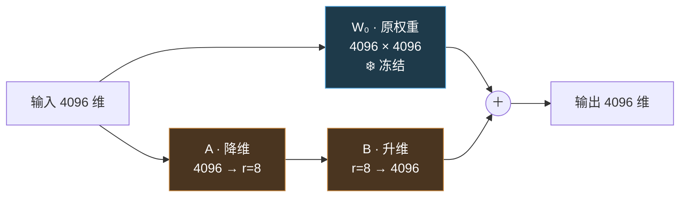

#AI #LLM #微调 #LoRA #PEFT

# 微调与 LoRA

> 微调不引入新结构，它更新的是预训练已经收敛的那批权重

> [!note] 定位
> **三个训练阶段分别是什么**（预训练 → SFT → RLHF）已在 [[大语言模型]] 第 6 节讲过，本文不重复。
> 本文答三个问题：**微调这个动作在数学上是什么、显存都花在哪、什么时候不该微调**。
> 术语在首次出现处就地解释，第 6 节另有集中的术语表。

## TL;DR

- **微调（fine-tuning）= 在预训练权重的基础上继续做梯度下降**，训练目标、损失函数、优化算法全部不变，变的只是训练语料
- **语料从原始文本换成「指令 → 回答」的对话格式**，模型学到的是「出现助手轮次标记后应当产出答案」这一条件概率，而非新的事实知识
- **全量微调的显存瓶颈不是权重，是优化器状态**：混合精度 AdamW 下每个参数要占 16 字节，7B 模型约 112 GB，是推理（2 字节/参数，14 GB）的 8 倍
- **LoRA 把权重更新量 ΔW 分解为两个低秩矩阵之积** $\Delta W = BA$，冻结 $W_0$ 只训 $A$、$B$，可训练参数降到 0.1%~1%
- **LoRA 推理时可以把 $BA$ 合并回 $W_0$**，因此不引入任何额外延迟——这是它胜过早期 Adapter 方案的关键
- **微调不能注入事实知识**：几万条样本相对 70 亿参数是 10⁻⁵ 量级的信号，要模型「知道」新内容必须走 [[RAG]]
- 决策边界：**要改变模型的知识范围 → RAG；要改变模型的默认行为与输出格式 → 微调；单次任务 → 提示工程**

---

## 1. 微调的定义与定位

**微调（fine-tuning）指以一组已训练好的权重为初始值，用新数据继续训练。** 它不是 LLM 专有的概念，迁移学习里一直这么做；在 LLM 语境下特指对预训练完成的 base model 继续训练。

关键在于它和预训练的关系：

| | 预训练 | 微调 |
|---|---|---|
| 权重初始值 | 随机数 | **预训练的结果** |
| 训练目标 | 预测下一个 token | **完全相同** |
| 损失函数 | 交叉熵 | **完全相同** |
| 优化算法 | AdamW + 梯度下降 | **完全相同** |
| 模型结构 | Transformer 若干层 | **完全相同，不增不减** |
| 语料 | 万亿 token 级原始文本 | 10⁴~10⁵ 条结构化样本 |
| 学习率 | 10⁻⁴ 量级 | **10⁻⁵ ~ 10⁻⁶ 量级** |

**所以微调没有"新机制"可讲**——它就是 [[大模型如何训练]] 描述的那一套动作，换了初始值、换了语料、把学习率调小一到两个数量级。

学习率（learning rate）是控制每次参数更新步长的超参数（[[模型里的四类数字]]）。微调必须用小学习率，否则少量新数据产生的梯度会把预训练积累的权重结构破坏掉，这个失效模式叫**灾难性遗忘**（见第 5 节）。

---

## 2. 语料格式：唯一真正改变的东西

训练目标是「预测下一个 token」，这一点从预训练到微调从未改变。改变的是文本的组织形式，因此模型学到的条件概率分布不同。

**预训练语料**是从互联网抓取的原始文本，未经改造：

```text
法国的首都是哪里？
A. 里昂   B. 巴黎   C. 马赛
答案：B
```

在这类文本上最小化交叉熵，模型学到的规律包括「问句之后常出现选项列表」。这直接解释了 base model 的行为：给它一个问题，它续写出更多题目（[[大语言模型]] 第 6 节有例子）。

**微调语料**是人工编写的指令-回答对，并套上该模型约定的**对话模板（chat template）**。以 LLaMA-2 的模板为例：

```text
<s>[INST] 法国的首都是哪里？ [/INST] 巴黎。</s>
```

`[INST]`、`[/INST]` 是标记指令边界的特殊 token，`<s>` / `</s>` 标记序列起止。在这类文本上继续训练，模型学到的是「`[/INST]` 之后应当出现对该指令的回答」。

两点值得注意：

- **模板是模型专属的约定，不是通用标准。** LLaMA-2、ChatML（OpenAI 系）、Gemma 各用一套。推理时用错模板会显著降低效果，因为模型学到的条件是绑定在那些具体 token 上的。
- **损失通常只在回答部分计算。** 用户提问那一段一般被 mask 掉不算损失——目标是让模型学会生成回答，不是学会生成问题。

### 为什么 10⁴ 量级的样本就够

```text
预训练： 10¹² token 量级
微调：   10⁷ token 量级（几万条对话）
```

相差五个数量级。这个量级的数据不可能改写 70 亿参数里编码的知识，它能做到的是**调整输出分布的偏好**——把「续写」这个行为倾向替换成「回答」。

这条推论同时是限制：**微调无法注入事实知识**，详见第 4 节。

---

## 3. 具体更新哪些参数

### 3.1 全量微调（full fine-tuning）

更新全部权重矩阵（7B 模型是 226 个，清单见 [[AI/Map|Map]] 第 1.3 节）。效果上限最高，显存成本也最高。

显存成本按**每个参数占多少字节**来算最清楚。混合精度训练配 AdamW 优化器：

```text
权重 fp16                2 字节/参数
梯度 fp16                2 字节/参数     每个参数都要记「该往哪调」
AdamW 一阶动量 fp32      4 字节/参数     梯度的滑动平均
AdamW 二阶动量 fp32      4 字节/参数     梯度平方的滑动平均
fp32 主权重              4 字节/参数     防止 fp16 累积误差
─────────────────────────────────────
合计                    16 字节/参数    →  7B × 16 ≈ 112 GB

推理只需                 2 字节/参数    →  7B × 2  ≈  14 GB
```

**优化器状态（optimizer state）是最大的一块，占了一半。** 它指优化器为自适应调整步长而额外维护的中间量：AdamW 给每个参数记两个数——梯度的一阶动量和二阶动量——用来判断这个参数最近的梯度是否稳定，从而决定步子大小。这两份账本合计 8 字节/参数，比 fp16 权重本身大四倍。

结论：单张 80 GB 显卡装不下 7B 的全量微调，需要多卡切分或 ZeRO offload 之类的显存优化。这是低成本微调方案存在的直接动因。

### 3.2 冻结（freeze）

**冻结指把部分参数标记为不参与更新。** 反向传播时梯度仍然穿过这些层（后面的层需要这条链路计算自己的梯度），但计算完不施加到这些参数上。

冻结的收益是连带省掉三项开销：这些参数不需要保存梯度、不需要优化器状态、不需要 fp32 主副本。按上面的账，被冻结的参数从 16 字节/参数降回 2 字节/参数。

### 3.3 LoRA（Low-Rank Adaptation，低秩适配）

**核心假设：微调产生的权重更新量 $\Delta W$ 是低秩的。**

「秩」（rank）是线性代数概念，指矩阵中线性无关的行（或列）的最大数目，可以理解为这个矩阵实际承载了多少个独立方向的信息（[[矩阵与线性变换]]）。LoRA 论文的观察是：适配一个下游任务所需的权重改动集中在少数几个方向上，$\Delta W$ 的有效秩远低于它的尺寸。

既然如此，就不必用满尺寸矩阵表示它，可以分解为两个瘦矩阵之积：

$$W = W_0 + \Delta W = W_0 + BA$$

- $W_0$ 是预训练权重，**冻结**
- $A$ 把输入从 4096 维**降到 $r$ 维**
- $B$ 把它从 $r$ 维**升回 4096 维**
- $r$ 是超参数，称为 rank，常用 8 / 16 / 32 / 64



**参数量**，以一个 4096 × 4096 的矩阵、$r = 8$ 为例：

```text
全量微调需训练：  4096 × 4096          = 16,777,216
LoRA 需训练：     4096 × 8 + 8 × 4096  =     65,536     →  0.39%
```

实践中整个模型的可训练参数通常落在 **0.1% ~ 1%**，取决于 $r$ 和挂载范围。

**三个必须知道的实现细节：**

**一、$B$ 零初始化。** $A$ 用随机高斯初始化，$B$ 初始化为全零，于是训练开始时 $\Delta W = BA = 0$，模型输出与原模型逐位相同。这保证微调是从预训练权重**精确出发**的，不会因为随机初始化的旁路引入初始扰动。

**二、缩放因子 $\alpha$。** 实际计算的是 $W_0 + \frac{\alpha}{r}BA$。$\alpha$ 是另一个超参数，作用是让调整 $r$ 时不必重新调学习率。常见设置是 $\alpha = r$ 或 $\alpha = 2r$。

**三、推理时可以合并。** 训练完成后可以直接算出 $W_0 + \frac{\alpha}{r}BA$ 并写回权重，得到一个结构与原模型完全一致的普通模型。**因此 LoRA 在推理阶段不引入任何额外计算或延迟**——这是它胜过早期 Adapter 方案的决定性优势（那类方法在层间插入新模块，推理时无法消除）。

**挂在哪些矩阵上：** 原论文只挂注意力的 $W_q$ 和 $W_v$。当前实践通常挂到所有线性层（含 $W_k$、$W_o$ 和前馈层的三个矩阵），效果更好、代价仍然很低。

**adapter 文件：** 训练产物只有 $A$、$B$ 两组小矩阵，通常几十到几百 MB，称为 adapter。多个 adapter 可以共用同一个 base model 并按需切换加载，这是开源社区能提供大量风格化模型而不必各自分发完整权重的原因。

### 3.4 QLoRA

在 LoRA 基础上再压一层：**把冻结的 $W_0$ 量化到 4 bit 存储**（NF4 格式），LoRA 的 $A$、$B$ 仍用高精度训练。前向传播时按需反量化。

由于 $W_0$ 不参与更新，量化带来的精度损失不会在训练中累积。效果是把门槛压到消费级硬件——7B 可在单张 24 GB 显卡上微调，原论文报告 65B 模型只需一张 48 GB 显卡。

### 3.5 三种方案对照

| | $W_0$ 是否更新 | 可训练参数 | 7B 显存量级 | 推理开销 | 适用 |
|---|---|---|---|---|---|
| **全量微调** | 全部更新 | 100% | 112 GB | 无 | 算力充足、追求效果上限 |
| **LoRA** | ❄️ 冻结 | 0.1% ~ 1% | 20 GB 上下 | 无（可合并） | **默认方案** |
| **QLoRA** | ❄️ 冻结 + 4bit | 0.1% ~ 1% | 单张消费卡 | 无（可合并） | 显存受限 |

补充一个术语：以上后两种属于 **PEFT（Parameter-Efficient Fine-Tuning，参数高效微调）**，指只训练少量参数就达到接近全量微调效果的一类方法的总称。LoRA 是其中最主流的，同类还有 Prefix Tuning、Prompt Tuning、IA³ 等。

---

## 4. 微调与另外两条路的边界

改变模型行为有三条路径，微调是成本最高的一条，且经常被误选。

| 路径 | 做法 | 成本 | 改变的对象 | 生效范围 |
|---|---|---|---|---|
| **提示工程** | 把要求写进提示词 | 近零 | 单次调用的输出 | 这一次 |
| **[[RAG]]** | 检索相关资料拼进上下文 | 中（建检索库） | 模型**能看到的信息** | 每次调用 |
| **微调** | 更新权重 | 高（数据 + 算力） | 模型的**默认行为分布** | 永久 |

**决策依据：**

```text
需要模型掌握它训练时不存在的信息
（内部文档、实时数据、私有规范）
    → RAG。微调无法注入事实（第 2 节的数量级推论）

需要改变输出的形式、语气、领域用词习惯
（永远输出 JSON、固定报告结构、特定术语体系）
    → 微调

单次或低频任务，或尚未认真优化提示词
    → 提示工程。先把这条路走到头
```

**最常见的误判是拿内部文档做微调，期望模型能回答文档内容。** 几百页文档约 10⁵ 到 10⁶ token，相对 70 亿参数是极弱的信号；模型能学到的是这批文档的行文风格，而不是其中的具体事实。即使勉强记住一部分，也无法保证准确复现，且文档更新就得重训。这类需求的正解是 [[RAG]]。

反方向的误判同样常见：把稳定不变的格式要求每次都写在提示词里，占用上下文窗口且不保证遵守。这种**持久的行为约束**才是微调的适用场景。

分工可以概括为：**RAG 决定模型能获取什么信息，微调决定模型倾向于如何输出。**

---

## 5. 三个典型失效模式

### 灾难性遗忘（catastrophic forgetting）

**表现：** 模型在微调目标任务上表现提升，但在原有的通用能力上退化——学会了生成指定格式的报告，通用对话、推理能力却明显变差。

**机制：** 更新的是同一批参数。梯度把权重推向新数据描述的最优区域，必然远离预训练收敛的位置，而预训练权重编码的通用能力就依附在那个位置上。学习率越大、训练轮数越多、微调数据分布与预训练差异越大，退化越严重。

**缓解：** 用小学习率、少轮数；LoRA 天然更安全（$W_0$ 未被修改，最坏情况是卸载 adapter 回到原模型）；也可以在微调数据里混入一定比例的通用语料。

### 过拟合（overfitting）

**表现：** 训练集上损失很低，但换一种问法就失效——模型在记忆样本而非学习模式。通用定义见 [[机器学习基础概念]]。

**相关术语：epoch（轮次）**，指把训练数据完整遍历一遍。微调常用 1~3 轮；样本量小而轮数多是过拟合的典型配方。

**缓解：** 留出验证集监控；轮数从 1 开始试；LoRA 的低秩约束本身也起到正则化作用（可表达的改动被限制在 $r$ 个方向内）。

### 数据质量主导结果

**微调是少数「数据质量的影响远超数据数量」的场景。** 几百条一致、准确、风格统一的样本经常优于几万条混杂样本。

原因在于第 2 节的推论：模型在微调阶段学的是输出分布的偏好。样本里只要混入不一致的风格或错误的答案，这些同样会被学成偏好——它没有判断哪条样本更可信的机制，交叉熵对所有样本一视同仁。

工程含义：微调项目里人力主要花在数据构造和清洗上，算力反而是可以直接采购的部分。

---

## 6. 术语表

| 术语 | 英文 / 缩写 | 含义 |
|---|---|---|
| 微调 | fine-tuning | 以已训练权重为初始值继续训练 |
| 裸模型 / 基座模型 | base model | 仅完成预训练的版本，只能续写，不能对话 |
| 指令微调 | SFT（Supervised Fine-Tuning） | 用「指令 → 回答」配对数据做的微调，目标是让模型学会响应指令 |
| 人类反馈强化学习 | RLHF | 由人对多个回答排序，训练奖励模型，再用强化学习优化策略 |
| 直接偏好优化 | DPO | RLHF 的简化替代：不训奖励模型，直接在偏好数据上优化，当前很常用 |
| 对话模板 | chat template | 标记角色轮次的特殊 token 约定，各模型不通用，推理时必须与训练时一致 |
| 全量微调 | full fine-tuning | 更新全部权重 |
| 参数高效微调 | PEFT | 只训少量参数即达到接近全量效果的一类方法的总称 |
| 低秩适配 | LoRA | 冻结 $W_0$，把 $\Delta W$ 分解为 $BA$ 只训两个瘦矩阵 |
| 秩 | rank / $r$ | 矩阵中线性无关行（列）的最大数目；LoRA 里是降维瓶颈的宽度 |
| 缩放因子 | $\alpha$ | LoRA 中 $\frac{\alpha}{r}$ 的分子，使调整 $r$ 时不必重调学习率 |
| 适配器 | adapter | LoRA 的训练产物，几十到几百 MB，可插拔、可与 base model 分发 |
| 量化低秩适配 | QLoRA | 把冻结的 $W_0$ 量化到 4 bit 存储的 LoRA 变体 |
| 冻结 | freeze | 标记参数不参与更新（梯度仍穿过，但不施加） |
| 优化器状态 | optimizer state | 优化器为自适应步长维护的中间量；AdamW 为每参数存两个 fp32，是训练显存的最大单项 |
| 轮次 | epoch | 训练数据完整遍历一遍；微调常用 1~3 |
| 学习率 | learning rate | 参数更新步长；微调比预训练小一到两个数量级 |
| 灾难性遗忘 | catastrophic forgetting | 微调获得新能力的同时原有能力退化 |
| 过拟合 | overfitting | 记忆训练样本而非学习模式，见 [[机器学习基础概念]] |

---

## 相关文章

- [[大语言模型]] - 三个训练阶段各是什么、base 与 instruct 的区别（本文的前置）
- [[大模型如何训练]] - 「预测下一个 token + 梯度下降」这套动作的细节
- [[RAG]] - 微调无法注入知识时的正解
- [[模型里的四类数字]] - rank、$\alpha$、学习率、epoch 都属于超参数
- [[机器学习基础概念]] - 损失函数、过拟合、学习率的通用定义
- [[矩阵与线性变换]] - 秩与低秩分解的线性代数背景
- [[AI/Map|AI 知识地图]] - 226 个权重矩阵的完整清单（第 1.3 节）

## 参考资料

- LoRA: Low-Rank Adaptation of Large Language Models（Hu et al., 2021）
- QLoRA: Efficient Finetuning of Quantized LLMs（Dettmers et al., 2023）
