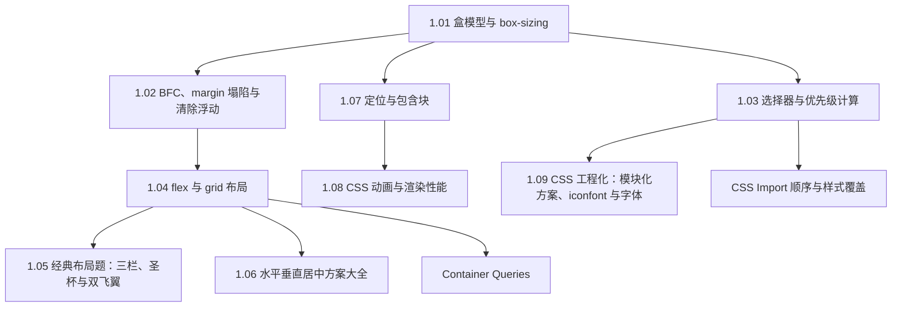

#CSS #index

# CSS 知识地图

> Library/CSS 总索引：阅读顺序、分组清单、概念速查

## 阅读顺序

盒模型和层叠规则是地基，布局题和工程化都建在上面。

---

## 文章清单

### 基础与层叠

| 文章 | 一句话定位 |
|---|---|
| [[1.01 盒模型与 box-sizing]] | 四层盒子；`border-box` 为何该全局默认，附 px/em/rem 单位题 |
| [[1.02 BFC、margin 塌陷与清除浮动]] | BFC 是隔离的布局小世界，三条特性正好对应三大应用 |
| [[1.03 选择器与优先级计算]] | `(a,b,c)` 三元组高位一票否决；同分时后出现的赢 |
| [[1.07 定位与包含块]] | position 五值 + 包含块；`transform` 导致「fixed 失效」的原因 |

### 布局

| 文章 | 一句话定位 |
|---|---|
| [[1.04 flex 与 grid 布局]] | 一维 vs 二维；`flex: grow shrink basis` 与 grid 的 fr/auto-fill/areas |
| [[1.05 经典布局题：三栏、圣杯与双飞翼]] | 「左右固定中间自适应」按时代分层的答案：flex/grid → 浮动负 margin |
| [[1.06 水平垂直居中方案大全]] | 按「知不知道子元素尺寸」分层答题，flex → grid → 定位 → 考古方案 |

### 动画、工程化与细节

| 文章 | 一句话定位 |
|---|---|
| [[1.08 CSS 动画与渲染性能]] | transition/animation/transform 三件套；只动 transform 和 opacity |
| [[1.09 CSS 工程化：模块化方案、iconfont 与字体]] | 模块化四代方案演进，图标与字体优化 |
| [[1.10 CSS 细节题集]] | 隐藏元素三巨头、文本溢出省略、变灰、点击穿透、安全区适配 |
| [[CSS Import 顺序与样式覆盖]] | 打包工具按 import 链输出 CSS，业务样式要排在第三方之后 |
| [[Container Queries]] | 按容器尺寸而非视口应用样式，Media Queries 的重要补充 |

---

## 概念速查（这个词在哪篇里讲透了）

| 概念 | 所在笔记 |
|---|---|
| content-box / border-box、margin 合并、px / em / rem | [[1.01 盒模型与 box-sizing]] |
| BFC、`display: flow-root`、清除浮动、高度塌陷 | [[1.02 BFC、margin 塌陷与清除浮动]] |
| 特异性三元组、`!important`、`:is()` / `:where()` / `:has()` | [[1.03 选择器与优先级计算]] |
| 主轴与交叉轴、flex 缩写、fr、`repeat(auto-fill, minmax())`、grid-template-areas | [[1.04 flex 与 grid 布局]] |
| 圣杯布局、双飞翼布局、负 margin | [[1.05 经典布局题：三栏、圣杯与双飞翼]] |
| absolute + transform 居中、margin auto 居中、table-cell | [[1.06 水平垂直居中方案大全]] |
| static/relative/absolute/fixed/sticky、包含块、百分比基准 | [[1.07 定位与包含块]] |
| `@keyframes`、合成层、GPU 加速、重排与重绘的分水岭 | [[1.08 CSS 动画与渲染性能]] |
| BEM、CSS Modules、CSS-in-JS、原子化、`font-display`、子集化 | [[1.09 CSS 工程化：模块化方案、iconfont 与字体]] |
| display:none / visibility:hidden / opacity:0、文本省略、`filter: grayscale`、`pointer-events`、安全区 | [[1.10 CSS 细节题集]] |
| 加载顺序覆盖、`@layer`、构建产物 CSS 顺序 | [[CSS Import 顺序与样式覆盖]] |
| `container-type`、`container-name`、cqw/cqh 单位 | [[Container Queries]] |

---

## 跨目录关联

- 样式为什么会阻塞渲染、回流重绘的机制 → [[2.03 浏览器渲染原理与回流重绘]]
- 动画的帧调度与 rAF → [[2.04 并发控制与耗时任务优化]]
- 移动端适配（rem 与 vw 两代方案）→ [[2.06 移动端适配与 JSBridge]]
- 微前端场景下的样式隔离 → [[1.04 CSS 隔离机制]]

---

## 维护说明

新增 CSS 笔记时：挂进「基础与层叠 / 布局 / 动画工程化与细节」之一，写一句定位并补概念速查。编号 `1.x` 是面试主线文章，专题短文（如 Container Queries）以名称成篇、不占编号。
