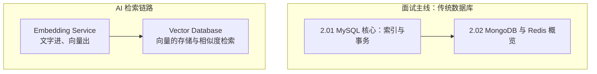

#数据库 #index

# 数据库知识地图

> Library/Database 总索引：分组清单与概念速查
> 本目录有两条互不相关的线：**面试主线**（MySQL / MongoDB / Redis）与 **AI 检索链路**（Embedding + 向量库）

## 两条线

---

## 文章清单

### 面试主线

| 文章 | 一句话定位 |
|---|---|
| [[2.01 MySQL 核心：索引与事务]] | 索引是 B+ 树；三大军规（最左前缀、别在索引列计算、覆盖索引免回表）+ 事务隔离级别 |
| [[2.02 MongoDB 与 Redis 概览]] | 文档数据库配 Mongoose 适合多变结构；Redis 五大结构管缓存、会话、分布式锁、排行榜 |

### AI 检索链路

| 文章 | 一句话定位 |
|---|---|
| [[Embedding Service]] | 文本 → 向量的服务层设计，是 RAG 与向量库的前置依赖 |
| [[Vector Database]] | 高维向量的存储与相似度搜索，RAG 系统的核心组件 |

---

## 概念速查（这个词在哪篇里讲透了）

| 概念 | 所在笔记 |
|---|---|
| B+ 树、聚簇索引、回表、覆盖索引、最左前缀、执行计划 | [[2.01 MySQL 核心：索引与事务]] |
| ACID、四种隔离级别、脏读/不可重复读/幻读、MVCC、锁 | [[2.01 MySQL 核心：索引与事务]] |
| BSON、Mongoose 建模、Redis 五大数据结构、缓存穿透/击穿/雪崩、分布式锁 | [[2.02 MongoDB 与 Redis 概览]] |
| 句级向量、批量嵌入、维度一致性、模型选型 | [[Embedding Service]] |
| 相似度搜索、近似最近邻、索引结构、元数据过滤 | [[Vector Database]] |

---

## 跨目录关联

- SQL 查询模式（排行榜、Top N、upsert、窗口函数）→ [[排行榜查询模式]]
- 向量与相似度的数学基础 → [[向量与点积]]
- 检索增强生成的完整链路 → [[RAG]]、[[Marauder'sMap/Library/AI/Index|AI 知识地图]]
- Node 侧的连接与部署 → [[Marauder'sMap/Library/Node/Index|Node.js 知识地图]]
- Python 侧的数据库访问 → [[4.05 数据库访问]]、[[4.04 资源池与连接池]]

---

## 维护说明

新增数据库笔记时：先判断属于「面试主线」还是「AI 检索链路」，挂进对应清单并写一句定位。编号 `2.x` 只给面试主线用（与 Library/Infrastructure 同属批次 7 的后端配套编号），AI 侧文章以名称成篇。
