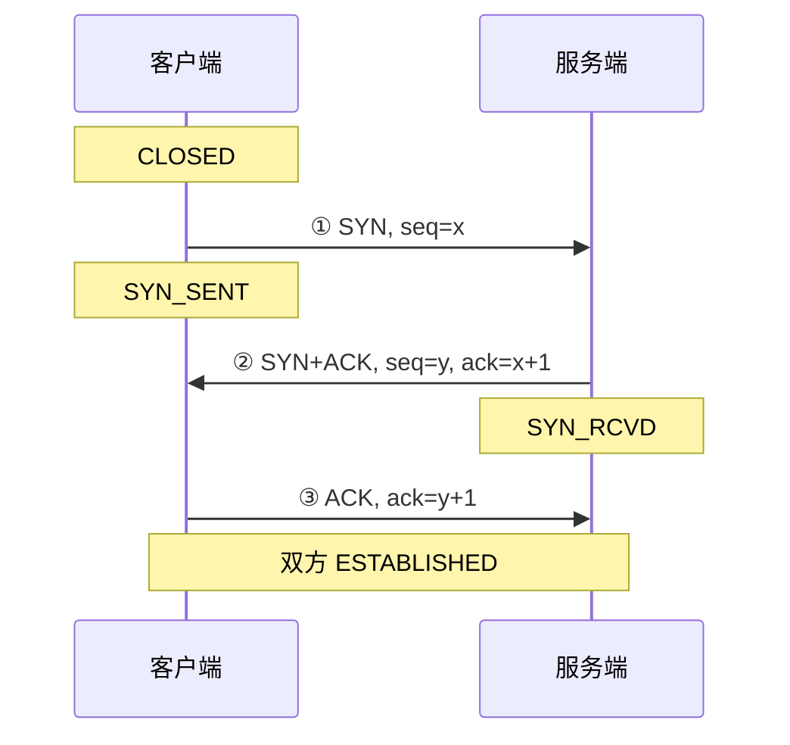
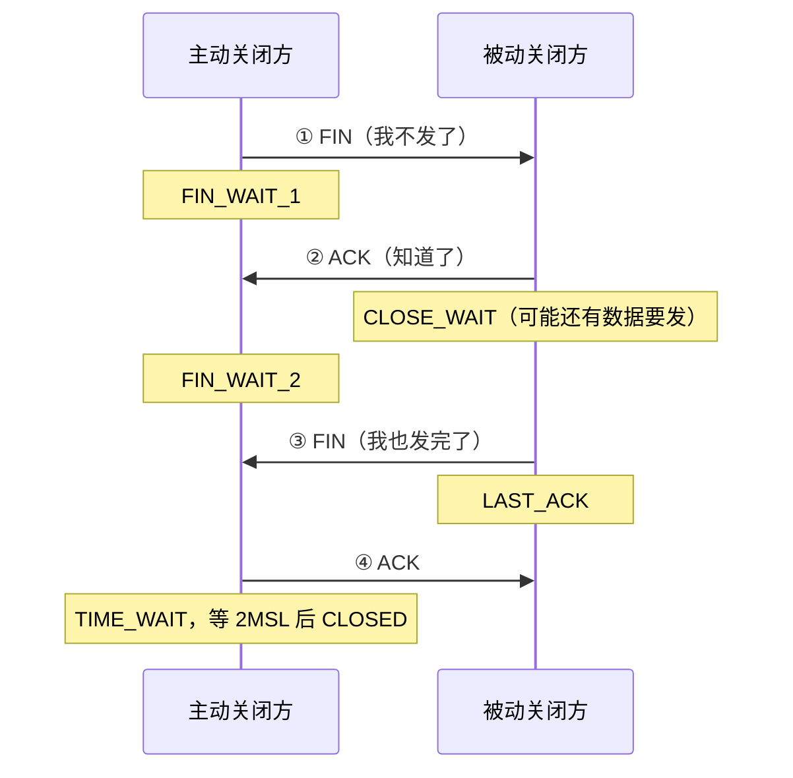

#网络 #TCP #面试

# 网络分层模型与 TCP 连接

## TL;DR

**分层的意义：每层只解决一件事**——以太网解决子网内点对点、IP 解决跨网络寻址、TCP 解决可靠传输、应用层协议（HTTP）定义语义。TCP 建连三次握手（双方各确认一次收发能力），断连四次挥手（两个方向分别关闭），这两张图必须能默写。

---

## 1. 分层模型

| TCP/IP 四层 | 职责（一句话） | 代表协议 |
|---|---|---|
| 应用层 | 定义数据语义 | HTTP、DNS、FTP、WebSocket |
| 传输层 | 端口到端口，可靠/不可靠传输 | TCP、UDP |
| 网络层 | 跨网络寻址与路由 | IP、ICMP |
| 网络接口层 | 子网内点对点通信、物理传输 | 以太网、Wi-Fi |

（OSI 七层是理论模型：应用/表示/会话三层在现实中合并为应用层，剩下与 TCP/IP 对应。面试报 TCP/IP 四层或五层即可，说清对应关系。）

发送数据 = 逐层**加包头**封装（HTTP 报文 → TCP 段 → IP 包 → 以太网帧），接收 = 逐层拆包。相关基础：MAC 地址标识网卡（链路层）、IP 地址标识主机（网络层，配合子网掩码 AND 运算判断是否同一子网）、端口标识进程（传输层）。

---

## 2. TCP vs UDP

| | TCP | UDP |
|---|---|---|
| 连接 | 面向连接（握手） | 无连接 |
| 可靠性 | 可靠：确认、重传、排序、流控、拥塞控制 | 尽力而为，可能丢、乱序 |
| 形态 | 字节流（无边界 → 粘包问题） | 数据报（有边界） |
| 头部 | 20 字节起 | 8 字节 |
| 场景 | HTTP/1、HTTP/2、文件传输 | DNS 查询、音视频、游戏；**HTTP/3 的 QUIC 基于 UDP** |

---

## 3. 三次握手

**为什么是三次，不是两次？** 核心目标是**双方都确认「自己和对方的收发能力都正常」并同步初始序号（ISN）**：

- 第①次后：服务端知道「客户端能发、我能收」；
- 第②次后：客户端知道「四种能力全正常」；
- 第③次后：服务端才知道「我能发、客户端能收」。

只握两次的问题：服务端无法确认客户端收到了自己的 SYN+ACK；且**历史重复的 SYN**（网络中滞留的旧连接请求）会让服务端单方面建立无效连接，浪费资源——第三次 ACK 给了客户端拒绝旧连接的机会。

---

## 4. 四次挥手

**为什么四次？** TCP 全双工，两个方向要**分别关闭**。被动方收到 FIN 时可能还有数据没发完，所以 ACK（②）和自己的 FIN（③）不能合并——先应答，发完剩余数据再关自己的方向。

**TIME_WAIT 为什么等 2MSL**（报文最大生存时间的两倍）：一保证最后的 ACK 若丢失、对方重发 FIN 时还能应答；二让本连接的旧报文在网络中自然消亡，不污染下一个相同四元组的新连接。

---

## 5. 可靠传输的机制速览（追问层）

- **Seq/ACK**：每字节编号；`本包 seq = 上包 seq + 上包数据长度`，`ack = 期望收到的下一个 seq`；
- **重传**：超时重传 + 快速重传（连收 3 个重复 ACK 立即重发）；
- **流量控制**：ACK 里携带接收窗口剩余容量，防止发得比对方收得快；
- **拥塞控制**：慢启动（指数增长）→ 拥塞避免（线性）→ 丢包后降速。初始拥塞窗口约 10 个 MSS（约 14KB）——这就是「首屏关键资源控制在 14KB 内可省一个往返」的出处；
- 一个 TCP 连接可以承载多次 HTTP 通信（Keep-Alive），HTTP 靠 Content-Length / chunked 划分消息边界。

---

## 面试问答

### Q: 讲讲三次握手的过程？为什么不能两次？

满分答案：客户端 SYN(seq=x) → 服务端 SYN+ACK(seq=y, ack=x+1) → 客户端 ACK(ack=y+1)，两端进入 ESTABLISHED；过程同步了双方初始序号。两次不够的原因：服务端发出 SYN+ACK 后无法确认客户端收到，「服务端发、客户端收」这条能力链没有闭环；并且网络中滞留的历史 SYN 会让服务端误建无效连接——第三次 ACK 正是客户端对「这是不是我当前想要的连接」的最终确认。

### Q: 为什么挥手要四次？TIME_WAIT 是干什么的？

满分答案：TCP 全双工，两个方向独立关闭：主动方 FIN、被动方先 ACK（此时它可能还有数据要发，处于 CLOSE_WAIT），发完后再发自己的 FIN，主动方最后 ACK——ACK 与 FIN 不能合并所以是四次。主动方最后进 TIME_WAIT 等 2MSL：既保证最后的 ACK 丢失后能重发（对方会重发 FIN），也让旧连接的报文自然过期，避免串扰复用同一四元组的新连接。大量 TIME_WAIT 是高并发短连接服务的经典问题，解法是连接复用。

### Q: TCP 和 UDP 的区别？各用在哪？

满分答案：TCP 面向连接、字节流、通过确认重传排序流控拥塞控制保证可靠，代价是握手延迟和头部开销；UDP 无连接、数据报、不保证可靠但轻快。选型：可靠性优先走 TCP（网页、API、文件）；实时性优先走 UDP（音视频、游戏、DNS）。加分点：HTTP/3 的 QUIC 构建在 UDP 上，在用户态实现了可靠性与多路复用，兼得低延迟和可靠。

### Q: 网络分层模型是什么？为什么要分层？

满分答案：TCP/IP 四层——应用层管语义（HTTP/DNS）、传输层管端口到端口（TCP/UDP）、网络层管跨网寻址路由（IP）、链路层管子网内传输（以太网）。分层是关注点分离：每层只依赖下层提供的服务、对上层提供接口，任一层可独立演进（比如 HTTP/3 换掉传输层，应用代码无感知）。发送时逐层封装加头，接收时逐层解封。
