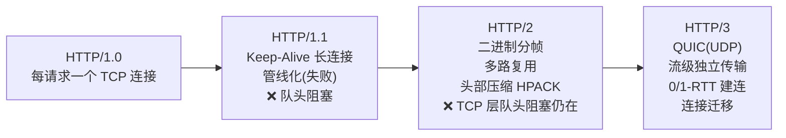

#网络 #HTTP #面试

# HTTP 协议与版本演进

## TL;DR

**HTTP/1.1 的病是队头阻塞，HTTP/2 用二进制分帧 + 多路复用治了应用层的，HTTP/3 用 QUIC（基于 UDP）连传输层的也治了**。版本演进这条线 + 常用方法/状态码/头部，构成 HTTP 面试的主干。

---

## 1. 报文与方法

请求报文 = 请求行（方法 + 路径 + 版本）+ 头部 + 空行 + body；响应报文 = 状态行 + 头部 + 空行 + body。

| 方法 | 语义 | 幂等 | 安全 |
|---|---|---|---|
| GET | 获取资源 | ✓ | ✓ |
| POST | 提交/创建 | ✗ | ✗ |
| PUT | 整体替换 | ✓ | ✗ |
| PATCH | 局部修改 | ✗ | ✗ |
| DELETE | 删除 | ✓ | ✗ |
| HEAD | 只要响应头 | ✓ | ✓ |
| OPTIONS | 询问服务器能力（Allow）；CORS 预检 | ✓ | ✓ |

GET vs POST 的规范答法：语义不同（获取 vs 提交）、GET 参数在 URL（有长度事实限制、进历史/日志）、GET 可缓存可收藏、POST 默认不缓存；「GET 更不安全因为参数可见」是表象，两者不加密时同样裸奔——安全靠 HTTPS。

OPTIONS 的两个用途：普通场景询问服务器支持的方法（返回 Allow）；CORS 中作**预检请求**，携带 Access-Control-Request-Method/Headers 与 Origin，服务器用 Access-Control-Allow-* 应答（详见 [[1.06 同源策略与跨域]]）。

---

## 2. 状态码（按类记 + 高频细节）

- **1xx** 信息；**2xx** 成功：200、204（无 body，预检常用）、206（分片，断点续传）
- **3xx** 重定向：
  - 301/308 永久，302/303/307 临时；
  - **区分记忆**：301、302 是老状态码，实践中浏览器可能把 POST 改写成 GET；**307/308 严格保持原方法**（307 临时、308 永久）；303 明确要求改为 GET；
  - 304 Not Modified：协商缓存命中（见 [[1.04 HTTP 缓存策略]]）
- **4xx** 客户端错误：400、401 未认证、403 已认证但无权限、404、405 方法不允许、429 限流
- **5xx** 服务端错误：500、502 网关收到上游无效响应、503 过载/维护、504 网关等上游超时

---

## 3. 版本演进主线（必考叙事）

**HTTP/1.1**：默认长连接复用 TCP；但一个连接上请求必须**串行**应答——前一个响应没回来，后面全排队（应用层队头阻塞）。浏览器的缓解手段：每域名开 6 个左右并发连接 + 域名分片（这也是雪碧图、资源合并等老优化的动机）。

**HTTP/2**：
- **二进制分帧**：报文拆成帧，流 ID 标识归属；
- **多路复用**：一个 TCP 连接上无限并发流，彻底解决应用层队头阻塞——雪碧图/域名分片反而成了反模式；
- **头部压缩 HPACK**：静态表 + 动态表 + 哈夫曼，重复头几乎零成本（HTTP/1 每个请求都带全量 Cookie 的痛点没了）；
- 服务端推送（Server Push）——注意现状：**Chrome 已移除支持**，被 103 Early Hints + preload 取代，面试提这个更新很加分；
- 遗留问题：TCP 是字节流，**丢一个包整个连接所有流都得等重传**（传输层队头阻塞）。

**HTTP/3**：
- 换传输层：**QUIC 基于 UDP**，在用户态实现可靠传输、拥塞控制、TLS 1.3（内建加密，不可明文）；
- 流与流**独立重传**——丢包只阻塞所在流，传输层队头阻塞终结；
- 建连快：QUIC 把传输握手与 TLS 握手合一，1-RTT 起步，回访 0-RTT；
- **连接迁移**：连接由 Connection ID 标识而非四元组，Wi-Fi 切 4G 不断连。

---

## 4. 高频头部速览

| 头 | 用途 |
|---|---|
| Content-Type / Content-Length | body 类型与长度（长度也是 TCP 流上的消息边界依据） |
| Transfer-Encoding: chunked | 分块传输，边生成边发 |
| Cache-Control / ETag / Last-Modified | 缓存（见 [[1.04 HTTP 缓存策略]]） |
| Location | 配合 3xx 指示新地址 |
| Content-Encoding: gzip/br | 压缩算法（br = Brotli，压缩率更高） |
| Accept-* / Content-Negotiation | 内容协商 |
| Range / Content-Range | 断点续传、大文件分片下载 |

---

## 面试问答

### Q: HTTP/1.1、HTTP/2、HTTP/3 的核心区别？

满分答案：按解决什么问题讲——1.1 用 Keep-Alive 复用连接，但同一连接上响应串行，存在应用层队头阻塞，只能靠多开连接缓解；2 用二进制分帧和流实现单连接多路复用、HPACK 头部压缩，解决应用层队头阻塞，但 TCP 丢包会阻塞全部流；3 把传输层换成基于 UDP 的 QUIC，流间独立重传根治队头阻塞，握手合并做到 1-RTT/0-RTT，还支持连接迁移。加分点：HTTP/2 的 Server Push 已被 Chrome 移除，业界转向 103 Early Hints。

### Q: GET 和 POST 的区别？

满分答案：本质是语义不同——GET 获取、幂等、可缓存、可收藏；POST 提交、非幂等、默认不缓存。参数位置（URL vs body）带来工程差异：GET 参数进历史与日志、受 URL 长度事实限制。纠偏两点：安全性差异不在明文与否（都要靠 HTTPS），「GET 产生一个 TCP 包、POST 两个」是不可靠的经验说法，不应作为标准答案。

### Q: 301、302、307、308 有什么区别？

满分答案：按「永久/临时 × 是否保持方法」四象限记——301 永久、302 临时，都是老状态码，重定向时浏览器可能把 POST 变 GET；308 永久、307 临时，严格保持原方法和 body；303 则明确要求转为 GET（常用于表单提交后跳结果页）。永久重定向会被浏览器强缓存，改错了很难撤销，工程上要慎用 301。

### Q: 状态码 502 和 504 的区别？

满分答案：都是网关（如反向代理）层的错——502 是网关收到了上游的响应但无效/连接被拒（上游挂了或崩了）；504 是网关在超时时间内没等到上游响应（上游太慢或网络不通）。排查方向：502 看上游服务进程状态，504 看上游耗时与超时配置。
