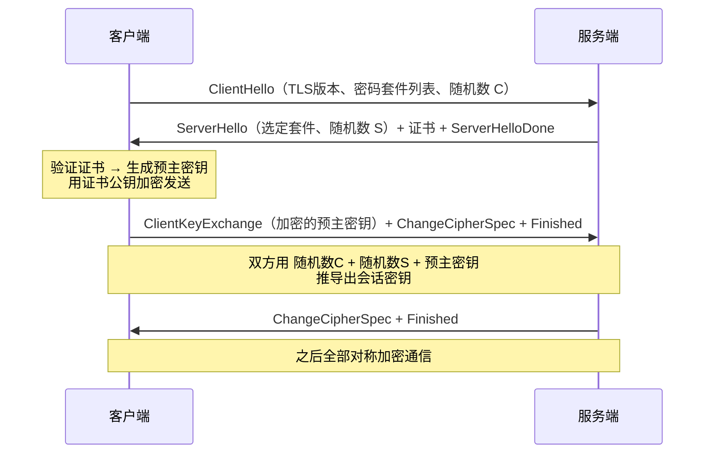

#网络 #HTTPS #TLS #安全 #面试

# HTTPS 与 TLS 握手

## TL;DR

**HTTPS = HTTP + TLS，解决 HTTP 的三大裸奔问题：窃听（加密）、篡改（摘要校验）、冒充（证书）**。加密方案是「混合加密」：非对称加密只用来安全地协商出会话密钥，之后全程对称加密。TLS 1.3 把握手压到 1-RTT，废除了一批不安全算法。

---

## 1. HTTP 明文的三个风险 → HTTPS 的三个对策

| 风险 | 对策 | 手段 |
|---|---|---|
| 窃听 | 机密性 | 混合加密（非对称协商 + 对称传输） |
| 篡改 | 完整性 | 摘要/MAC，TLS 1.3 用 AEAD（加密与校验一体） |
| 冒充 | 身份认证 | 数字证书（CA 签名背书的公钥） |

**为什么混合加密**：对称加密快但「密钥怎么安全送达」无解；非对称加密解决了密钥交换但慢一两个数量级。于是：握手阶段用非对称方法协商出**会话密钥**，数据阶段全部用它做对称加密——两者取长补短。

---

## 2. 证书：信任从哪来

证书 = 服务器公钥 + 域名等信息 + **CA 的数字签名**（CA 用自己的私钥对证书摘要签名）。

浏览器校验链路：用内置的 CA 根证书公钥逐级验证签名 → 核对域名、有效期、吊销状态。信任的根基是「操作系统/浏览器预装的根 CA 列表」。

**中间人为什么伪造不了**：中间人可以换公钥，但拿不到 CA 私钥、签不出合法签名；自签证书会触发浏览器红色警告（除非用户手动信任——这也是抓包工具 Charles/Fiddler 能解 HTTPS 的原理：让你主动安装它的根证书）。

---

## 3. TLS 1.2 握手（经典 2-RTT，理解原理用）

三个随机数缺一不可：单靠预主密钥，若某端随机性差密钥就可预测；三方拼合保证每次会话密钥都新鲜。

**ECDHE vs RSA 密钥交换**：RSA 方式的预主密钥由客户端生成、公钥加密传输——服务器私钥一旦泄露，历史流量全部可解；ECDHE 每次会话临时生成密钥对做 Diffie-Hellman 交换，私钥泄露也解不了过去的流量，即**前向安全**。这是 TLS 1.3 只保留 ECDHE 的原因。

---

## 4. TLS 1.3：更快更安全（现状答案）

- **1-RTT 握手**：ClientHello 直接带上密钥交换参数（key_share），服务端一个回合就能算出会话密钥；会话恢复可 **0-RTT**（有重放风险，幂等请求才用）；
- **砍掉不安全遗产**：RSA 密钥交换、静态 DH、CBC 套件、SHA-1、压缩全部移除，密码套件从几十种精简到 5 种；
- 证书等握手消息也加密传输；
- HTTP/3 的 QUIC 内建 TLS 1.3，把传输握手和加密握手合并（见 [[1.02 HTTP 协议与版本演进]]）。

---

## 5. 工程关联

- 混合内容（HTTPS 页面加载 HTTP 资源）会被浏览器拦截或警告；
- HSTS 头（Strict-Transport-Security）强制后续访问走 HTTPS，防降级/首跳劫持；
- 证书链不全、过期、域名不匹配是线上 HTTPS 故障三大常客；
- CDN 场景的证书在边缘节点终止 TLS（见 [[1.05 DNS 与 CDN]]）。

---

## 面试问答

### Q: HTTPS 为什么安全？加密过程讲一下？

满分答案：HTTPS 在 HTTP 与 TCP 之间加了 TLS 层，针对明文三风险给出三对策——混合加密防窃听、摘要校验防篡改、CA 证书防冒充。流程：握手阶段客户端验证服务器证书后，双方用非对称手段（现代是 ECDHE）协商出会话密钥（TLS 1.2 靠三个随机数推导），之后应用数据全走对称加密。混合的原因：非对称解决密钥分发但慢，对称快但发不了密钥，各取所长。

### Q: 数字证书怎么防中间人？

满分答案：证书是 CA 用私钥对「服务器公钥 + 域名」摘要的签名背书，浏览器用预置的根 CA 公钥逐级验签，再核对域名和有效期。中间人换了公钥就得重签，但没有 CA 私钥签不出来；自签证书会触发警告。补充：抓包工具能解 HTTPS 正是因为用户手动信任了它的根证书，等于自己请了个中间人。

### Q: TLS 1.3 相比 1.2 改进了什么？

满分答案：握手从 2-RTT 减到 1-RTT（ClientHello 直接携带 key_share），会话恢复支持 0-RTT（注意重放风险）；只保留带前向安全的 ECDHE 密钥交换，废除 RSA 交换、CBC、SHA-1 等不安全算法，套件大幅精简；握手消息本身也加密。一句话：更少往返、默认前向安全。

### Q: 什么是前向安全？

满分答案：即使服务器长期私钥将来泄露，攻击者也无法解密之前录下的历史流量。RSA 密钥交换不具备（预主密钥用服务器公钥加密，私钥一泄全解）；ECDHE 每次会话用临时密钥对做 DH 交换、用完即弃，session 之间互相隔离，因此具备前向安全——这也是它成为 TLS 1.3 唯一选择的原因。
