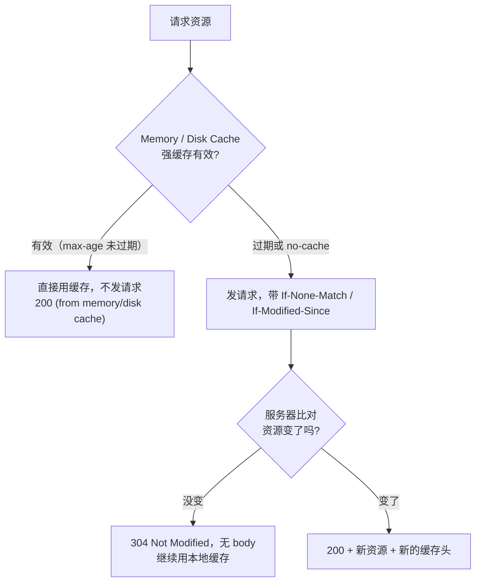

#网络 #HTTP #缓存 #面试

# HTTP 缓存策略

## TL;DR

**先强缓存后协商缓存：强缓存命中不发请求（200 from cache），过期了带上 ETag/Last-Modified 去问服务器，没变就 304 继续用**。工程标配：HTML 用 `no-cache` 走协商，带 hash 的静态资源 `max-age=31536000, immutable` 一年强缓存——文件一改名，缓存天然失效。

---

## 1. 全景：一次资源请求的缓存决策



浏览器侧的缓存层次（按优先级）：Memory Cache（本次会话内存，tab 关闭失效）→ Service Worker Cache（可编程）→ HTTP Cache（磁盘，本文主角）→ Push Cache。同一资源首次命中在内存，关掉 tab 再开通常就是 disk cache。

---

## 2. 强缓存：Cache-Control 逐项说

| 指令 | 含义 |
|---|---|
| `max-age=秒` | 有效期（相对时间），期内不发请求 |
| `no-cache` | **可以缓存，但每次必须协商验证**（名字有迷惑性） |
| `no-store` | 真·不缓存，啥也不存 |
| `private` / `public` | 仅浏览器可存 / 中间代理（CDN）也可存 |
| `immutable` | 有效期内**连刷新都不发请求**（正常刷新会触发协商，immutable 把这一步也省了，杀掉无意义 304） |
| `s-maxage=秒` | 只对共享缓存（CDN）生效，优先于 max-age |
| `stale-while-revalidate=秒` | 过期后先用旧的，后台异步刷新（SWR 名字的来源） |

`Expires` 是 HTTP/1.0 的绝对过期时间，受客户端时钟影响，与 max-age 同在时**被忽略**；`Pragma: no-cache` 同为 1.0 兼容遗产。

---

## 3. 协商缓存：两对头部

| 响应头（服务器给） | 请求头（下次带上） | 比对内容 |
|---|---|---|
| `Last-Modified` | `If-Modified-Since` | 文件最后修改时间（秒级） |
| `ETag` | `If-None-Match` | 资源内容指纹 |

流程（两者一致）：首次响应携带标识 → 再次请求带回 → 服务器比对 → 没变回 304（无 body），变了回 200 + 新内容 + 新标识。

**ETag 优先级高于 Last-Modified**：两者同时存在时，服务器应忽略 If-Modified-Since（MDN 明确）。

**Last-Modified 的三个不足**（为什么需要 ETag）：秒级精度，1 秒内多次修改测不出；内容没变但 mtime 变了（重新部署 touch 文件）导致缓存失效；反过来编辑后又撤销，时间变了内容没变。

**ETag 怎么生成**：规范不限定。Nginx 的实现是 `Last-Modified 十六进制 + Content-Length` 拼接（弱验证器，前缀 `W/`）；强验证器一般是内容哈希。弱 ETag 语义等同即可，强 ETag 要求字节相同。ETag 的另一用途：配合 `If-Match` 做乐观锁，防协同编辑「空中碰撞」。

---

## 4. 工程标准答案：HTML 不缓存 + hash 资源长缓存

```text
# HTML 入口：每次协商，保证拿到最新资源清单
index.html      →  Cache-Control: no-cache

# 带内容 hash 的静态资源：一年强缓存 + immutable
app.3f9d2c.js   →  Cache-Control: max-age=31536000, immutable
```

原理：入口 HTML 永远新鲜，而它引用的 JS/CSS 文件名含内容 hash——内容一变文件名就变，等于**用改名代替缓存失效**，旧文件永不弄脏、新文件立即生效。这就是「为什么打包产物要带 hash」的完整答案。

相关操作题「设置 index.html 不缓存」：服务端对 HTML 响应设 `Cache-Control: no-cache`（或 `no-store` 一刀切）；CDN 上单独给 HTML 配短 TTL/不缓存；改版后主动刷新 CDN。

---

## 5. 刷新行为对缓存的影响（细节加分）

| 操作 | 行为 |
|---|---|
| 地址栏回车 / 正常导航 | 完整走强缓存 → 协商缓存 |
| F5 / 普通刷新 | 跳过强缓存有效期判断，一律协商（immutable 资源除外） |
| Ctrl+F5 / 强制刷新 | 请求头带 `Cache-Control: no-cache`，强缓存协商缓存全跳过 |

---

## 面试问答

### Q: 讲讲强缓存和协商缓存？

满分答案：强缓存由 Cache-Control: max-age（或旧的 Expires）控制，有效期内不发请求直接用本地副本，状态显示 from memory/disk cache；过期后进入协商缓存——带 If-None-Match（对 ETag）或 If-Modified-Since（对 Last-Modified）询问服务器，未变化返回 304 无 body 继续用缓存，变化则 200 返回新资源。顺序永远是先强后协商。加分点：no-cache 是「缓存但必须验证」不是「不缓存」，不缓存是 no-store。

### Q: ETag 和 Last-Modified 的区别？为什么有了 Last-Modified 还要 ETag？

满分答案：Last-Modified 基于文件修改时间，秒级精度，一秒内多次修改感知不到，且部署 touch 文件会造成「时间变了内容没变」的无效失效；ETag 是内容指纹，只认内容。两者共存时 ETag 优先。生成方式规范未限定：Nginx 用 Last-Modified + Content-Length 拼弱 ETag，严格做法是内容哈希。代价：ETag 需要计算，分布式多机还要保证生成算法一致，否则负载均衡后缓存永远 miss。

### Q: 前端项目的缓存方案怎么设计？

满分答案：HTML 入口 no-cache 走协商保证最新；JS/CSS/图片文件名带内容 hash，设 max-age 一年加 immutable 强缓存——内容变化即文件名变化，用改名代替失效，旧缓存永不脏读。配合 CDN 时给共享缓存设 s-maxage，发版后刷新 HTML 的 CDN 缓存即可。这套方案同时拿到「最新性」和「几乎为零的重复下载」。

### Q: 304 是怎么产生的？什么情况下永远不会 304？

满分答案：协商缓存命中时产生——服务器比对 If-None-Match/If-Modified-Since 认定资源未变，返回 304 空 body。不会出现 304 的情况：强缓存有效期内（根本不发请求）；no-store（每次全量 200）；资源加了 immutable（有效期内连刷新触发的协商都被跳过，这个指令的设计目标就是消灭无意义 304）。
