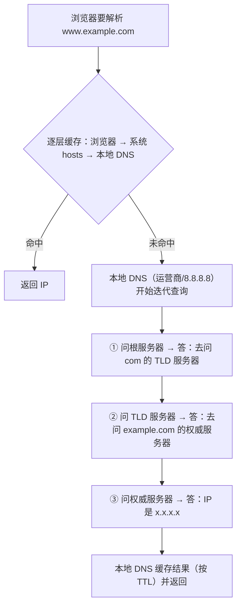
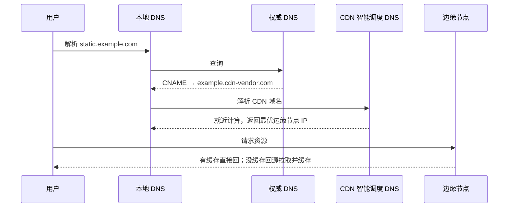

#网络 #DNS #CDN #面试

# DNS 与 CDN

## TL;DR

**DNS 把域名逐级解析成 IP（本地缓存 → 本地 DNS 递归 → 根 → 顶级域 → 权威服务器迭代）；CDN 的入口正是 DNS：把域名 CNAME 到 CDN 域名，由 CDN 的智能调度返回离用户最近的边缘节点 IP**。记住 A 记录=域名到 IP、CNAME=域名到域名。

---

## 1. 域名的树状结构

`www.example.com.` 从右往左：`.` 根域名 → `com` 顶级域名（TLD）→ `example` 二级域名（你注册的）→ `www` 三级域名（主机名/子域名）。每一级有自己的 DNS 服务器，**只有上一级才知道下一级去哪查**——这是逐级查询的结构基础。

常用记录类型：

| 记录 | 作用 |
|---|---|
| **A / AAAA** | 域名 → IPv4 / IPv6 地址 |
| **CNAME** | 域名 → 另一个域名（别名，接入 CDN 的钥匙） |
| NS | 该域名由哪台权威服务器负责 |
| TXT | 文本（域名所有权验证、SPF） |
| MX | 邮件服务器 |

一个域名可对应多个 IP（负载均衡），一个 IP 也可服务多个域名。

---

## 2. DNS 解析全过程

两种查询角色：客户端到本地 DNS 是**递归查询**（你只管要结果），本地 DNS 到根/TLD/权威是**迭代查询**（每一步拿到「下一个该问谁」）。

传输层细节（加分）：DNS 查询走 **UDP 53**，一问一答两个包搞定；响应超过限制被截断时才改用 TCP。「根服务器只有 13 台」的真相：早期 512 字节 UDP 报文最多装 13 组根服务器记录，所以根服务器**命名**只有 A–M 13 个，实际靠**任播（Anycast）**在全球部署了上千个镜像实例。

---

## 3. CDN：把内容搬到用户家门口

CDN（内容分发网络）= 遍布各地的边缘缓存节点 + 智能调度系统。加速的两笔账：物理距离近了（RTT 小），源站压力小了（缓存扛量）。

**接入方式就是 DNS**——把自己的域名 CNAME 到 CDN 服务商域名：

命中逻辑：边缘节点有缓存且未过期 → 直接返回；否则**回源**（向源站取），存下来再给用户。缓存时长由源站响应头（Cache-Control/s-maxage）或 CDN 控制台规则决定——与 [[1.04 HTTP 缓存策略]] 同一套语义。

**刷新与预热**（运维两板斧）：发版后「刷新」让边缘缓存立即失效强制回源；大促前「预热」提前把资源推到边缘节点，防止首批用户全部回源打挂源站。

---

## 4. OSS 与 CDN 的关系（经典搭配题）

- **OSS（对象存储）**：解决「存」——海量文件、高可用、超高带宽上限，但节点在固定地域、每次请求都到它那里，**本身没有边缘缓存**；
- **CDN**：解决「送」——就近分发和缓存，但它不存源数据，未命中要回源。

标准架构：**OSS 做源站，CDN 做分发**。静态资源传 OSS，CDN CNAME 指向 OSS，用户请求命中边缘缓存，未命中回源 OSS。省钱账：CDN 流量单价低于 OSS 外网流出，且缓存大幅减少回源流量。

---

## 面试问答

### Q: 输入域名后 DNS 解析的完整过程？

满分答案：先查缓存链——浏览器缓存、系统 hosts、本地 DNS 缓存；未命中则本地 DNS 发起迭代查询：问根服务器得到 TLD 服务器地址，问 TLD 得到权威服务器地址，问权威服务器拿到 IP，逐级缓存后返回。客户端到本地 DNS 是递归查询，本地 DNS 往上是迭代查询。加分点：走 UDP 53、超长截断转 TCP；结果按 TTL 缓存。

### Q: A 记录和 CNAME 的区别？CNAME 有什么用？

满分答案：A 记录把域名指向 IP，CNAME 把域名指向另一个域名（别名），解析会沿着 CNAME 链继续直到拿到 A 记录。CNAME 的核心价值是解耦：目标 IP 变化时上游无感——接入 CDN 就是把域名 CNAME 给 CDN 服务商，由其调度系统动态返回最优节点 IP；换云、换负载均衡也一样。限制：根域名（裸域）按规范不能配 CNAME。

### Q: CDN 的加速原理？

满分答案：两层——DNS 调度 + 边缘缓存。域名 CNAME 到 CDN 后，CDN 的智能 DNS 按用户位置、节点负载返回最近的边缘节点 IP；节点有缓存直接响应，没有则回源拉取并缓存。收益是 RTT 缩短和源站卸载。工程配套：缓存策略沿用 HTTP 缓存头（s-maxage 只管 CDN）、发版刷新、大促预热、回源限流。

### Q: 为什么说根域名服务器只有 13 台？

满分答案：这是历史误读——早期 DNS 用 512 字节 UDP 报文，最多容纳 13 组根服务器地址，所以根服务器「编号」只有 A 到 M 共 13 个；实际通过任播技术，同一个 IP 在全球部署了上千个镜像节点，就近应答。这题考的是 UDP 报文限制 + Anycast 两个知识点。
