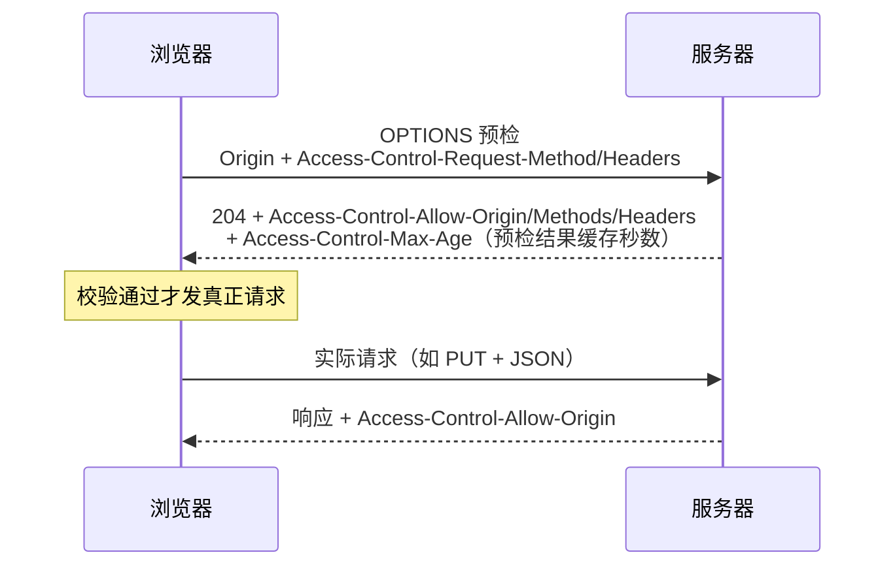

#网络 #跨域 #CORS #面试

# 同源策略与跨域

## TL;DR

**同源 = 协议 + 域名 + 端口三者完全一致，是浏览器的安全限制（服务器之间没有跨域一说）**。主流解法就三个：CORS（标准方案，服务器发头授权）、开发环境代理（同源中转）、Nginx 反向代理；JSONP 是历史方案，原理（script 不受同源限制）仍常被问。

---

## 1. 同源策略限制什么、为什么要有

三个「不许」：不许读跨源页面的 DOM（防 iframe 套壳偷密码）、不许读跨源响应（XHR/fetch 拿不到结果——注意**请求发出去了**，是响应被浏览器拦下）、限制跨源 Cookie/存储访问（防身份冒用）。

不受限制的标签（跨域方案的原料）：`<script src>`、``、`<link>`、`<video>`、`<iframe>`（能加载不能读内容）——它们只能「加载执行」，不能「读取响应内容」。

---

## 2. CORS：标准答案（重点背）

浏览器把跨域请求分两类：

**简单请求**（同时满足：方法是 GET/HEAD/POST；头部只动 Accept、Accept-Language、Content-Language、Content-Type 等安全清单；Content-Type 限 `text/plain`、`multipart/form-data`、`application/x-www-form-urlencoded`）——直接发送，自动带 `Origin` 头，浏览器检查响应里的 `Access-Control-Allow-Origin` 是否放行。

**非简单请求**（如 `Content-Type: application/json`、带自定义头、PUT/DELETE）——先发 **OPTIONS 预检**：



响应头速查：

| 头 | 作用 |
|---|---|
| `Access-Control-Allow-Origin` | 放行的源：`*` 或具体源（带凭据时**不能用 \*** ） |
| `Access-Control-Allow-Methods` / `-Headers` | 预检应答：允许的方法/头 |
| `Access-Control-Max-Age` | 预检结果缓存，减少 OPTIONS 次数 |
| `Access-Control-Allow-Credentials` | 允许携带 Cookie |
| `Access-Control-Expose-Headers` | 允许 JS 读取的额外响应头（默认只能读少数基本头） |
| `Vary: Origin` | 按 Origin 区分缓存，动态回源头时必配 |

**携带 Cookie 三件套**（一个都不能少）：前端 `fetch(..., { credentials: 'include' })` 或 XHR `withCredentials = true`；服务端 `Access-Control-Allow-Credentials: true`；`Allow-Origin` 必须是**具体源**。第三方 Cookie 还受 SameSite 约束（见 [[2.05 浏览器存储：Cookie、Web Storage 与 IndexedDB]]）。

---

## 3. JSONP：历史方案，原理必会

利用 `<script src>` 不受同源限制：把回调函数名拼进 URL，服务器返回一段「调用该函数并传入数据」的 JS：

```js
function jsonp(url, params) {
  return new Promise((resolve, reject) => {
    const cb = `jsonp_${Date.now()}`;
    window[cb] = (data) => {          // 注册全局回调
      resolve(data);
      delete window[cb];
      script.remove();
    };
    const script = document.createElement('script');
    const query = new URLSearchParams({ ...params, callback: cb });
    script.src = `${url}?${query}`;
    script.onerror = reject;
    document.head.appendChild(script);
  });
}
// 服务端返回：jsonp_1712345678({"user":"admin"})
```

缺点决定了它被 CORS 淘汰：**只支持 GET**、无错误状态区分、纯文本注入式执行有安全风险（必须绝对信任服务方）。

---

## 4. 代理类方案与其他

- **开发环境**：webpack devServer / Vite 的 `server.proxy` ——浏览器请求同源的开发服务器，由它转发到后端（服务器之间无同源限制）；
- **生产环境**：Nginx 反向代理，前端与 API 收敛到同一域名下（`/api` 转发上游）；
- **iframe 页面间通信**：`window.postMessage`（标准、双向、可控 origin）；同主域子域间旧法 `document.domain` **已被浏览器废弃**，别再答；
- **WebSocket**：协议本身无同源限制（服务端应校验 Origin，见 [[1.09 WebSocket 与实时通信]]）。

---

## 面试问答

### Q: 什么是跨域？浏览器为什么要有同源策略？

满分答案：协议、域名、端口任一不同即跨域，同源策略是浏览器行为——跨域时请求其实到达了服务器，是响应被浏览器拦截。目的：阻止恶意页面读取其他源的 DOM、响应数据和 Cookie，否则任何网页都能 iframe 你的网银并偷读内容、带着你的 Cookie 冒充你请求接口（这也是 CSRF 防护的边界，见 [[1.07 Web 安全：XSS 与 CSRF]]）。

### Q: CORS 的简单请求和预检请求怎么区分？

满分答案：方法为 GET/HEAD/POST，且头部不出安全清单、Content-Type 限 text/plain、multipart/form-data、x-www-form-urlencoded 三种的是简单请求，直接发送靠响应的 Allow-Origin 判定；否则先发 OPTIONS 预检，带 Access-Control-Request-Method/Headers，服务器用 Allow-Methods/Headers 应答，通过后才发真实请求，Access-Control-Max-Age 可缓存预检结果。典型触发预检的场景：Content-Type: application/json 或带 Authorization 自定义头。

### Q: 跨域时怎么携带 Cookie？

满分答案：三个条件缺一不可——前端声明凭据模式（fetch credentials: 'include' / XHR withCredentials）；服务端 Access-Control-Allow-Credentials: true；且 Access-Control-Allow-Origin 必须回具体源不能是通配符。再叠加 Cookie 自身的 SameSite=None; Secure 才能作为第三方 Cookie 发送。

### Q: JSONP 的原理和缺点？

满分答案：script 标签加载不受同源策略限制，把全局回调函数名拼在 URL 上，服务器返回「回调名(数据)」形式的 JS，脚本执行即完成数据传递。缺点：只能 GET、没有 HTTP 错误语义、把执行权交给对方存在注入风险，现已被 CORS 全面取代——但它体现的「利用不受限资源加载通信」思路仍是面试考察点。

### Q: 生产环境和开发环境分别怎么解决跨域？

满分答案：开发环境用构建工具的 devServer 代理，浏览器始终请求同源，代理服务器转发（服务器间无同源限制）；生产环境首选服务端 CORS 头授权，或 Nginx 反向代理把前端与 API 收敛到同一域名。选择逻辑：能改后端就 CORS（标准、细粒度），不能改就代理收口。
