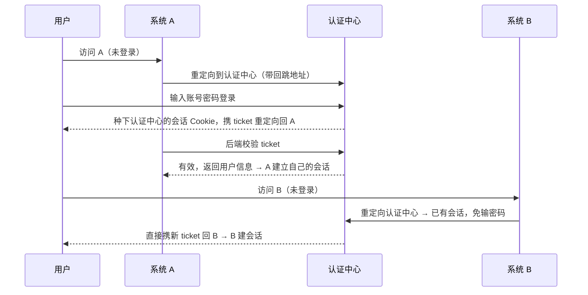

#网络 #登录 #JWT #OAuth #面试

# 登录方案：Session、JWT、SSO 与 OAuth

## TL;DR

**Session 是「状态存服务端，Cookie 里只放钥匙」；JWT 是「状态签名后整个发给客户端，服务端不存」**。SSO 解决多系统一次登录，OAuth 2.0 解决「授权第三方访问我的资源」——授权码模式的 code 换 token 流程必须能默写。

---

## 1. Session-Cookie：有状态方案

流程：登录成功 → 服务端创建 Session（存用户态）→ `Set-Cookie: sid=xxx` → 后续请求自动带 sid → 服务端查 Session 认人。

特点与代价：服务端可**主动踢人**（删 Session 即失效）；但有状态——多机部署要 Session 共享（集中存 Redis 是标准解），Cookie 天然受同源/跨域限制。安全配置：`HttpOnly + Secure + SameSite`（见 [[1.07 Web 安全：XSS 与 CSRF]]）。

---

## 2. JWT：无状态方案

结构 `Header.Payload.Signature`，前两段是 **Base64URL 编码（不是加密，谁都能解开看）**，第三段是签名：

```text
HMACSHA256( base64Url(header) + "." + base64Url(payload), secret )
```

服务端校验签名即可信任 Payload 内容（改一个字签名就对不上），**无需存储会话** → 天然适合分布式与跨域（通常放 `Authorization: Bearer <token>` 头）。

必考的三组权衡：

| 问题 | 说法 |
|---|---|
| 敏感信息 | Payload 仅编码不加密，**不能放密码等敏感数据** |
| 无法主动失效 | 签出去就管不了，注销/踢人难——缓解：短有效期 + refresh token 续签，或服务端维护黑名单（但那就又有状态了） |
| 体积 | 比 sid 大得多，每个请求都带 |

**双 token 实践**：access_token 短命（分钟~小时级）用于请求；refresh_token 长命、仅在续签接口使用，泄露面小；refresh 失败即要求重新登录。

---

## 3. SSO 单点登录

目标：一个账号，登录一次，全家系统通行。核心角色是独立的**认证中心**：



关键理解：**登录态存在认证中心的域下**；各子系统拿到的 ticket 是一次性凭证，换取用户信息后各自维护自己的会话。同主域的简化版可以直接种父域 Cookie；跨主域就必须走上面的重定向 + ticket（CAS 模式）。

---

## 4. OAuth 2.0：授权（不是认证）框架

场景：「用微信登录某 App」「允许某工具读取你的 GitHub 仓库」——**用户授权第三方应用访问自己在资源服务器上的数据，而不给它账号密码**。

授权码模式（Authorization Code，最安全、最常问）：

1. 应用把用户重定向到授权服务器：带 `response_type=code`、`client_id`、`redirect_uri`、`scope`、`state`（防 CSRF 的随机值）；
2. 用户在**授权服务器的页面**登录并同意授权；
3. 授权服务器 302 回 `redirect_uri`，URL 上带一次性的**授权码 code**；
4. 应用**后端**用 `code + client_id + client_secret` 向授权服务器换 **access_token**（+ expires_in、refresh_token）；
5. 之后凭 access_token 调资源服务器 API；过期用 refresh_token 续。

**为什么绕一道 code，不直接回 token**：重定向经过浏览器，URL 会进历史、日志、Referer——token 直接回就暴露在前端信道里；code 一次性、短时效，且换 token 还需要**只存在于后端的 client_secret**，即使 code 被截也换不到 token。这题是 OAuth 面试的胜负手。

补充现状：纯前端/移动端应用没有后端保管 secret，标准做法是**授权码 + PKCE**（用动态生成的 code_verifier 代替 client_secret）；早年的隐式模式（implicit，直接回 token）已被 OAuth 2.1 草案弃用。OIDC（OpenID Connect）在 OAuth 2.0 之上加了 id_token（JWT 格式），补上「认证」语义——「OAuth 管授权、OIDC 管认证」。

---

## 面试问答

### Q: Session 和 JWT 的区别？怎么选？

满分答案：Session 把状态存服务端、Cookie 只带会话 ID，可主动失效，但分布式要做 Session 共享（Redis）；JWT 把签名后的用户态整个交给客户端，服务端无状态、天然水平扩展和跨域友好，但无法主动作废、Payload 可被解读、体积大。选择：需要强制下线/精细会话管理选 Session；微服务、多端、跨域 API 选 JWT + 短有效期 + refresh token，必要时加黑名单兜底。

### Q: JWT 的结构？为什么不能篡改却能被读取？

满分答案：Header.Payload.Signature 三段——头部声明算法，负载放声明（用户 ID、过期时间），签名是对前两段用密钥做 HMAC 或 RSA 签名。前两段只是 Base64URL 编码，任何人可解码阅读，所以不能放敏感信息；但改动任何内容都会导致签名验证失败，服务端只信签名——「可读不可改」。

### Q: 讲讲 SSO 的流程？

满分答案：核心是独立认证中心持有全局登录态。首次访问系统 A 未登录 → 重定向认证中心登录，认证中心种自己域的会话并携一次性 ticket 重定向回 A → A 后端向认证中心校验 ticket 换用户信息、建立本系统会话。再访问系统 B 时重定向到认证中心，发现已有会话直接签发新 ticket 回 B，实现免登。要点：登录态在认证中心域下、ticket 一次性、各系统会话独立。

### Q: OAuth 授权码模式为什么要先拿 code 再换 token？

满分答案：重定向走浏览器前端信道，URL 会留在历史、日志和 Referer 里，直接回 token 等于把令牌暴露在最不安全的一段；code 是一次性、短时效凭证，且换 token 必须附上只保存在应用后端的 client_secret——code 即使被截获也无法兑换。补充：无后端的 SPA/App 用 PKCE 替代 secret，隐式模式已被弃用；如果还需要「这个用户是谁」的认证语义，用 OIDC 的 id_token。
