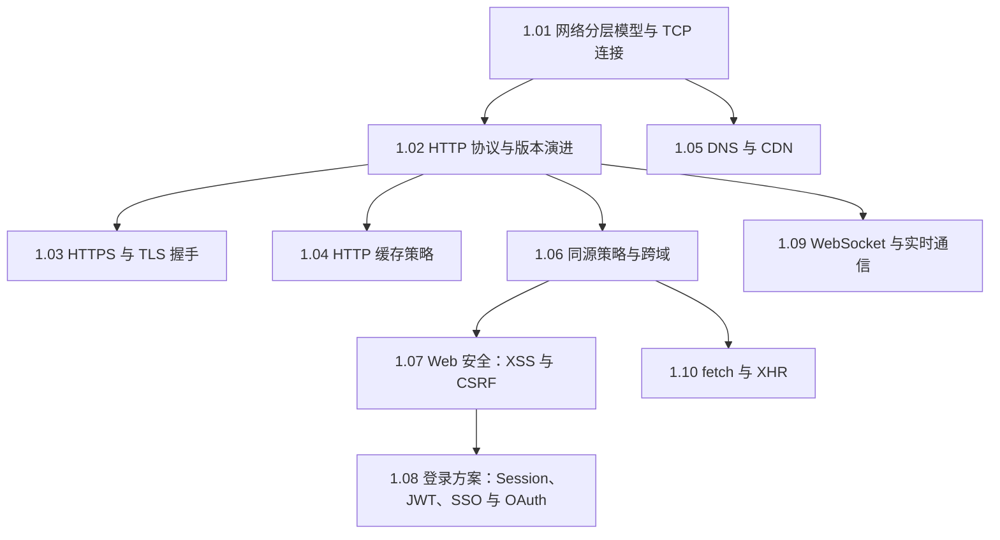

#网络 #index

# 网络与 HTTP 知识地图

> Library/HTTP 总索引：阅读顺序、分组清单、概念速查

## 阅读顺序

从底层往上走一遍，再横向铺开安全、登录与实时通信。

「从输入 URL 到页面展示」是把这十篇串起来的总题，见 [[2.02 从输入 URL 到页面展示]]。

---

## 文章清单

### 协议与传输

| 文章 | 一句话定位 |
|---|---|
| [[1.01 网络分层模型与 TCP 连接]] | 每层只解决一件事；三次握手与四次挥手必须能默写 |
| [[1.02 HTTP 协议与版本演进]] | 队头阻塞这条主线：HTTP/1.1 → HTTP/2 二进制分帧 → HTTP/3 QUIC |
| [[1.03 HTTPS 与 TLS 握手]] | 混合加密解决窃听/篡改/冒充；TLS 1.3 压到 1-RTT |
| [[1.05 DNS 与 CDN]] | 域名逐级解析；CDN 的入口正是 DNS 的 CNAME 与智能调度 |

### 缓存与跨域

| 文章 | 一句话定位 |
|---|---|
| [[1.04 HTTP 缓存策略]] | 先强缓存后协商缓存；HTML 走 no-cache、hash 资源一年 immutable |
| [[1.06 同源策略与跨域]] | 同源 = 协议+域名+端口；CORS、开发代理、Nginx 反代，JSONP 是历史方案 |

### 安全与身份

| 文章 | 一句话定位 |
|---|---|
| [[1.07 Web 安全：XSS 与 CSRF]] | 一句话区分：XSS 偷数据，CSRF 冒身份；两套防御各自成体系 |
| [[1.08 登录方案：Session、JWT、SSO 与 OAuth]] | 状态存服务端 vs 签名发客户端；授权码模式流程必须能默写 |

### 通信与客户端

| 文章 | 一句话定位 |
|---|---|
| [[1.09 WebSocket 与实时通信]] | 一次 HTTP 升级握手换来全双工；单向推送选 SSE，双向选 WebSocket |
| [[1.10 fetch 与 XHR]] | fetch 的三个反直觉：404 不 reject、默认不带跨域 Cookie、没有超时与进度 |

---

## 概念速查（这个词在哪篇里讲透了）

| 概念 | 所在笔记 |
|---|---|
| OSI/TCP-IP 分层、TCP vs UDP、三次握手、四次挥手、滑动窗口 | [[1.01 网络分层模型与 TCP 连接]] |
| 请求/响应报文、状态码、HTTP/2 多路复用、QUIC、常用头部 | [[1.02 HTTP 协议与版本演进]] |
| 对称/非对称加密、数字证书、CA、TLS 1.2 与 1.3 握手 | [[1.03 HTTPS 与 TLS 握手]] |
| Cache-Control、max-age、immutable、ETag、Last-Modified、304 | [[1.04 HTTP 缓存策略]] |
| A 记录、CNAME、递归与迭代查询、边缘节点、OSS 与 CDN 搭配 | [[1.05 DNS 与 CDN]] |
| 同源策略、CORS、预检请求、`credentials`、JSONP、反向代理 | [[1.06 同源策略与跨域]] |
| 存储型/反射型/DOM 型 XSS、CSP、HttpOnly、CSRF Token、SameSite | [[1.07 Web 安全：XSS 与 CSRF]] |
| Session-Cookie、JWT、刷新令牌、SSO、OAuth 2.0 授权码模式 | [[1.08 登录方案：Session、JWT、SSO 与 OAuth]] |
| 101 Switching Protocols、帧、心跳、SSE、长轮询 | [[1.09 WebSocket 与实时通信]] |
| XMLHttpRequest、`response.ok`、`AbortSignal.timeout`、上传进度 | [[1.10 fetch 与 XHR]] |

---

## 跨目录关联

- 串起全流程的总题 → [[2.02 从输入 URL 到页面展示]]
- Cookie / Storage 的客户端一侧 → [[2.05 浏览器存储：Cookie、Web Storage 与 IndexedDB]]
- 服务端的代理与 HTTPS 配置 → [[2.03 Nginx 配置精要]]
- 网络层的性能收益 → [[2.02 首屏加载优化]]
- 与 IP 的小对照 → [[localhost 和 127.0.0.1 的区别]]

---

## 维护说明

新增网络笔记时：挂进「协议与传输 / 缓存与跨域 / 安全与身份 / 通信与客户端」之一，写一句定位并补概念速查。编号沿用 `1.x`；浏览器实现侧的内容放 Library/浏览器。
