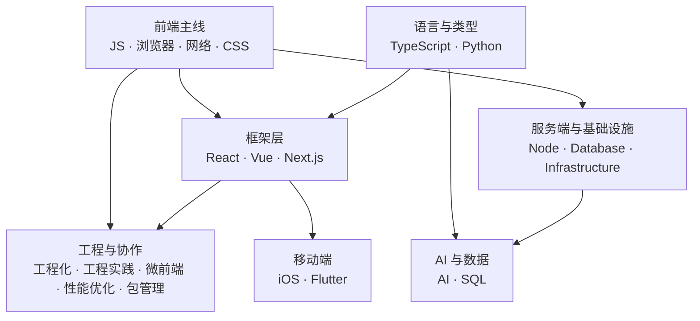

#index

# Library 总索引

> 全库入口：每个主题目录一张索引页，从这里进任何一个主题
> 旧仓库素材的整理进度见 [[整理进度]]

## 全景

---

## 主题索引

### 前端主线

| 主题 | 索引页 | 内容 |
|---|---|---|
| JavaScript | [[Marauder'sMap/Library/JS/Index\|JavaScript 知识索引]] | 语言基础、异步、手写题与模式、引擎与执行模型 |
| 浏览器 | [[Marauder'sMap/Library/浏览器/Index\|浏览器知识地图]] | 进程线程、渲染流水线、资源加载、存储、垃圾回收 |
| 网络与 HTTP | [[Marauder'sMap/Library/HTTP/Index\|网络与 HTTP 知识地图]] | 协议与传输、缓存与跨域、安全与登录、实时通信 |
| CSS | [[Marauder'sMap/Library/CSS/Index\|CSS 知识地图]] | 盒模型与层叠、布局、动画与渲染性能、工程化 |

### 框架层

| 主题 | 索引页 | 内容 |
|---|---|---|
| React | [[Marauder'sMap/Library/React/Index\|React 知识地图]] | 核心机制、Hooks、状态管理与优化、React Compiler |
| Vue | [[Marauder'sMap/Library/Vue/Index\|Vue 知识地图]] | 响应式与渲染、组件与应用层（Router / Pinia） |
| Next.js | [[Marauder'sMap/Library/Nextjs/Index\|Next.js 知识地图]] | 软导航与 RSC、App Router 状态管理、项目实战 |

### 语言与类型

| 主题 | 索引页 | 内容 |
|---|---|---|
| TypeScript | [[Marauder'sMap/Library/TypeScript/Index\|TypeScript 知识地图]] | 类型系统、interface 与 type、泛型与类型编程、工程配置 |
| Python | [[Marauder'sMap/Library/Python/Index\|Python 索引]] | 入口分流；完整清单在 [[Python 教程总览]] |

### 工程与协作

| 主题 | 索引页 | 内容 |
|---|---|---|
| 工程化 | [[Marauder'sMap/Library/工程化/Index\|前端工程化知识地图]] | 模块化与包管理、构建与编译、Git 与协作规范 |
| 工程实践 | [[Marauder'sMap/Library/工程实践/Index\|前端工程实践知识地图]] | 构建加速、Monorepo、API 层、E2E、灰度、监控、埋点 |
| 微前端 | [[Marauder'sMap/Library/微前端/Index\|微前端知识地图]] | 选型、qiankun 原理、JS/CSS 隔离、通信与踩坑 |
| 性能优化 | [[Marauder'sMap/Library/性能优化/Index\|性能优化知识地图]] | 指标与监控、首屏、图片、虚拟列表、移动端适配 |
| 包管理器 | [[Marauder'sMap/Library/Node包管理器/Index\|Node 包管理器索引]] | SemVer 与 npm 命令细节 |

### 服务端与基础设施

| 主题 | 索引页 | 内容 |
|---|---|---|
| Node.js | [[Marauder'sMap/Library/Node/Index\|Node.js 知识地图]] | 事件循环、模块系统、中间件、多进程、内存、部署 |
| 数据库 | [[Marauder'sMap/Library/Database/Index\|数据库知识地图]] | MySQL / MongoDB / Redis，以及 AI 检索链路 |
| 基础设施 | [[Marauder'sMap/Library/Infrastructure/Index\|基础设施知识地图]] | Nginx、Linux 文件系统、日志与 Sentry |

### AI 与数据

| 主题 | 索引页 | 内容 |
|---|---|---|
| AI | [[Marauder'sMap/Library/AI/Index\|AI 知识地图]] | 数学地基 → 机器学习 → 神经网络 → Transformer → RAG |
| SQL | [[排行榜查询模式]] | 单篇：排行榜会反复用到的 5 个 SQL 模式 |

### 移动端

| 主题 | 索引页 | 内容 |
|---|---|---|
| iOS | [[Marauder'sMap/Library/iOS/Index\|iOS 知识地图]] | SPM 与 CocoaPods、Xcode 依赖解析排查 |
| Flutter | [[Flutter 中好用的库]] | 单篇：常用第三方库速查表 |

### 单篇与散页

篇数还不够开目录索引的，直接从这里进：

| 笔记 | 内容 |
|---|---|
| [[浮点数精度]] | IEEE 754 为什么存不准小数，单精度与双精度的差别 |
| [[localhost 和 127.0.0.1 的区别]] | 一个是域名要解析，一个是回环 IP 不用解析 |
| [[OAuth]] | Firebase Google 登录接入与移动端 redirect 的坑 |
| [[Top N]] | 各语言/领域的好用工具与库收藏（占位，待整理） |
| [[URL]] | 占位页，尚无正文 |

---

## 维护说明

- **新增一篇笔记**：写进它所属主题的索引页（分组清单 + 一句话定位），必要时补概念速查
- **新增一个主题目录**：目录里放一张 `Index.md`（沿用「阅读顺序 mermaid + 分组清单 + 概念速查 + 跨目录关联」的结构），再回本页挂一行
- **只有一两篇的目录先不开索引页**，直接挂到上面「单篇与散页」，攒够三篇以上再升格
- 跨目录链接用完整路径（如 `[[Marauder'sMap/Library/JS/Index|...]]`）——各目录的索引页同名为 `Index`，短链接会指错文件
