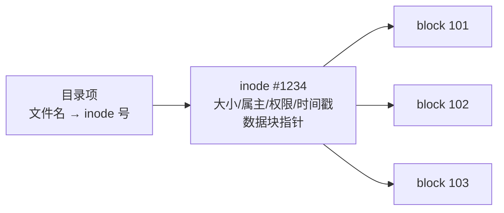

#Linux #文件系统 #inode #面试

# Linux 基础：文件系统与软硬链接

## TL;DR

**文件 = inode（元数据 + 数据块指针）+ block（实际数据）；文件名只是目录里指向 inode 的一条记录**。由此推出硬链接与软链接的全部区别：**硬链接 = 又一个指向同一 inode 的名字**（同盘、不能链目录、删一个不影响数据）；**软链接 = 存着路径字符串的独立小文件**（可跨盘、可链目录、源删则悬空）。pnpm 的省磁盘魔法正是硬链接（见 [[1.03 npm、yarn 与 pnpm]]）。

---

## 1. inode 与 block



- **block**：数据存储的基本单位（常见 4KB）——10KB 的文件占 3 个块；块大 → 大文件吞吐好但小文件浪费尾块；
- **inode**：文件的元数据结构（大小、属主、权限、时间戳）+ 指向数据块的指针（大文件用间接/双重间接指针扩展）；**inode 里没有文件名**；
- **文件名住在目录里**：目录本身是「文件名 → inode 号」的映射表文件。

两个实战推论：`df -i` 看 inode 用量——**海量小文件会把 inode 耗尽**（磁盘明明有空间却写不进，node_modules 时代的经典事故）；「打开文件」的过程 = 目录项找 inode → inode 找 blocks。

---

## 2. 硬链接 vs 软链接

```bash
ln  target hard_name    # 硬链接
ln -s target soft_name  # 软链接（符号链接）
```

| | 硬链接 | 软链接 |
|---|---|---|
| 本质 | **同一 inode 的另一个名字**（目录里加一条记录，inode 链接计数 +1） | **独立文件**（自己的 inode，内容是目标**路径字符串**） |
| inode | 与源相同 | 与源不同 |
| 跨文件系统 | ✘（inode 号仅盘内有效） | ✔（存的是路径） |
| 链接目录 | ✘（防目录环） | ✔ |
| 删除源文件 | 数据仍在——inode 计数减 1，**归零才真正释放** | 悬空链接（指向不存在的路径） |
| 移动/重命名源 | 无影响（认 inode 不认路径） | 悬空（认路径） |

理解模型：**硬链接是「多对一的实名」，软链接是「写着地址的便签」**。文件的真正删除条件 = 链接计数归零**且**没有进程持有打开的文件描述符——「删了大日志文件磁盘没释放」的经典问题（进程还开着，`lsof | grep deleted` 定位，重启进程或 truncate 解决）。

---

## 3. 前端工程里的链接实战

- **pnpm**：全局 store 用**硬链接**去重磁盘（同版本包全机共享一份数据），node_modules 组织依赖用**软链接**——两种链接各取所长的教科书案例（详见 [[1.03 npm、yarn 与 pnpm]]）；
- `npm link` / `pnpm link`：本地调试包 = 软链接到全局再链进项目；
- 部署目录切换：`current -> releases/v42` 软链接原子切换版本，回滚只需改链接；
- Docker 镜像层、Git 对象存储都有同样的「内容寻址 + 引用计数」思想。

---

## 面试问答

### Q: 软链接和硬链接的区别？

满分答案：从 inode 模型推——文件名只是目录里指向 inode 的记录，硬链接就是给同一 inode 再加一个名字：inode 相同、不能跨文件系统（inode 号盘内有效）、不能链目录、删除任一名字只减引用计数、数据到计数归零才释放；软链接是内容为目标路径的独立小文件：自己的 inode、可跨盘可链目录、源文件删除或移动即悬空。一句话：硬链接认 inode，软链接认路径。

### Q: 什么是 inode？inode 用光了会怎样？

满分答案：inode 是文件的元数据结构——大小、属主、权限、时间戳和数据块指针，文件名不在其中而在目录项里。文件系统创建时 inode 数量就固定了，海量小文件场景（构建缓存、node_modules）会出现「df -h 显示有空间、却报 No space left」——df -i 查看 inode 用尽，清小文件或重新格式化调 inode 密度。这题考「文件名、inode、block 三层分离」的模型。

### Q: 删除正在被进程使用的大文件，磁盘空间为什么没释放？

满分答案：删除只是把目录项移除、链接计数减一；真正释放需要计数归零且无进程持有打开的文件描述符。进程还开着该文件时数据块保留，lsof | grep deleted 能看到这类「已删除仍占用」的文件。处理：重启/reload 持有进程，或用 truncate 清空（> file 重定向对已打开 fd 同样有效）。日志文件轮转要用 logrotate 的 copytruncate 或通知进程重开 fd，就是这个原理。
