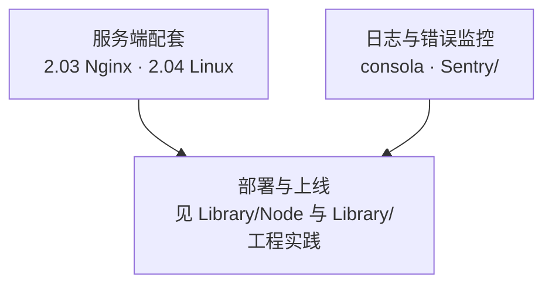

#engineering #index

# 基础设施知识地图

> Library/Infrastructure 总索引：分组清单与阅读提示
> 收录「前端要懂的服务端与运维」：网关、系统基础、日志与错误监控工具

## 目录构成

---

## 文章清单

### 服务端配套

| 文章 | 一句话定位 |
|---|---|
| [[2.03 Nginx 配置精要]] | 前端要会的四件事：反向代理、静态站托管、HTTPS、负载均衡；root 与 alias 的区别 |
| [[2.04 Linux 基础：文件系统与软硬链接]] | 文件 = inode + block，文件名只是目录里的一条记录；硬链接与软链接的全部区别由此推出 |

### 日志与错误监控

| 文章 | 一句话定位 |
|---|---|
| [[consola]] | unjs 的日志库，可通过 custom reporter 接到 Sentry 的 log 能力 |
| [[Marauder'sMap/Library/Infrastructure/Sentry/Map\|Sentry Map]] | Sentry 用法与配置的收纳页 |
| [[Log]] | Sentry Logs 官方文档入口 |
| [[Breadcrumbs]] | Sentry Breadcrumbs（问题详情里的行为面包屑）文档入口 |

> Sentry 三篇目前是**资料链接占位**，还没有整理成正文；要用的时候顺着链接读，读完把结论写回 [[Marauder'sMap/Library/Infrastructure/Sentry/Map\|Sentry Map]]。

---

## 跨目录关联

- 反向代理背后的协议知识 → [[1.06 同源策略与跨域]]、[[1.03 HTTPS 与 TLS 握手]]
- 部署形态与容器化 → [[1.06 Node 部署与 Docker]]
- 监控告警的方法论与落地 → [[1.07 监控告警与健康检查]]、[[2.01 Web 性能指标与前端监控]]
- 软硬链接的同款思路在包管理器里的应用 → [[1.03 npm、yarn 与 pnpm]]（pnpm 的 store 硬链接）

---

## 维护说明

本目录放「前端够得着的基础设施」：网关、操作系统、日志与监控工具。数据库放 Library/Database，Node 运行时与部署流程放 Library/Node，公司落地叙事放 Library/工程实践。编号 `2.x` 沿用后端配套序列。
