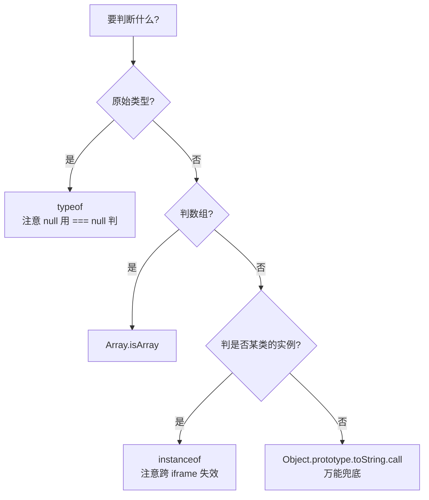

#JS #数据类型 #面试

# 数据类型与类型判断

## TL;DR

**JS 共 8 种数据类型：7 种原始类型（undefined、null、boolean、number、bigint、string、symbol）+ object**。类型判断四种手段各有死角：`typeof` 判不出 null 和具体对象类型，`instanceof` 判不了原始值且跨 iframe 失效，`constructor` 可被改写，只有 `Object.prototype.toString.call()` 最全能。

---

## 1. 数据类型总览

| 分类 | 类型 | 说明 |
|---|---|---|
| 原始类型 | `undefined` | 声明了但未赋值 |
| | `null` | 显式赋的「空值」 |
| | `boolean` | true / false |
| | `number` | IEEE 754 双精度浮点数（整数和小数是同一种类型） |
| | `bigint` | 任意精度整数，字面量加 `n`：`10n` |
| | `string` | 字符串 |
| | `symbol` | 唯一值，常用作对象 key |
| 引用类型 | `object` | 对象、数组、函数、Date、RegExp…… 全是 object |

原始类型的值直接存放，赋值即复制；引用类型变量里存的是**指向堆中对象的引用**，赋值复制的是引用，两个变量会指向同一个对象。

---

## 2. typeof：快但有死角

```js
typeof undefined   // 'undefined'
typeof true        // 'boolean'
typeof 42          // 'number'
typeof NaN         // 'number'  ← NaN 也是 number
typeof 10n         // 'bigint'
typeof 'hi'        // 'string'
typeof Symbol()    // 'symbol'
typeof function(){} // 'function' ← 函数被特殊对待
typeof class C {}  // 'function' ← class 本质是函数

typeof null        // 'object'  ← 历史 bug！
typeof []          // 'object'  ← 判不出数组
typeof new Number(1) // 'object' ← new 出来的包装对象
```

两个关键点：

- **`typeof null === 'object'` 是历史 bug**：JS 第一版实现里，值用「类型标签 + 数据」存储，对象的类型标签是 0，而 null 的机器表示恰好是全 0，于是被误判为对象。为了不破坏存量代码，这个 bug 永久保留了。
- **typeof 对未声明的变量不报错**（返回 `'undefined'`），但对 `let`/`const` 声明前的暂时性死区（TDZ）内访问会抛 `ReferenceError`——这是它「安全」神话的例外。

---

## 3. instanceof：查原型链

原理一句话：**右边构造函数的 `prototype` 是否出现在左边对象的原型链上**。

```js
[] instanceof Array   // true
[] instanceof Object  // true（原型链一路向上都算）
'hi' instanceof String // false ← 原始值不行
null instanceof Object // false
1 instanceof null      // TypeError：右侧必须是对象
```

手写实现（面试高频）：

```js
function myInstanceof(left, right) {
  if (left === null || typeof left !== 'object' && typeof left !== 'function') {
    return false;                      // 原始值直接 false
  }
  let proto = Object.getPrototypeOf(left);
  while (proto !== null) {
    if (proto === right.prototype) return true;
    proto = Object.getPrototypeOf(proto);
  }
  return false;
}
```

局限：**跨 iframe / 跨 Realm 失效**——每个 iframe 有自己的一套全局对象，A 页面的数组传给 B 页面，`arr instanceof Array` 是 false，因为两边的 `Array.prototype` 不是同一个对象。所以判断数组永远用 `Array.isArray()`。

---

## 4. constructor：能用但不可靠

```js
(1).constructor === Number   // true
([]).constructor === Array   // true
(null).constructor           // TypeError
```

问题：`constructor` 是原型上的普通属性，**可以被改写**；继承时如果忘了修正，子类实例的 constructor 会指向父类。只适合快速判断，不适合做类型守卫。

---

## 5. Object.prototype.toString.call()：全能方案

```js
const toString = Object.prototype.toString;
toString.call(1)          // '[object Number]'
toString.call(null)       // '[object Null]'
toString.call(undefined)  // '[object Undefined]'
toString.call([])         // '[object Array]'
toString.call(new Date()) // '[object Date]'
```

封装成通用方法（面试常让手写）：

```js
function isType(type) {
  return (value) =>
    Object.prototype.toString.call(value) === `[object ${type}]`;
}
const isArray = isType('Array');
const isDate = isType('Date');
```

注意：对象可以通过 `Symbol.toStringTag` 自定义这个标签，所以它对「自家对象」并非绝对可靠，但对内置类型足够权威。

选型决策图：



---

## 6. 专项工具：Object.is、Number.isNaN

`Object.is` 和 `===` 只有两处不同：

```js
NaN === NaN        // false
Object.is(NaN, NaN) // true

+0 === -0          // true
Object.is(+0, -0)  // false
```

`Number.isNaN(x)` 只在 x 真的是 NaN 时返回 true；全局 `isNaN(x)` 会先把 x 转成数字再判断，`isNaN('abc')` 也是 true，容易误伤。

---

## 7. undefined 与 null

- `undefined`：**系统层面的「没有」**——声明未赋值、访问不存在的属性、函数没 return。
- `null`：**程序员主动表达的「空」**——常用于初始化将要放对象的变量、解除引用。

宽松相等的特例（ECMAScript 规范直接规定）：

```js
undefined == null   // true，且它俩不等于任何其他值
undefined === null  // false（类型不同）
```

所以 `if (value == null)` 是同时排除 null 和 undefined 的惯用写法——这是少数「推荐用 ==」的场景。

---

## 8. 类数组与数组

类数组：有 `length`、能用下标访问，但**原型不是 Array.prototype**，没有 push/map 等数组方法。典型：函数的 `arguments`、`document.querySelectorAll` 返回的 NodeList、`{0:'a', 1:'b', length:2}`。

转成真数组的三种方式：

```js
Array.from(arrayLike)          // 首选，还接受第二个参数做 map
[...arrayLike]                 // 要求对象可迭代（arguments、NodeList 可以，纯 {length} 不行）
Array.prototype.slice.call(arrayLike)  // ES5 时代写法
```

---

## 9. 0.1 + 0.2 为什么不等于 0.3

JS 的 number 是 **IEEE 754 双精度浮点数**（64 位：1 符号 + 11 指数 + 52 尾数）。0.1 和 0.2 的二进制是**无限循环小数**，存进 52 位尾数时必须截断，参与运算的其实是两个近似值，加出来自然只是接近 0.3：

```js
0.1 + 0.2            // 0.30000000000000004
```

应对方案：

```js
// 1. 误差容忍：差值小于 Number.EPSILON 就视为相等
Math.abs(0.1 + 0.2 - 0.3) < Number.EPSILON  // true

// 2. 化小数为整数运算
(0.1 * 10 + 0.2 * 10) / 10  // 0.3

// 3. 展示层面：toFixed 后注意它返回字符串
(0.1 + 0.2).toFixed(2)      // '0.30'
```

相关边界：整数超过 `Number.MAX_SAFE_INTEGER`（2^53 - 1）后精度不保，需要 `BigInt`；金额计算的工程惯例是**以分为单位存整数**。

---

## 面试问答

### Q: JS 有哪些数据类型？如何存储？

满分答案：8 种——7 种原始类型 undefined、null、boolean、number、bigint、string、symbol，加上引用类型 object（数组、函数、Date 都属于 object）。原始类型的值不可变、按值复制；引用类型变量保存指向堆中对象的引用，赋值传递的是引用。加分点：bigint 和 symbol 是 ES2020/ES2015 新增，number 是 IEEE 754 双精度浮点，整数与小数同一类型。

### Q: 判断类型的方法有哪些？各有什么优缺点？

满分答案：四种。typeof 适合原始类型，快且对未声明变量安全，但 null 会返回 'object'（历史 bug），所有对象都笼统返回 'object'；instanceof 检查构造函数的 prototype 是否在对象原型链上，适合判断实例关系，但对原始值无效、跨 iframe 失效；constructor 能区分类型但属性可被改写、null/undefined 直接报错；Object.prototype.toString.call() 对所有内置类型都准确，是封装通用类型判断的标准方案。实践中：判数组用 Array.isArray，判 NaN 用 Number.isNaN，其余按场景选。

### Q: typeof null 为什么是 'object'？

满分答案：JS 初版实现中值用「类型标签 + 数据」表示，对象的类型标签是 0，null 的机器表示恰好全 0，被误读成对象。发现时已有大量代码依赖此行为，修复会破坏兼容性，于是规范将错就错保留至今。判断 null 直接用 `value === null`。

### Q: 为什么 0.1 + 0.2 !== 0.3？怎么解决？

满分答案：number 采用 IEEE 754 双精度浮点，0.1、0.2 的二进制是无限循环小数，存入 52 位尾数时被截断，运算的是近似值。解决：比较时用 `Math.abs(a - b) < Number.EPSILON`；计算时先放大为整数再缩小；金额类业务用「分」存整数或用 BigInt/精度库。加分点：安全整数范围是 ±(2^53 − 1)，超出用 BigInt。

### Q: 类数组和数组的区别？如何互转？

满分答案：类数组有 length 和下标，但原型不是 Array.prototype，没有数组方法；典型有 arguments、NodeList。转换首选 `Array.from`（还能顺便 map），可迭代对象也可以用展开运算符，ES5 写法是 `Array.prototype.slice.call`。

### Q: Object.is 和 === 的区别？

满分答案：只有两处——`Object.is(NaN, NaN)` 为 true，`Object.is(+0, -0)` 为 false，其余行为与 === 完全一致。它是 React 判断 state 变化、手写 shallowEqual 时的底层依据。
