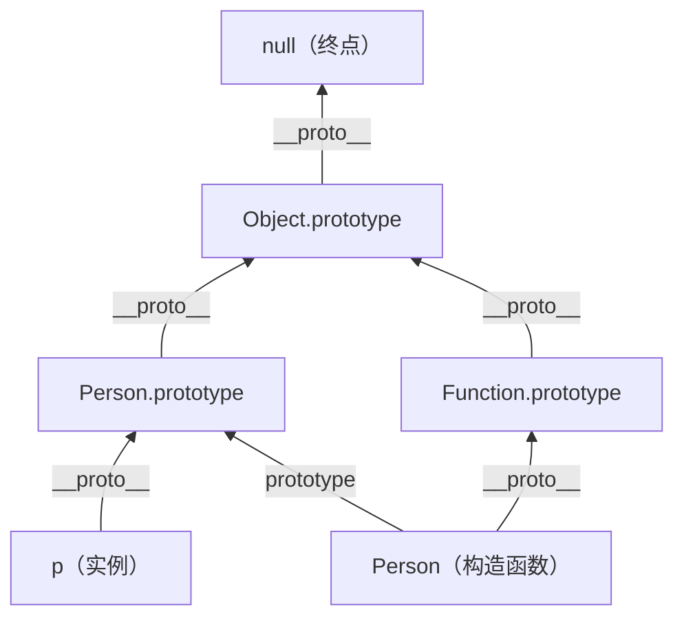

#JS #原型 #面试

# 原型与原型链

## TL;DR

**每个对象都有一个隐式原型（`[[Prototype]]`），指向创建它的构造函数的 `prototype` 对象；访问属性时沿这条链逐层向上找，直到 `null` 为止**。`prototype` 是函数的属性，`__proto__`（隐式原型）是对象的属性，`实例.__proto__ === 构造函数.prototype` 是全部的关键。

---

## 1. prototype 与 __proto__ 的关系

- **`prototype`**：只有函数才有，是「将来 new 出来的实例的原型对象」。
- **`__proto__`**（规范里叫 `[[Prototype]]`）：所有对象都有，指向自己的原型。

```js
function Person() {}
const p = new Person();

p.__proto__ === Person.prototype            // true
Person.prototype.constructor === Person     // true（原型对象指回构造函数）
Person.prototype.__proto__ === Object.prototype  // true
Object.prototype.__proto__ === null         // 链的终点
```

现代写法：**别直接用 `__proto__`**（历史遗留的非标准访问器），读用 `Object.getPrototypeOf(obj)`，造用 `Object.create(proto)`；`Object.setPrototypeOf` 能改但性能差，尽量避免。

---

## 2. 原型链

访问 `obj.x` 时：自身有就用，没有就沿 `[[Prototype]]` 逐层向上，直到 `null`，还没有就返回 `undefined`（注意不是报错——报错的是访问未声明的**变量**）。



两个经典的「烧脑」结论，看图就明白：

```js
Function.__proto__ === Function.prototype  // true：Function 也是函数，由自己构造（闭环）
Object.__proto__ === Function.prototype    // true：Object 构造函数也是函数
Function.prototype.__proto__ === Object.prototype  // true：原型对象归根到底是对象
```

相关方法辨析：

| 方法 | 判断的是 |
|---|---|
| `obj.hasOwnProperty(x)` | x 是否是**自身**属性（不查原型链） |
| `x in obj` | 自身 + 原型链上是否有 x |
| `A.prototype.isPrototypeOf(obj)` | A.prototype 是否在 obj 的原型链上 |
| `obj instanceof A` | 同上（语法不同） |

---

## 3. new 做了什么（手写实现）

`new Constructor(args)` 四步：

1. 创建一个新对象，`[[Prototype]]` 指向 `Constructor.prototype`；
2. 以新对象为 this 执行构造函数；
3. 若构造函数返回了**对象**，就用那个返回值；
4. 否则返回新对象（返回原始值会被忽略）。

```js
function myNew(Constructor, ...args) {
  const target = Object.create(Constructor.prototype);  // 步骤 1
  const result = Constructor.apply(target, args);       // 步骤 2
  return result instanceof Object ? result : target;    // 步骤 3/4
}
```

---

## 4. Object.create 与手写实现

`Object.create(proto)` = 「以 proto 为原型造一个新对象」，是最纯粹的原型式继承。polyfill 思路就是借一个空构造函数：

```js
function create(proto) {
  function F() {}
  F.prototype = proto;
  return new F();
}
```

`Object.create(null)` 造出**没有原型的对象**——没有 toString/hasOwnProperty，适合当纯净字典用（无原型污染风险）。

---

## 5. 原型的动态性与陷阱

```js
function Fn() {}
const a = new Fn();
Fn.prototype.say = () => 'hi';
a.say();               // 'hi' —— 实例创建后再加的原型方法也能访问（动态查找）

Fn.prototype = { say: () => 'new' };  // 整体替换 prototype
const b = new Fn();
a.say();               // 'hi'  —— 老实例还连着旧原型
b.say();               // 'new' —— 新实例连新原型
```

另一个常见坑：**给实例赋值同名属性只会遮蔽（shadow）原型属性，不会修改原型**；`delete 实例属性` 后原型属性重新露出来。

---

## 面试问答

### Q: 讲讲原型和原型链？

满分答案：每个对象都有隐式原型 [[Prototype]]，指向其构造函数的 prototype 对象；prototype 上有 constructor 指回构造函数。访问属性时先查自身，没有就沿隐式原型逐层向上直到 Object.prototype，它的原型是 null，即链的终点，最终没找到返回 undefined。这条查找链就是原型链，也是 JS 实现继承和方法共享的机制。加分点：prototype 是函数的属性、__proto__ 是对象的属性，实例.__proto__ === 构造函数.prototype；现代代码用 Object.getPrototypeOf / Object.create 代替直接操作 __proto__。

### Q: new 的过程发生了什么？手写一个 new？

满分答案：四步——以构造函数的 prototype 为原型创建新对象；将 this 绑定为新对象执行构造函数；若构造函数显式返回对象则用该对象；否则返回新对象。手写核心是 Object.create(Constructor.prototype) 加 apply，最后判断返回值是否为对象。加分点：返回原始值会被忽略；箭头函数没有 [[Construct]] 不能被 new。

### Q: Function 和 Object 的原型关系？

满分答案：所有函数（包括 Object、Function 自己）都是 Function 的实例，所以 Object.__proto__ 和 Function.__proto__ 都是 Function.prototype——Function 构造自己形成闭环；而 Function.prototype 本身是对象，其原型是 Object.prototype，最终到 null。一句话：函数沿 Function.prototype 找，对象沿 Object.prototype 找，两条线在 Object.prototype 汇合。

### Q: hasOwnProperty、in、instanceof 的区别？

满分答案：hasOwnProperty 只查自身属性；in 查自身加原型链；instanceof 判断构造函数的 prototype 是否在对象原型链上，与 isPrototypeOf 等价。补充：遍历时 for...in 会包含原型链上的可枚举属性，需配 hasOwnProperty 过滤，或直接用 Object.keys。

### Q: 经典输出题——Foo.getName 系列

```js
function Foo() {
  getName = function () { console.log(1); };
  return this;
}
Foo.getName = function () { console.log(2); };
Foo.prototype.getName = function () { console.log(3); };
var getName = function () { console.log(4); };
function getName() { console.log(5); }

Foo.getName();        // 2  静态属性
getName();            // 4  函数声明先提升，被 var 赋值覆盖
Foo().getName();      // 1  Foo() 修改了全局 getName，this 是全局
getName();            // 1
new Foo.getName();    // 2  运算符优先级：new (Foo.getName)()
new Foo().getName();  // 3  (new Foo()).getName()，查原型
new new Foo().getName(); // 3  new ((new Foo()).getName)()
```

满分答案要点：函数声明提升后被函数表达式赋值覆盖；Foo() 直接调用时 this 是全局对象且内部无 var 的赋值改写了全局 getName；带参数的 new（new Fn()）优先级高于点号，无参数的 new 低于点号。
