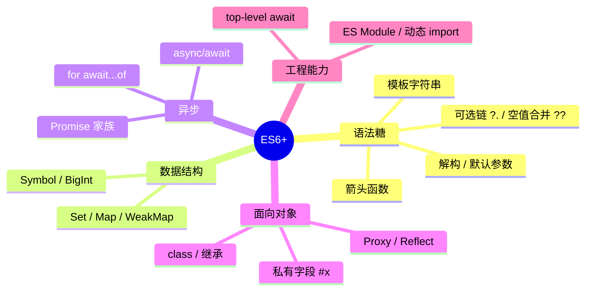

#JS #ES6 #新特性 #面试

# ES6+ 特性地图

## TL;DR

**ES6（ES2015）是分水岭：let/const、箭头函数、class、模块、Promise、解构、模板字符串一次到位；之后每年一版小步快跑**。面试答「ES6+ 有哪些特性」时按版本分组说，重点展开 ES2017 async/await、ES2020 可选链与空值合并、ES2022 类字段与 top-level await。

---

## 1. 名词与流程（正本清源）

- **ECMAScript** 是 ECMA 国际第 262 号标准（ECMA-262），**JavaScript 是它最主流的实现**；标准由 **TC39** 委员会制定。
- 正式命名是 ES + 年份：ES6 = ES2015，之后每年 6 月发一版。
- 提案五阶段：**Stage 0 设想 → 1 提案 → 2 草案 → 3 候选（基本定稿，可实验实现）→ 4 完成（通过 Test262，进入年度标准）**。「某特性 Stage 3」意味着语法基本不会再变，但仍需编译器/运行时支持。

---

## 2. 按版本速查

| 版本 | 必须说得出的特性 |
|---|---|
| **ES2015 (ES6)** | let/const、箭头函数、class、模板字符串、解构、默认参数、rest/展开、Promise、generator、Symbol、Set/Map、Proxy/Reflect、ES Module、for...of |
| ES2016 | `**` 幂运算、`Array.prototype.includes` |
| **ES2017** | **async/await**、Object.values/entries、字符串 padStart/padEnd、getOwnPropertyDescriptors |
| ES2018 | 异步迭代 for await...of、Promise.finally、对象 rest/spread、正则命名捕获组 |
| ES2019 | flat/flatMap、Object.fromEntries、trimStart/trimEnd、可选 catch 参数 |
| **ES2020** | **可选链 `?.`、空值合并 `??`**、BigInt、Promise.allSettled、globalThis、动态 import()、String.matchAll |
| ES2021 | 逻辑赋值 `??=`/`&&=`/`\|\|=`、Promise.any、replaceAll、数字分隔符 `1_000_000` |
| **ES2022** | **类字段与 #私有字段**、static 块、**top-level await**、Array.at(-1)、Object.hasOwn、Error cause |
| ES2023 | 不可变数组方法 toSorted/toReversed/toSpliced/with、findLast |
| ES2024 | Object.groupBy/Map.groupBy、Promise.withResolvers、正则 v 标志 |
| ES2025 | Set 集合运算（union/intersection 等）、Iterator Helpers（iter.map/filter/take）、正则内联标志 |

---

## 3. 高频特性要点

**箭头函数**（详见 [[1.04 this 与 call、apply、bind]]）：没有 this/arguments/prototype，不能 new、不能做 generator；适合回调，不适合对象方法和动态 this 的事件处理器。

**解构 + 默认值**：

```js
const { a = 1, b: renamed, ...rest } = obj;   // 默认值只在 undefined 时生效
const [x, , y = 5] = arr;
function fn({ id, name = 'anon' } = {}) {}     // 参数解构 + 整体默认值防 undefined 报错
```

**展开运算符**：内部走迭代协议（for...of），所以能展开数组/字符串/Set/Map，展开普通对象用的是另一套（自身可枚举属性浅拷贝）。`{ ...obj }` 与 `Object.assign({}, obj)` 等价，都是**浅拷贝**。

**可选链与空值合并**（现代代码的标配防御）：

```js
const city = user?.address?.city ?? '未知';
obj?.fn?.();          // 方法存在才调用
arr?.[0];             // 下标访问版
```

`??` 只在左侧为 null/undefined 时取右侧，`||` 在任何假值（0、''、false）都取右侧——设置默认值时 `??` 更安全。`?.` 短路后整条链直接返回 undefined。

**模板字符串**：支持换行和 `${表达式}`；标签模板 `` tag`a${b}c` `` 是函数调用语法糖，styled-components、SQL 参数化都基于它；`String.raw` 保留反斜杠原文。

**ES2023 不可变数组方法**：`toSorted/toReversed/toSpliced/with` 返回新数组不动原数组——React 时代改 state 的利器，取代 `[...arr].sort()` 手法。

---

## 4. 记忆框架（答题时的组织方式）



按这五个抽屉组织答案，比按年份背更不容易漏。

---

## 面试问答

### Q: ES6 有哪些新特性？

满分答案：按类别答——语法层：let/const 与块级作用域、箭头函数、解构、模板字符串、默认参数、rest 与展开；数据结构：Set/Map、Symbol；异步：Promise、generator；面向对象：class 与 extends、Proxy/Reflect；工程：ES Module。再补一句后续版本延续了年更：ES2017 的 async/await、ES2020 的可选链和空值合并、ES2022 的私有字段和 top-level await 是最常用的几个。

### Q: ?? 和 || 的区别？

满分答案：|| 在左侧是任何假值（0、''、false、null、undefined、NaN）时都返回右侧；?? 只在左侧是 null 或 undefined 时返回右侧。给「0 或空字符串是合法值」的配置设默认值必须用 ??。补充：?? 与 && / || 混用必须加括号，否则语法错误；还有配套的逻辑赋值运算符 ??=。

### Q: 展开运算符是深拷贝吗？

满分答案：浅拷贝——只复制一层，嵌套对象仍共享引用，与 Object.assign 一致。另外注意展开数组走迭代器协议（可展开任何可迭代对象），展开对象走自身可枚举属性复制，两者机制不同。深拷贝见 structuredClone 或手写递归（[[3.01 深拷贝与浅拷贝]]）。

### Q: TC39 提案流程是什么？Stage 3 意味着什么？

满分答案：TC39 是制定 ECMA-262（ECMAScript）标准的委员会，提案经 Stage 0 设想、1 提案、2 草案、3 候选、4 完成五个阶段，Stage 4 需通过 Test262 测试并随年度版本发布。Stage 3 表示语法语义已定稿、等待实现和反馈，此时用 Babel/TS 使用它风险较低，比如装饰器目前就停在 Stage 3。
