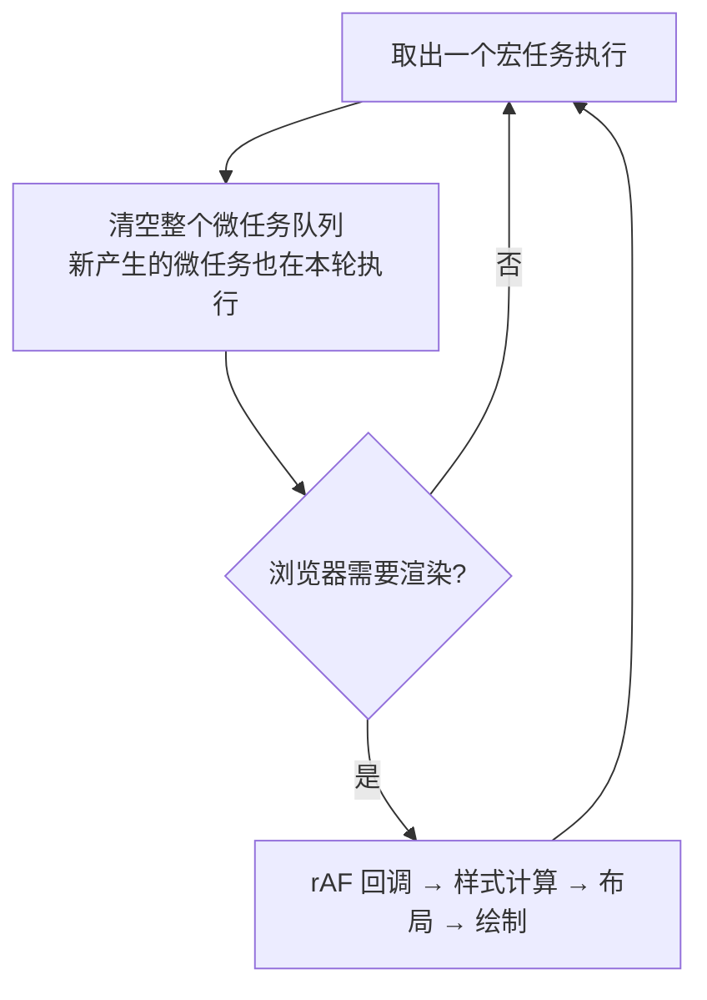

#JS #事件循环 #异步 #面试

# 事件循环与宏微任务

## TL;DR

**JS 单线程，靠事件循环调度异步：每执行完一个宏任务，就把微任务队列清空，然后才轮到下一个宏任务（浏览器中间还可能穿插渲染）**。微任务：Promise.then、queueMicrotask、MutationObserver；宏任务：script 整体、setTimeout/setInterval、I/O、用户事件。

---

## 1. 为什么需要事件循环

JS 执行线程只有一条（避免多线程同时改 DOM 的混乱）。耗时操作（网络、定时器）交给宿主（浏览器/Node）的其他线程去做，完成后把回调排进任务队列，主线程空闲时由**事件循环**取出执行——单线程 + 异步非阻塞就是这么来的。

---

## 2. 宏任务与微任务

| | 宏任务（task） | 微任务（microtask） |
|---|---|---|
| 来源 | script 整体、setTimeout/setInterval、setImmediate(Node)、I/O、UI 事件、MessageChannel | Promise.then/catch/finally、queueMicrotask、MutationObserver、process.nextTick(Node，优先级更高) |
| 执行时机 | 每轮循环取**一个** | 当前宏任务结束后**全部清空**（包括执行中新产生的） |

执行模型：



两个推论：

- **微任务插队**：then 回调永远先于同刻的 setTimeout；
- **微任务能饿死渲染**：微任务队列清不空（递归 queueMicrotask），页面就一直不渲染；而递归 setTimeout 每轮之间渲染有机会进来。

---

## 3. 经典输出题（必须秒答）

```js
console.log('1');
setTimeout(() => console.log('2'));
Promise.resolve().then(() => console.log('3'));
console.log('4');
// 1 4 3 2 —— 同步 → 微任务 → 宏任务
```

async/await 版（await 的本质是把后续代码放进 then）：

```js
async function a() {
  console.log('a1');
  await b();            // b 同步执行完后，a 的剩余部分进微任务
  console.log('a2');
}
async function b() { console.log('b'); }

a();
new Promise(r => { console.log('p1'); r(); }).then(() => console.log('p2'));
console.log('sync');
// a1 → b → p1 → sync → a2 → p2
```

判分口诀：**遇到 await，「等号右边同步执行，await 下面全进微任务」**；executor（new Promise 里的函数）是同步执行的。

深度加分点：`await 普通值` 只产生一次微任务；但 **resolve 一个 thenable/Promise 会额外消耗时序**——V8 会创建 PromiseResolveThenableJob 再解包，所以 `resolve(promise)` 比 `resolve(值)` 晚约两个微任务节拍。这是「为什么这道题差两拍」类问题的标准解释。

---

## 4. 应用题：每隔一秒输出 0..4

```js
for (var i = 0; i < 5; i++) {
  setTimeout(() => console.log(i), 1000);   // 一秒后输出 5 个 5
}
```

五种改法，考点各不相同：

```js
// ① let：每轮新绑定（块级作用域）
for (let i = 0; i < 5; i++) setTimeout(() => console.log(i), 1000 * i);

// ② IIFE：手工造作用域（闭包）
for (var i = 0; i < 5; i++) (j => setTimeout(() => console.log(j), 1000 * j))(i);

// ③ setTimeout 第三个参数：传参给回调
for (var i = 0; i < 5; i++) setTimeout(j => console.log(j), 1000 * i, i);

// ④ async/await：串行等待（真·每隔一秒）
const sleep = ms => new Promise(r => setTimeout(r, ms));
(async () => {
  for (let i = 0; i < 5; i++) { if (i) await sleep(1000); console.log(i); }
})();
```

注意 ①②③ 是「第 i 秒输出 i」（一次性排好定时器），④ 是真正的逐次等待——面试时主动区分这两种语义是亮点。

---

## 5. Node 与浏览器的差异（简答版）

Node 的事件循环分六个阶段（timers → pending → idle/prepare → **poll** → check(setImmediate) → close）；微任务在**每个阶段切换间**清空（Node 11 起与浏览器行为对齐：每个宏任务后就清微任务）。`process.nextTick` 有自己的队列，优先于所有微任务。面试通常点到：**Node 11+ 后输出顺序与浏览器基本一致，nextTick 最先，setImmediate 与 setTimeout(0) 在 I/O 回调内 setImmediate 必先**。

---

## 面试问答

### Q: 讲讲事件循环机制？

满分答案：JS 单线程，异步操作由宿主线程完成后将回调排入任务队列。事件循环每轮取一个宏任务执行，执行完把微任务队列整个清空（执行中新增的微任务也在本轮处理），浏览器再视情况渲染，然后进入下一轮。微任务有 Promise.then、queueMicrotask、MutationObserver；宏任务有 script、定时器、I/O、UI 事件。加分点：微任务可以饿死渲染；rAF 在渲染前执行，属于渲染流程的一部分而非普通宏任务。

### Q: async/await 的输出顺序怎么判断？

满分答案：await 等号右边的表达式同步执行，await 之后的代码等价于包进 then 回调，进微任务队列；new Promise 的 executor 同步执行。逐行标注「同步/微/宏」即可稳定求解。深挖点：await/resolve 的对象若是 thenable 或 Promise，V8 需要额外的 PromiseResolveThenableJob 解包，比 resolve 普通值多消耗时序，这是部分题目「差两拍」的原因。

### Q: setTimeout(fn, 0) 为什么不是立即执行？

满分答案：它只是把回调在 0ms 后放入宏任务队列，仍要排队等当前同步代码和全部微任务执行完；HTML 规范还规定嵌套超过 5 层的定时器最小间隔 4ms。所以 setTimeout 的延时是「不早于」而非「精确」。需要更早执行用微任务（queueMicrotask），需要渲染对齐用 requestAnimationFrame。

### Q: for 循环 + setTimeout 每隔一秒输出 i，有几种写法？

满分答案：一次性排布类——let 块级绑定 / IIFE 闭包 / setTimeout 第三个参数，配合 1000*i 实现「第 i 秒输出 i」；真串行类——async/await 加 sleep 函数逐次等待。主动指出两类的语义差异（预排定时器 vs 逐次等待），并顺带说明 var 版全输出 5 的原因是共享变量 + 回调晚于循环结束执行。
