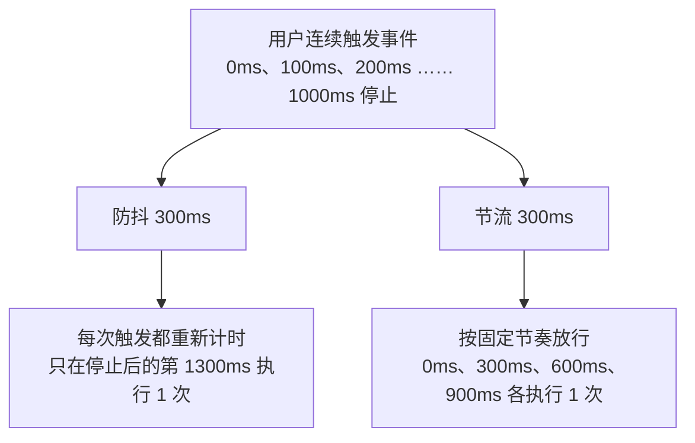

#JS #防抖 #节流 #手写 #面试

# 防抖与节流

## TL;DR

**防抖（debounce）：事件停止触发 n 毫秒后才执行，重触发就重新计时——「等你说完我再动」**。**节流（throttle）：n 毫秒内最多执行一次——「不管你多快，我按自己的节奏来」**。防抖适合搜索输入，节流适合滚动/拖拽。实现都靠闭包存 timer/时间戳。

---

## 1. 一图看懂区别



选型口诀：**关心「最终状态」用防抖**（输入联想、窗口 resize 完成后重算布局、表单校验）；**关心「过程中的均匀采样」用节流**（滚动加载、拖拽、mousemove、射击类按钮）。

---

## 2. 手写防抖（含立即执行版）

```js
function debounce(fn, wait, immediate = false) {
  let timer = null;
  function debounced(...args) {
    if (timer) clearTimeout(timer);
    if (immediate && !timer) {
      fn.apply(this, args);          // 首次立刻执行，之后进入冷却
    }
    timer = setTimeout(() => {
      if (!immediate) fn.apply(this, args);
      timer = null;                  // 冷却结束
    }, wait);
  }
  debounced.cancel = () => { clearTimeout(timer); timer = null; };
  return debounced;
}
```

判分点：

1. **闭包存 timer**，每次触发先清旧定时器（重新计时的语义）；
2. **fn.apply(this, args)** 保住 this 和事件参数——挂在 DOM 事件上时 this 应是元素；
3. immediate 版：首次立即执行、停止 wait 毫秒后才允许下一次「立即」；
4. 提供 cancel 是工程加分项（组件卸载时清理）。

---

## 3. 手写节流（时间戳版 + 定时器版 + 完整版）

```js
// 时间戳版：首次立刻执行（leading），停止后不再补一次（无 trailing）
function throttleByTime(fn, wait) {
  let last = 0;
  return function (...args) {
    const now = Date.now();
    if (now - last >= wait) {
      last = now;
      fn.apply(this, args);
    }
  };
}

// 定时器版：首次延迟执行，停止后会补最后一次（trailing）
function throttleByTimer(fn, wait) {
  let timer = null;
  return function (...args) {
    if (timer) return;
    timer = setTimeout(() => {
      fn.apply(this, args);
      timer = null;
    }, wait);
  };
}

// 完整版：leading + trailing 可配置（lodash.throttle 的形态）
function throttle(fn, wait, { leading = true, trailing = true } = {}) {
  let last = 0, timer = null;
  return function (...args) {
    const now = Date.now();
    if (!leading && !last) last = now;        // 关掉首次立即执行
    const remaining = wait - (now - last);
    if (remaining <= 0) {
      if (timer) { clearTimeout(timer); timer = null; }
      last = now;
      fn.apply(this, args);
    } else if (trailing && !timer) {
      timer = setTimeout(() => {
        last = leading ? Date.now() : 0;
        timer = null;
        fn.apply(this, args);                 // 补最后一次
      }, remaining);
    }
  };
}
```

两个基础版本的取舍正是面试追问点：**时间戳版有头无尾，定时器版无头有尾**，完整版把两者拼起来并可配置。

---

## 4. 工程实践备忘

- React 里要用 `useMemo`/`useRef` 保住防抖函数的身份，否则每次渲染新建函数，闭包里的 timer 就丢了；组件卸载记得 cancel。
- 事件处理器里 `event` 对象要立即取值再进异步（React 17 前的合成事件池、DOM 事件复用）。
- 滚动场景先考虑 **IntersectionObserver / CSS（position: sticky）** 能否替代监听 scroll——不触发 JS 才是最好的节流。
- lodash 的 debounce 有 `maxWait` 选项——防抖太久不执行时强制执行一次，本质是「防抖 + 节流」的混合体。

---

## 面试问答

### Q: 防抖和节流的区别？各自的应用场景？

满分答案：防抖是事件停止触发 wait 毫秒后才执行，期间重触发就重新计时，适合只关心最终状态的场景——搜索联想、resize 结束重算、按钮防重复提交；节流是固定窗口内最多执行一次，保证过程中的均匀执行，适合滚动加载、拖拽、mousemove。一句话：防抖归零计时，节流固定频率。

### Q: 手写防抖要注意什么？

满分答案：四点——闭包保存 timer，触发先清再设实现「重新计时」；用 fn.apply(this, args) 透传 this 和参数（DOM 事件下 this 是元素）；immediate 选项让首次立即执行、冷却后再允许下次；返回的函数挂 cancel 方法供组件卸载时清理。React 中还要用 useRef/useMemo 固定防抖函数身份，避免重渲染后闭包丢失。

### Q: 节流的时间戳实现和定时器实现有什么差异？

满分答案：时间戳版比较 now - last，达到间隔立即执行——有 leading 无 trailing，停止触发后最后一批操作不会执行；定时器版 timer 存在就忽略——无 leading 有 trailing，首次要等 wait 毫秒但停止后会补一次。完整版结合两者，用 remaining 计算剩余窗口，leading/trailing 可配置，就是 lodash.throttle 的思路。

### Q: 用防抖节流之外，高频事件还有什么优化手段？

满分答案：能不监听就不监听——懒加载和曝光统计用 IntersectionObserver 代替 scroll 监听；吸顶用 CSS sticky；动画对齐渲染帧用 requestAnimationFrame（天然「每帧一次」的节流）；被动监听 passive: true 让滚动不等 JS。原则是把工作从 JS 主线程挪到浏览器原生机制。
