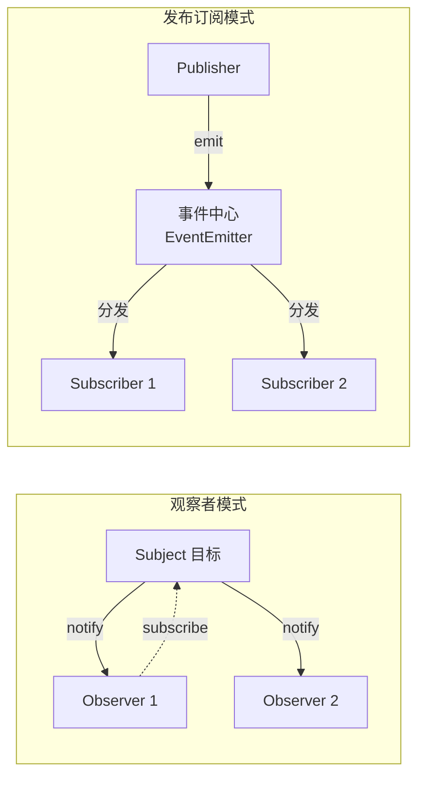

#JS #设计模式 #EventEmitter #手写 #面试

# 发布订阅与观察者模式

## TL;DR

**观察者模式：目标直接持有观察者列表，两者互相认识；发布订阅：中间多了个事件中心，发布者和订阅者互不认识**。手写 EventEmitter 四件套 on/off/emit/once，once 的判分点是包装函数 + 挂原回调引用以便 off。

---

## 1. 两个模式的差异（先说清概念再写代码）



| | 观察者 | 发布订阅 |
|---|---|---|
| 耦合 | 目标认识观察者（直接调用其 update） | 双方只认识事件中心，完全解耦 |
| 关系 | 一对多 | 多对多（按事件名分组） |
| 例子 | Vue 响应式里 Dep 与 Watcher、MutationObserver | EventEmitter、EventBus、消息队列、DOM 事件 |

面试一句话总结：**发布订阅 = 观察者 + 事件通道中介**。Vue 2 响应式（见 [[1.08 Proxy 与 Reflect]]）里 Dep-Watcher 是观察者模式，`$on/$emit` 则是发布订阅。

---

## 2. 手写观察者模式

```js
class Subject {
  #observers = new Set();
  subscribe(ob) { this.#observers.add(ob); }
  unsubscribe(ob) { this.#observers.delete(ob); }
  notify(data) { this.#observers.forEach(ob => ob.update(data)); }
}

const subject = new Subject();
subject.subscribe({ update: d => console.log('A 收到', d) });
subject.notify('变化了');
```

---

## 3. 手写 EventEmitter（高频，判分点都在注释里）

```js
class EventEmitter {
  #events = new Map();   // 事件名 → 回调数组

  on(name, cb) {
    if (!this.#events.has(name)) this.#events.set(name, []);
    this.#events.get(name).push(cb);
    return this;         // 支持链式
  }

  emit(name, ...args) {                    // ① 透传参数
    const cbs = this.#events.get(name);
    if (!cbs) return false;
    [...cbs].forEach(cb => cb(...args));   // ② 拷贝一份再遍历：
    return true;                           //    防止回调里 off/once 改数组导致跳项
  }

  off(name, cb) {
    const cbs = this.#events.get(name);
    if (!cbs) return this;
    if (!cb) { this.#events.delete(name); return this; }   // 不传 cb 清空该事件
    this.#events.set(
      name,
      // ③ 同时匹配原回调 与 once 包装（靠挂在包装上的 origin 引用）
      cbs.filter(f => f !== cb && f.origin !== cb),
    );
    return this;
  }

  once(name, cb) {
    const wrapper = (...args) => {
      cb(...args);
      this.off(name, wrapper);   // ④ 执行一次就自拆
    };
    wrapper.origin = cb;         // ⑤ 让 off(name, 原回调) 也能移除包装
    return this.on(name, wrapper);
  }
}
```

五个判分点：**参数透传**、**遍历前浅拷贝回调数组**（回调中注销不乱序）、**off 支持只传事件名清空**、**once 用包装函数自拆**、**包装上挂 origin 让 off 原函数也生效**。

工程提醒：事件总线（EventBus）滥用会让数据流不可追踪，Vue 3 移除了 `$on`，官方推荐 mitt / provide-inject / 状态管理代替全局总线；组件卸载必须 off，否则回调闭包引发内存泄漏（同 [[1.03 执行上下文、调用栈与闭包]] 的泄漏机制）。

---

## 4. 链式调用 + 任务队列：LazyMan（综合应用题）

要求：`LazyMan('Hank').sleepFirst(5).eat('dinner')` 按规则输出。考察**链式调用（return this）+ 任务队列 + 事件循环**的组合：

```js
class LazyMan {
  #queue = [];
  constructor(name) {
    this.#queue.push(() => console.log(`Hi! This is ${name}!`));
    // 关键：用 setTimeout 0 把执行推迟到本轮同步链式调用【全部注册完】之后
    setTimeout(async () => {
      for (const task of this.#queue) await task();
    });
  }
  #sleepTask = s => () => new Promise(r =>
    setTimeout(() => { console.log(`Wake up after ${s}`); r(); }, s * 1000));

  eat(food) { this.#queue.push(() => console.log(`Eat ${food}~`)); return this; }
  sleep(s) { this.#queue.push(this.#sleepTask(s)); return this; }
  sleepFirst(s) { this.#queue.unshift(this.#sleepTask(s)); return this; }  // 插队首
}
```

精髓两处：**构造函数里的 setTimeout** 保证所有 `.xxx()` 先把任务排完队才开始执行（事件循环知识点）；**sleepFirst 用 unshift** 插到队首。

---

## 面试问答

### Q: 观察者模式和发布订阅模式的区别？

满分答案：观察者模式里目标直接维护观察者列表、变化时点名调用，两者耦合；发布订阅引入事件中心，发布者 emit、订阅者 on，互相不认识，按事件名解耦成多对多。举例定位：Vue 响应式的 Dep-Watcher 是观察者，EventBus/Node 的 EventEmitter 是发布订阅。选择依据：模块内部的联动用观察者，跨模块/跨层通信用发布订阅（但要注意可追踪性）。

### Q: 手写 EventEmitter 的关键细节？

满分答案：on 按事件名收集回调；emit 透传参数、遍历前先浅拷贝数组（防止回调里 off 导致跳项）；off 支持精确移除和整名清空，且要能移除 once 的包装函数——做法是 once 的 wrapper 上挂 origin 指向原回调，off 时双条件过滤；once 包装执行后自拆。再补一句内存泄漏：长生命周期的 emitter 上不 off 的回调会拖住整个闭包。

### Q: LazyMan 类题目的实现思路？

满分答案：三个机制拼装——return this 实现链式；方法只往任务队列里塞函数（不执行）；构造函数里 setTimeout(fn, 0) 把「跑队列」推迟到同步链全部注册完成之后（宏任务时机），执行器 for...of + await 保证串行，sleepFirst 用 unshift 插队首。这题实际考事件循环 + 队列 + Promise 串行三个知识点的组合运用。
