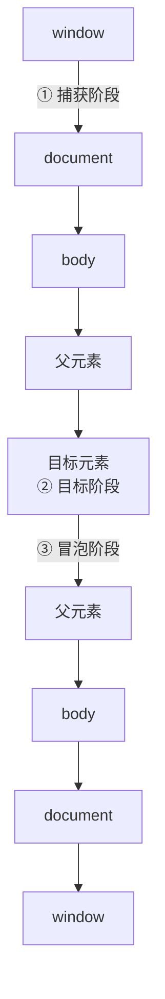

#JS #DOM #事件 #面试

# 事件模型与事件委托

## TL;DR

**DOM 事件流三阶段：捕获（window → 目标）→ 目标 → 冒泡（目标 → window）**。`addEventListener` 第三参 true 在捕获段触发，默认 false 在冒泡段。事件委托就是利用冒泡把子元素的事件统一挂到父级，靠 `e.target` 识别真实来源——省内存、天然支持动态子元素。

---

## 1. 事件流三阶段



规则要点：

- 捕获监听器（第三参 true）在①触发，冒泡监听器（默认）在③触发；
- **目标元素自身**：捕获/冒泡的区分失效，按**注册顺序**执行；
- 不冒泡的事件要记几个：`focus`/`blur`（用 focusin/focusout 替代）、`mouseenter`/`mouseleave`（mouseover/out 冒泡）、`load`、`scroll`（不冒泡但能在捕获段拦到）。

---

## 2. addEventListener vs onclick

| | `addEventListener` | `on` 属性 |
|---|---|---|
| 同事件多监听器 | ✓ 依次执行 | ✗ 后赋值覆盖前者 |
| 选择捕获/冒泡 | ✓ 第三参 | 只能冒泡 |
| 移除 | removeEventListener（需同一函数引用） | `el.onclick = null` |
| 高级选项 | `once`、`passive`、`signal` | 无 |

第三参的对象形式是加分项：

```js
el.addEventListener('click', fn, {
  once: true,      // 执行一次自动移除
  passive: true,   // 承诺不 preventDefault → 滚动不必等 JS，性能优化关键
  capture: false,
  signal: controller.signal,  // AbortController 批量解绑（现代姿势）
});
```

---

## 3. 阻止行为的三个 API（别混）

| API | 作用 |
|---|---|
| `e.preventDefault()` | 阻止**默认行为**（跳转、提交），不影响传播 |
| `e.stopPropagation()` | 阻止继续传播（捕获/冒泡都停），同元素其他监听器**照常执行** |
| `e.stopImmediatePropagation()` | 传播停 + 同元素**后续监听器也不执行** |

`e.target` 是实际触发事件的元素，`e.currentTarget` 是监听器所在元素（=== this，箭头函数下只能靠它）。

---

## 4. 事件委托（事件代理）

把子元素的监听统一挂在父级，冒泡上来后用 `e.target` 判断来源：

```js
// 1000 个 li 只挂 1 个监听器；后来动态插入的 li 也自动生效
list.addEventListener('click', (e) => {
  // closest 而不是裸比较 tagName：子元素里还有 <span> 时也能命中所属 li
  const li = e.target.closest('li');
  if (li && list.contains(li)) {
    console.log('点击了', li.dataset.id);
  }
});
```

收益：**内存省**（n 个监听器 → 1 个）、**动态子元素免重绑**、初始化更快。

注意事项：

- 用 `e.target.closest(selector)` 匹配，处理「点在深层子节点」的情况；
- 不冒泡的事件（focus/blur）改用会冒泡的兄弟（focusin/focusout）或捕获段监听；
- 委托层级别太高（都挂 document 会让每次点击都跑判断逻辑），挂到最近的稳定祖先。

通用的 delegate 封装（手写题版本）：

```js
function delegate(parent, selector, type, handler) {
  parent.addEventListener(type, (e) => {
    const target = e.target.closest(selector);
    if (target && parent.contains(target)) {
      handler.call(target, e);   // this 指向命中的子元素，贴近原生体验
    }
  });
}
delegate(document.querySelector('ul'), 'li', 'click', function (e) {
  console.log('点了', this.textContent);
});
```

---

## 5. 一道综合题：点击 li 输出下标为什么全是错的

```html
<ul><li>0</li><li>1</li><li>2</li></ul>
<script>
  const lis = document.querySelectorAll('li');
  for (var i = 0; i < lis.length; i++) {
    lis[i].onclick = function () { console.log(i); };  // 全输出 3
  }
</script>
```

三种修法呼应前文知识：`let` 替换 `var`（[[1.02 作用域、变量提升与 var-let-const]]）、IIFE 闭包、**事件委托**读取 dataset/DOM 位置——委托是「结构性修复」，另两种是「作用域修复」。

---

## 面试问答

### Q: 描述 DOM 事件流？捕获和冒泡的执行顺序？

满分答案：三阶段——捕获从 window 到目标父级、目标阶段、冒泡从目标回到 window。addEventListener 第三参（或 capture 选项）为 true 注册在捕获段，默认冒泡段；目标元素自身不分捕获冒泡、按注册顺序执行。补充不冒泡的事件：focus/blur（focusin/focusout 冒泡版）、mouseenter/leave、load。

### Q: 什么是事件委托？为什么用？

满分答案：利用冒泡，把子元素的事件统一注册到祖先元素，回调里用 e.target.closest 判断实际来源。三个收益——监听器数量从 n 降到 1 省内存、动态增删的子元素无需重新绑定、初始化更快。注意点：用 closest 处理深层子节点命中、不冒泡的事件换 focusin 或捕获段、委托点选最近稳定祖先而不是一律 document。

### Q: preventDefault、stopPropagation、stopImmediatePropagation 的区别？

满分答案：preventDefault 只取消默认行为（链接跳转、表单提交），事件照常传播；stopPropagation 停止向后传播但同元素其余监听器仍执行；stopImmediatePropagation 连同元素后续监听器一起截断。加分点：passive: true 的监听器里调用 preventDefault 无效并报警告——它就是靠「承诺不阻止默认滚动」换取滚动性能。

### Q: target 和 currentTarget 的区别？

满分答案：target 是真正触发事件的元素（点击的最深节点），currentTarget 是当前执行监听器的元素，等于监听器里的 this。事件委托的原理就是两者的分离：监听挂在 currentTarget（父级），逻辑判断用 target（子元素）。
