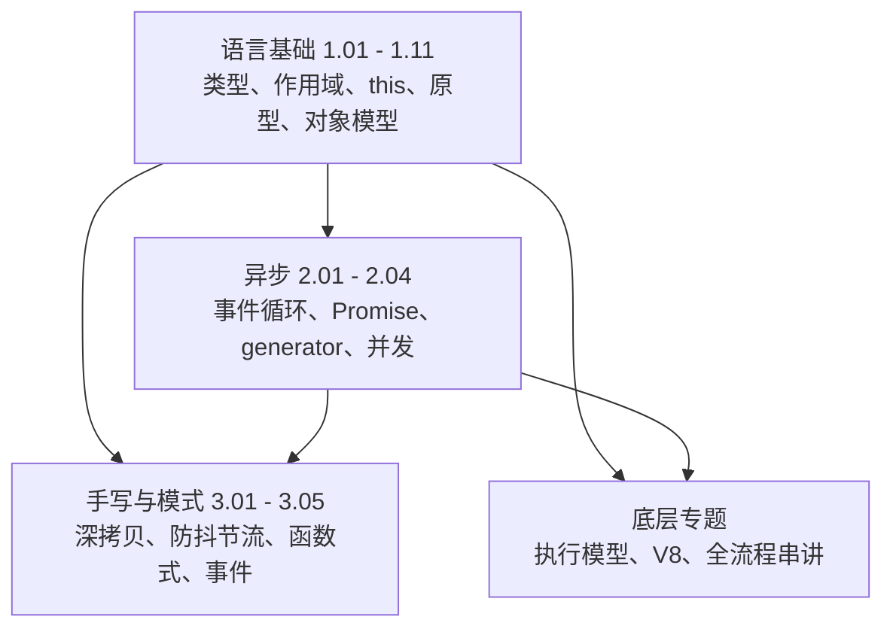

#JS #index

# JavaScript 知识索引

> Library/JS 总索引：阅读顺序、分组清单、概念速查
> 本篇是**目录索引**；把「从加载到渲染」串成一条流程讲完的长文是 [[Marauder'sMap/Library/JS/Map\|JavaScript 知识地图]]

## 阅读顺序

三条线相对独立：语言基础是地基，异步和手写题都建在它之上。

急于应付面试可以先扫每篇的 TL;DR，再按「输出题答不上来的那一篇」回头精读。

---

## 文章清单

### 语言基础

| 文章 | 一句话定位 |
|---|---|
| [[1.01 数据类型与类型判断]] | 7 种原始类型 + object；四种判断手段各有死角，`Object.prototype.toString.call()` 最全能 |
| [[1.02 作用域、变量提升与 var-let-const]] | 词法作用域、变量提升、暂时性死区——一大类「输出题」的通解 |
| [[1.03 执行上下文、调用栈与闭包]] | 闭包 = 函数 + 它定义时的词法环境引用；好处是私有状态，代价是内存 |
| [[1.04 this 与 call、apply、bind]] | 四条绑定规则的优先级：`new` > 显式 > 隐式 > 默认，箭头函数是唯一例外 |
| [[1.05 原型与原型链]] | `实例.__proto__ === 构造函数.prototype`，属性访问沿链上找到 `null` |
| [[1.06 继承与 class]] | 寄生组合继承是 ES5 最优解；class 是它的语法糖但不完全等价 |
| [[1.07 对象属性与属性描述符]] | 数据描述符 vs 存取描述符；`Object.defineProperty` 是操作入口 |
| [[1.08 Proxy 与 Reflect]] | 13 种 trap + Reflect 转发透传 receiver，Vue 3 响应式的地基 |
| [[1.09 Set、Map 与弱引用]] | 去重用 Set，非字符串 key 用 Map，不想阻碍 GC 用 WeakMap |
| [[1.10 数组与对象的遍历、去重、扁平化]] | 遍历方式选型 + 去重/扁平化的现代解与手写解 |
| [[1.11 ES6+ 特性地图]] | 按版本分组回答「ES6+ 有哪些特性」，重点在 async/await、可选链、类字段 |

### 异步

| 文章 | 一句话定位 |
|---|---|
| [[2.01 事件循环与宏微任务]] | 每执行完一个宏任务就清空微任务队列，再轮到下一个宏任务 |
| [[2.02 Promise 用法与手写实现]] | 状态机 + 回调收集 + then 返回值解析；all/allSettled/race/any 的差异 |
| [[2.03 generator 与 async-await]] | async/await = generator + 自动执行器，手写 co 是本主题终极题 |
| [[2.04 并发控制与耗时任务优化]] | 限并发靠补位循环；不卡页面靠切片（rIC/scheduler）或搬进 Worker |

### 手写与模式

| 文章 | 一句话定位 |
|---|---|
| [[3.01 深拷贝与浅拷贝]] | 首选 `structuredClone`；手写判分点是特殊类型 + WeakMap 解循环引用 |
| [[3.02 防抖与节流]] | 「等你说完我再动」vs「我按自己的节奏来」，都靠闭包存 timer |
| [[3.03 柯里化、偏函数与 compose]] | 闭包攒参数、`fn.length` 判断够没够；compose 一行 reduce |
| [[3.04 发布订阅与观察者模式]] | 有没有事件中心是两者的分界；手写 on/off/emit/once |
| [[3.05 事件模型与事件委托]] | 捕获 → 目标 → 冒泡三阶段，委托靠 `e.target` 识别真实来源 |

### 底层与专题

| 文章 | 一句话定位 |
|---|---|
| [[JS执行模型]] | 规范视角的代理（Agent）、域（Realm）、栈与执行上下文 |
| [[V8 引擎与 JIT 编译]] | 多层 JIT 把热点代码编成机器码，与 CPython 只解释字节码的对照 |
| [[Marauder'sMap/Library/JS/Map\|JavaScript 知识地图]] | 长文串讲：HTML 解析 → 引擎初始化 → 解析编译 → 执行 → 事件循环 → 渲染 |
| [[for 循环]] | 各种 for 的核心区别：遍历的是「键」还是「值」 |

---

## 概念速查（这个词在哪篇里讲透了）

| 概念 | 所在笔记 |
|---|---|
| typeof、instanceof、装箱、类型转换、`0.1+0.2`、类数组 | [[1.01 数据类型与类型判断]] |
| 词法作用域、变量提升、暂时性死区、IIFE | [[1.02 作用域、变量提升与 var-let-const]] |
| 执行上下文、调用栈、闭包、尾调用 | [[1.03 执行上下文、调用栈与闭包]] |
| 隐式/显式绑定、`new` 绑定、手写 call/apply/bind | [[1.04 this 与 call、apply、bind]] |
| `__proto__`、prototype、原型链、手写 new / instanceof | [[1.05 原型与原型链]] |
| 寄生组合继承、super、静态继承、类私有域 | [[1.06 继承与 class]] |
| 属性描述符、writable/enumerable/configurable、`Symbol.toStringTag` | [[1.07 对象属性与属性描述符]] |
| Proxy trap、Reflect、receiver | [[1.08 Proxy 与 Reflect]] |
| Set、Map、WeakMap、弱引用 | [[1.09 Set、Map 与弱引用]] |
| 宏任务、微任务、`queueMicrotask` | [[2.01 事件循环与宏微任务]] |
| Promise 状态机、then 链、promisify | [[2.02 Promise 用法与手写实现]] |
| yield、迭代器协议、co 执行器 | [[2.03 generator 与 async-await]] |
| 并发池、时间切片、Web Worker、rAF | [[2.04 并发控制与耗时任务优化]] |
| 循环引用、`structuredClone`、`JSON.parse(JSON.stringify())` 的缺陷 | [[3.01 深拷贝与浅拷贝]] |
| 事件冒泡与捕获、事件委托、`addEventListener` 第三参 | [[3.05 事件模型与事件委托]] |
| 隐藏类、内联缓存、Ignition、TurboFan | [[V8 引擎与 JIT 编译]] |

---

## 跨目录关联

- 事件循环的宿主侧（进程线程、渲染时机）→ [[2.01 浏览器进程、线程与事件循环]]
- 闭包与内存的另一面（GC 怎么判定垃圾）→ [[2.06 垃圾回收机制]]
- Node 的事件循环有六个阶段，与浏览器不同 → [[1.01 Node.js 事件循环]]
- 模块化（CommonJS 与 ESM）不在本目录 → [[1.01 JS 模块化演进：CommonJS 与 ESM]]
- 类型层 → [[Marauder'sMap/Library/TypeScript/Index|TypeScript 知识地图]]

---

## 维护说明

新增 JS 笔记时：挂进上面某张分组表并写一句定位，若引入新术语再补一行概念速查。编号沿用 `1.x 语言基础 / 2.x 异步 / 3.x 手写与模式` 三段，未编号的属「底层与专题」。
