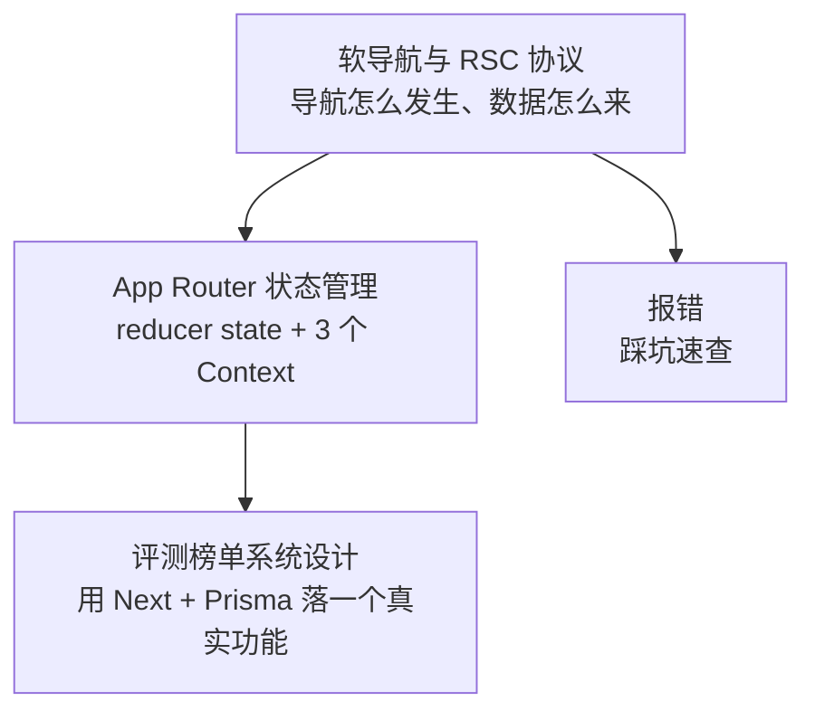

#Nextjs #index

# Next.js 知识地图

> Library/Nextjs 总索引：分组清单与阅读提示

## 目录构成

App Router 的两篇是一体两面：先看导航怎么发生，再看状态存在哪。

---

## 文章清单

| 文章 | 一句话定位 |
|---|---|
| [[软导航与RSC协议]] | 软导航 = History API + 数据获取 + 受控渲染；RSC payload 让服务端 JSX 流到客户端 |
| [[App Router 状态管理]] | 客户端运行时用 useReducer 管路由 state，按变化频率拆成 3 个 Context 分发 |
| [[评测榜单系统设计]] | 同一张 `Submission` 表既装系统 baseline 又装用户提交，靠 `userId + isPublic` 区分 |
| [[报错]] | 开发中遇到的报错与解法速查（如 layout.js 传输不全导致的 SyntaxError） |

---

## 跨目录关联

- React 的渲染与状态基础 → [[Marauder'sMap/Library/React/Index|React 知识地图]]、[[React 渲染机制]]
- Context 的性能特性（value 变化穿透 memo）→ [[1.08 组件通信与 Context]]
- 客户端路由的通用原理 → [[1.08 Vue Router 原理]]（同一套 History API 思路）
- 榜单功能的 SQL 侧 → [[排行榜查询模式]]
- 首屏与 SSR/SSG 的性能取舍 → [[2.02 首屏加载优化]]

---

## 维护说明

本目录混装**框架原理**（软导航、App Router 状态）与**项目实战**（榜单设计、报错速查）两类内容，新增时挂进清单并写一句定位即可，暂不编号——篇数还少，编号反而会限制归类。
