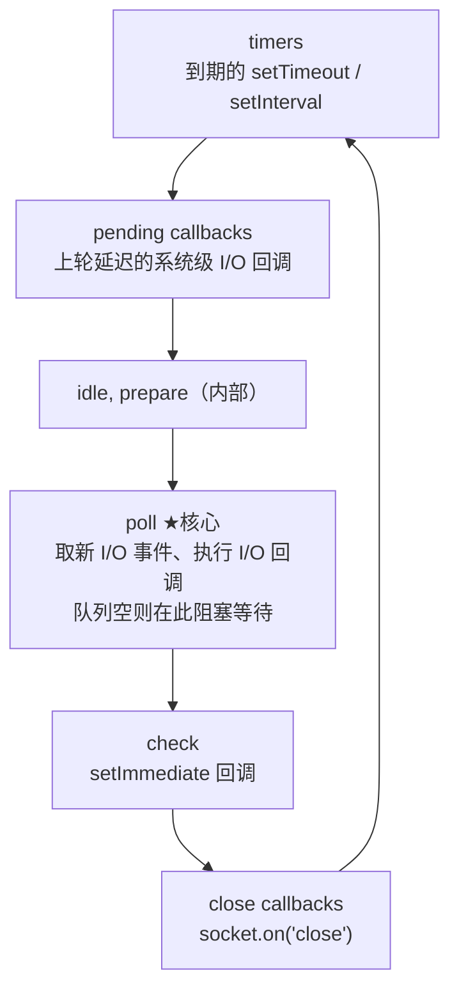

#Node #事件循环 #libuv #面试

# Node.js 事件循环

## TL;DR

**Node 的事件循环由 libuv 实现，分六阶段轮转：timers → pending callbacks → idle/prepare → poll（核心，I/O 回调与阻塞等待）→ check（setImmediate）→ close callbacks**。微任务不属于任何阶段——**每个宏任务回调结束后清空**（Node 11+ 与浏览器对齐），其中 `process.nextTick` 队列优先于 Promise 微任务。

> 浏览器事件循环与宏微任务基础见 [[2.01 事件循环与宏微任务]]。

---

## 1. 架构：V8 + libuv

Node = V8（执行 JS）+ **libuv**（C 库：跨平台事件循环 + 线程池）。JS 调用 Node API → libuv 接手：网络 I/O 走操作系统的事件通知（epoll/kqueue，**不占线程**）；文件 I/O、DNS、加密等则交给**线程池**（默认 4 线程，`UV_THREADPOOL_SIZE` 可调）——「Node 单线程」指 JS 执行单线程，底下有一支工人队伍。

---

## 2. 六阶段模型



每个阶段有自己的 FIFO 回调队列，执行到耗尽（或达到上限）才进下一阶段。**poll 是心脏**：没有到期定时器和 setImmediate 时，循环会阻塞在 poll 等新事件；有 setImmediate 则结束 poll 进入 check；有到期 timer 则绕回 timers。

**微任务的位置**：nextTick 队列和 Promise 队列不属于六阶段——**每执行完一个回调就清空**（先 nextTick 后 Promise）。`process.nextTick` 名字有误导：它不是「下一轮循环」而是「当前操作完成后立刻」，递归调用会饿死 I/O——官方建议新代码用 `queueMicrotask`/Promise。

---

## 3. 三个经典输出题

```js
// ① nextTick vs Promise vs setImmediate
process.nextTick(() => console.log('nextTick'));
Promise.resolve().then(() => console.log('then'));
setImmediate(() => console.log('setImmediate'));
console.log('end');
// end → nextTick → then → setImmediate
// 同步先行；微任务中 nextTick 队列整队优先于 Promise 队列；setImmediate 在 check 阶段
```

```js
// ② setTimeout(0) vs setImmediate —— 顺序不确定！
setTimeout(() => console.log('timeout'), 0);
setImmediate(() => console.log('immediate'));
// 主模块中两者顺序随机：进入循环耗时若 <1ms，timer 未到期，immediate 先；反之 timeout 先
```

```js
// ③ 在 I/O 回调里，setImmediate 永远先于 setTimeout
fs.readFile(f, () => {
  setTimeout(() => console.log('timeout'), 0);
  setImmediate(() => console.log('immediate'));  // 必先输出
});
// I/O 回调在 poll 阶段执行，下一站就是 check；timers 要等下一轮
```

题②③连着答是加分组合：**顺序不确定的原因（定时器 1ms 精度与启动耗时的竞争）+ 确定化的方法（放进 I/O 回调）**。

---

## 4. 与浏览器的差异（对比题收尾）

| | 浏览器 | Node |
|---|---|---|
| 实现 | HTML 规范，各引擎实现 | libuv |
| 宏任务组织 | 任务队列（含优先级） | **六阶段各自队列** |
| 微任务时机 | 每宏任务后清空 | 同（Node 11+ 对齐；11 前是**阶段之间**才清，老文章的差异表已过时） |
| 特有 API | rAF、rIC | setImmediate、process.nextTick |
| 渲染 | 穿插渲染帧 | 无渲染 |

答题时点明「Node 11 前后行为有变」既避免背旧结论，也展示知识新鲜度。

---

## 面试问答

### Q: 描述一下 Node.js 的事件循环？

满分答案：libuv 实现的六阶段循环——timers 执行到期定时器；pending callbacks 处理上轮遗留的系统回调；poll 是核心：拉取并执行 I/O 回调，空闲时在此阻塞等待，有 setImmediate 则转入 check 阶段执行，最后 close callbacks，再绕回 timers。微任务（nextTick 优先、Promise 次之）不属于阶段，每个回调执行完就清空。网络 I/O 靠系统事件通知，文件/DNS 走默认 4 线程的线程池——JS 单线程但 I/O 并不单线程。

### Q: setTimeout(fn, 0) 和 setImmediate 谁先执行？

满分答案：分场景——主模块中顺序不确定：setTimeout 最小精度约 1ms，若事件循环启动耗时不足 1ms，timers 阶段无到期任务，check 阶段的 setImmediate 反而先跑，多次运行结果随机；在 I/O 回调中 setImmediate 恒先：I/O 回调处于 poll 阶段，紧接着就是 check，而 timers 要等下一轮循环。这题本质考六阶段的顺序与定时器精度。

### Q: process.nextTick 和 Promise.then 的区别？用 nextTick 要注意什么？

满分答案：都在微任务时机执行，但 Node 维护两条队列——nextTick 队列每次都整队优先清空，然后才轮到 Promise 队列。注意：nextTick 名不副实，是「当前操作后立即」而非下一轮循环；递归 nextTick 会让事件循环永远到不了 poll，饿死 I/O。官方建议新代码用 queueMicrotask，nextTick 留给「必须在任何 I/O 之前修正状态」的库场景。

### Q: Node 和浏览器的事件循环有什么区别？

满分答案：三点——组织结构：浏览器是带优先级的任务队列，Node 是 libuv 六阶段各自带队列；专属 API：Node 有 setImmediate（check 阶段）和 nextTick（超优先微任务），浏览器有 rAF/rIC 且穿插渲染；微任务时机：现已一致（每个宏任务回调后清空），但要注明 Node 11 之前是阶段间才清微任务——很多老面经的输出题答案基于旧行为，需要带版本说明。
