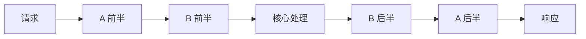

#Node #Koa #Express #中间件 #手写 #面试

# 中间件原理：Express、Koa 与洋葱模型

## TL;DR

**中间件 = 处理请求的流水线函数**。Express 是「线性穿过」：next() 只是继续往后走，响应通常在最后写；Koa 是「洋葱模型」：`await next()` 之后的代码在**内层全部完成后回头执行**——所以 Koa 能优雅地做耗时统计、错误兜底这类「包住后续」的逻辑。手写 koa-compose 是本主题的终极题。

---

## 1. 洋葱模型：await next() 的两半

```js
app.use(async (ctx, next) => {   // 中间件 A
  console.log('A-in');
  await next();                  // ↓ 进入内层
  console.log('A-out');          // ↑ 内层全部完成后回来
});
app.use(async (ctx, next) => {   // 中间件 B
  console.log('B-in');
  await next();
  console.log('B-out');
});
// 输出：A-in → B-in → B-out → A-out
```



每个中间件把请求「包」一层——前半在进入时执行，后半在**内层链路全部 resolve 后**执行。这让三类逻辑变得自然：**耗时统计**（前后取时间差）、**统一错误处理**（try/catch 包住 await next() 就兜住了所有内层错误）、**响应后置加工**（内层设置 body，外层统一压缩/包装）。

---

## 2. 手写 koa-compose（判分核心）

```js
function compose(middlewares) {
  return function (ctx, next) {
    let lastIndex = -1;                        // 防重复调用的游标
    function dispatch(i) {
      if (i <= lastIndex) {
        return Promise.reject(new Error('next() called multiple times'));
      }
      lastIndex = i;
      const fn = i === middlewares.length ? next : middlewares[i];
      if (!fn) return Promise.resolve();       // 链走到头
      try {
        // ★ 核心一行：把「下一个中间件」作为 next 传进当前中间件
        return Promise.resolve(fn(ctx, dispatch.bind(null, i + 1)));
      } catch (err) {
        return Promise.reject(err);            // 同步抛错也归一成 rejection
      }
    }
    return dispatch(0);
  };
}
```

四个判分点：**递归组合**——dispatch(i) 里把 dispatch(i+1) 当 next 传入，函数式地把数组卷成洋葱；**一切 Promise 化**——同步函数、同步 throw 都被 Promise.resolve/reject 归一，错误沿链冒泡到最外层 catch；**防止 next 重复调用**（index 游标）；**返回 Promise** 使外层可以 then 出统一响应。与 [[3.03 柯里化、偏函数与 compose]] 的函数组合是同一思想的异步版。

---

## 3. Express vs Koa vs Egg/Nest

| | Express | Koa | Egg / Nest（企业框架） |
|---|---|---|---|
| 中间件模型 | 线性「漏斗」：next() 继续向后，回程逻辑无保证（基于回调） | **洋葱**：async/await 双向穿透 | Koa 之上（Egg）/ 装饰器+DI（Nest） |
| API | req/res 原生风格，自带路由、模板 | ctx 封装 req/res，**极简内核**，路由都是插件 | 约定/规范全家桶：多进程、插件、安全、日志 |
| 错误处理 | 四参错误中间件，异步错误要手动 next(err)（Express 5 起 async 错误可自动捕获） | 最外层 try/catch 一网打尽 + error 事件 | 框架内建统一处理 |
| 定位 | 老牌全能 | 中间件内核，自由组装 | 团队规模化：约定优于配置 |

选型口径：玩具/胶水服务 Express/Koa 皆可；团队生产直接上企业框架（约定、安全、多进程内建，见 [[1.04 Node 多进程与集群]] 与 [[1.06 Node 部署与 Docker]]）。

**Express 中间件的极简实现**（对照记忆）：维护数组，next 就是「取下一个执行」的迭代器——没有 Promise 包装，所以回程顺序对异步不可靠，这正是两者的分水岭：

```js
function expressNext(i) {
  const fn = stack[i];
  if (fn) fn(req, res, () => expressNext(i + 1));
}
```

---

## 面试问答

### Q: 什么是洋葱模型？它解决了什么问题？

满分答案：Koa 中间件的执行序——每个中间件被 await next() 分成两半，前半按注册顺序进入，后半在内层全部完成后逆序回程，像穿过洋葱再穿回来。解决「需要包住后续处理」的横切逻辑：耗时统计前后取差、最外层 try/catch await next() 统一捕获全链错误、内层产出 body 外层统一加工。本质是把函数组合（compose）异步化。

### Q: 手写 Koa 的 compose？

满分答案：返回 (ctx, next) => dispatch(0)；dispatch(i) 取第 i 个中间件，把 dispatch.bind(null, i+1) 作为它的 next 传入，返回值用 Promise.resolve 包装、同步异常 reject——递归组合成洋葱。判分点：index 游标防同一中间件多次调用 next；越界时执行外部传入的 next 或 resolve 空；全链 Promise 化让错误冒泡到顶层统一处理。可现场演示 A-in/B-in/B-out/A-out 的输出验证。

### Q: Express 和 Koa 中间件的区别？

满分答案：Express 基于回调的线性模型——next 只是「继续往后」，异步场景下 next 之后的代码执行时机无保证，响应习惯写在最后一个中间件，异步错误需手动 next(err)（Express 5 才自动捕获 async 异常）；Koa 用 async/await 加 compose 实现洋葱双向穿透，回程可靠、错误一个顶层 try/catch 全兜住。再补定位差异：Express 自带路由模板走全能路线，Koa 极简内核一切皆插件，企业场景则由 Egg/Nest 这类框架在其上加约定。
