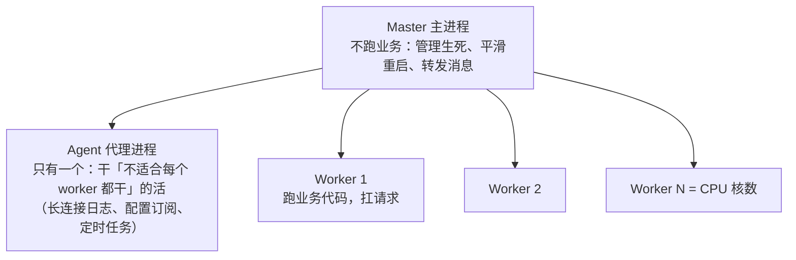

#Node #多进程 #cluster #面试

# Node 多进程与集群

## TL;DR

**JS 单线程 ≠ 服务器只用一个核：cluster 模块按 CPU 核数 fork 多个 worker 共同监听一个端口，主进程负责分发连接与拉起挂掉的子进程**。进程间通过 IPC 通道 postMessage 式通信。企业框架的标准形态是「master 管生死 + agent 干独活 + worker 扛流量」三角色。

---

## 1. 为什么要多进程

单个 Node 进程：JS 执行单线程（一个核）+ 内存上限（老生代默认约 2-4GB）。多核机器上想吃满 CPU、想要「一个 worker 崩了服务不断」，就需要多进程。三种创建方式：

| API | 用途 |
|---|---|
| `child_process.spawn/exec` | 跑外部命令（流式/缓冲） |
| `child_process.fork` | 派生 **Node 子进程**，自带 IPC 通道 |
| `cluster.fork` | fork 的特化：多个 worker **共享监听端口** |

（`worker_threads` 是线程方案——共享内存、适合 CPU 密集计算，与多进程的取舍见下文。）

---

## 2. cluster 原理：端口共享的秘密

```js
import cluster from 'node:cluster';
import { cpus } from 'node:os';

if (cluster.isPrimary) {
  cpus().forEach(() => cluster.fork());
  cluster.on('exit', (worker) => cluster.fork());   // 守护：挂一个补一个
} else {
  http.createServer(handler).listen(3000);          // 各 worker「都」listen 同一端口
}
```

多个进程 listen 同一端口为什么不报 EADDRINUSE？**worker 里的 listen 是假的**——cluster 拦截了它：实际只有**主进程创建监听 socket**，收到连接后按**轮询（round-robin）策略**把连接句柄通过 IPC 发给某个 worker 处理。所以：负载分配在 master、业务处理在 worker；worker 之间内存完全隔离（session 等状态必须外置到 Redis）。

**IPC 通信**：fork 时建立的通道（底层管道），`process.send(msg)` / `worker.on('message')` 收发，支持传递 socket 句柄（上面的连接分发正是靠它）。兄弟 worker 间不能直连，要经 master 转发——「进程间怎么通信」答 IPC 通道 + 句柄传递 + 经 master 中转三层。

---

## 3. 企业框架的三角色模型（以公开的 Egg 架构为例）



设计动机拆解：**master 保持极简稳定**（不跑业务就几乎不会挂）；**agent 解决「N 个 worker 重复做同一件事」的浪费**——比如与配置中心的长连接只需一条，agent 建好后把结果广播给 workers；worker 挂掉 master 重新 fork，**先起新再退旧**实现平滑重启。这套模型是「Node 服务生产化」的标准答案骨架。

**worker_threads vs cluster**：线程共享内存（SharedArrayBuffer）、创建轻，适合**CPU 密集计算**（图像处理、加密）放进线程池；cluster 进程隔离、故障不互染，适合**横向扩容 HTTP 服务**。口诀：算力用线程，流量用进程。

---

## 4. 进程管理实务

- **PM2**：生产守护标配——`pm2 start app.js -i max`（cluster 模式自动按核数）、崩溃自动拉起、`pm2 reload` 平滑重启、日志与监控（部署上下文见 [[1.06 Node 部署与 Docker]]）；
- 容器时代的修正：K8s 里常用「单进程容器 × 多副本」替代进程内 cluster——编排层负责扩缩容与自愈，容器内 PM2 反而多余（答出这层权衡很加分）；
- 排查命令：`ps aux | grep node`、`kill -15`（优雅）vs `kill -9`（强杀）、信号处理（SIGTERM 里关服务器、断连接再退出）。

---

## 面试问答

### Q: Node 是单线程的，怎么利用多核 CPU？

满分答案：cluster 模块——主进程按核数 fork worker，全部「监听」同一端口：实际 socket 只在 master 上，连接按轮询经 IPC 把句柄分发给 worker。配合 exit 事件重新 fork 实现进程守护。补充分工：CPU 密集计算用 worker_threads 线程（共享内存、切换轻），HTTP 扩容用 cluster 进程（隔离、故障不互染）；生产用 PM2 的 cluster 模式或 K8s 多副本替代手写。

### Q: 多个进程监听同一个端口为什么不冲突？

满分答案：因为 worker 并没有真的 listen——cluster 改写了 worker 的 listen 调用，仅主进程创建监听 socket；master 收到连接后用轮询策略选一个 worker，通过 IPC 通道把连接句柄传过去。这也解释了负载均衡策略在 master 层（round-robin，可配）以及 worker 内存隔离——共享状态必须外置 Redis/DB。

### Q: 说说企业级 Node 框架的多进程模型？

满分答案：三角色——master 只管进程生死与消息转发，极简所以稳定；agent 单实例承担「不该每个 worker 重复做」的工作：长连接日志、配置订阅、定时任务，结果经 master 广播给 workers；worker 按核数扩展跑业务。故障恢复：worker 挂了 master 补位；平滑发布：先拉新 worker 就绪再优雅退出旧的，服务不断流。这是 Egg 公开文档的经典架构，也适用于自建服务的设计参照。
