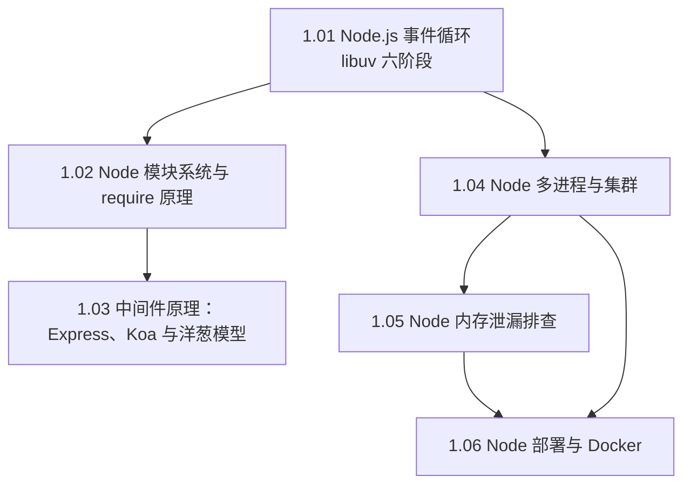

#Node #index

# Node.js 知识地图

> Library/Node 总索引：阅读顺序、分组清单、概念速查

## 阅读顺序

---

## 文章清单

| 文章 | 一句话定位 |
|---|---|
| [[1.01 Node.js 事件循环]] | libuv 六阶段轮转；微任务在每个宏任务后清空，`process.nextTick` 优先 |
| [[1.02 Node 模块系统与 require 原理]] | require 四步 + 包装函数；CJS 的一切「魔法」都从那个函数来 |
| [[1.03 中间件原理：Express、Koa 与洋葱模型]] | 线性穿过 vs 洋葱回头；手写 koa-compose 是终极题 |
| [[1.04 Node 多进程与集群]] | cluster 按核数 fork worker 共同监听端口；master/agent/worker 三角色 |
| [[1.05 Node 内存泄漏排查]] | 监控发现 → 压测复现 → 堆快照对比 → 修复验证的四步方法论 |
| [[1.06 Node 部署与 Docker]] | PM2 → Docker → K8s 三形态；层缓存、多阶段构建、进程必须前台运行 |

---

## 概念速查（这个词在哪篇里讲透了）

| 概念 | 所在笔记 |
|---|---|
| libuv、timers/poll/check 阶段、`setImmediate`、`process.nextTick` | [[1.01 Node.js 事件循环]] |
| 模块包装函数、`module.exports` 与 `exports`、模块缓存、查找顺序 | [[1.02 Node 模块系统与 require 原理]] |
| 中间件、`next()`、洋葱模型、koa-compose、错误兜底 | [[1.03 中间件原理：Express、Koa 与洋葱模型]] |
| cluster、fork、IPC、端口共享、进程守护 | [[1.04 Node 多进程与集群]] |
| RSS / heapUsed、堆快照、Retained Size、Retainers 链、常见泄漏源 | [[1.05 Node 内存泄漏排查]] |
| PM2、Dockerfile 层缓存、多阶段构建、前台进程、K8s 编排 | [[1.06 Node 部署与 Docker]] |

---

## 跨目录关联

- 浏览器侧的事件循环差异 → [[2.01 事件循环与宏微任务]]、[[2.01 浏览器进程、线程与事件循环]]
- CommonJS 与 ESM 的完整演进 → [[1.01 JS 模块化演进：CommonJS 与 ESM]]
- 包管理与依赖 → [[Marauder'sMap/Library/Node包管理器/Index|Node 包管理器索引]]、[[1.03 npm、yarn 与 pnpm]]
- GC 与内存的语言层原理 → [[2.06 垃圾回收机制]]
- 部署前面的那层网关 → [[2.03 Nginx 配置精要]]
- 数据库访问 → [[Marauder'sMap/Library/Database/Index|数据库知识地图]]

---

## 维护说明

新增 Node 笔记时：挂进文章清单并写一句定位，编号沿用 `1.x`。数据库、Nginx、Linux 等后端配套放 Library/Database 与 Library/Infrastructure，本目录只放 Node 运行时与框架。
