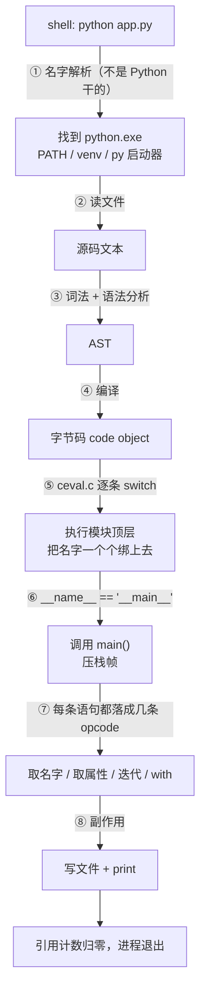

#Python #CPython #map

# Python 知识地图：从敲下回车到进程退出

> 跑一个 40 行的真实脚本，看解释器每一步在干什么——用这一次真实执行，把 Library/Python 的全部知识点串成一条线

> [!note] 定位
> 本文是 Python 知识树的**地图**：以一次执行为主线，途经每个知识点时只做够用的说明，细节链接到对应笔记。目录式的分类清单、学习路径与 TODO 见 [[Python 教程总览]]。

> [!info] 本文所有输出都是真跑出来的
> 环境：CPython 3.13.1 / Windows。字节码在 3.11 前后差异很大（`BINARY_ADD` 已并入 `BINARY_OP`、多了 `RESUME`），看到的指令名与旧教程对不上是正常的。

## 主角：app.py

```python
import json

CACHE = {}

def memoize(fn):
    def wrapper(n):
        if n not in CACHE:
            CACHE[n] = fn(n)
        return CACHE[n]
    return wrapper

@memoize
def square(n):
    return n * n

class Report:
    def __init__(self, name):
        self.name = name
        self.rows = []

    def add(self, n):
        self.rows.append(square(n))

    def __str__(self):
        return f"{self.name} 共 {len(self.rows)} 行: {self.rows}"

def main():
    r = Report("藜麦")
    for n in [1, 2, 3, 2]:
        r.add(n)
    with open("out.json", "w", encoding="utf-8") as f:
        json.dump({"rows": r.rows}, f, ensure_ascii=False)
    print(r)

if __name__ == "__main__":
    main()
```

```text
$ python app.py
藜麦 共 4 行: [1, 4, 9, 4]
```

四十行里塞进了：导入、闭包、装饰器、类、魔术方法、f-string、迭代、上下文管理、文件 IO、序列化、编码。下面把这一次执行拆成十四站。

## 核心流程概览

1. **找解释器** - `python` 这个词先要被解析成一个具体的可执行文件
2. **编译** - 源码 → AST → 字节码，全在启动的头几毫秒完成
3. **import** - 一句 `import json` 拉进来 23 个模块
4. **建对象** - 每个值都是带引用计数和类型指针的堆对象
5. **执行模块顶层** - `def` / `class` / `@` 全是**语句**，执行到才生效
6. **调用 main** - 压一个栈帧，参数绑成局部变量
7. **取名字** - LEGB 的三级在编译期就定成了三种不同指令
8. **取属性** - 实例 `__dict__` → 类 → MRO
9. **for 循环** - 要的不是 list，是迭代器协议
10. **with 块** - 要的不是文件，是 `__enter__` / `__exit__`
11. **写文件** - 序列化与编码，中文在这里出岔子
12. **print** - f-string 拼串，`__str__` 决定长什么样
13. **异常** - 没走到的那条岔路
14. **退出** - 引用计数归零，析构



### TL;DR

- **没有"声明"这回事**：`def`、`class`、`@decorator` 都是执行到才生效的语句，编译期只生成"造一个函数对象、绑到这个名字上"的指令
- **变量是标签不是盒子**：赋值是把标签贴到对象上，`del` 是撕掉标签，引用计数数的就是标签数
- **协议大于类型**：`for` 认 `__iter__`、`with` 认 `__enter__`、`print` 认 `__str__`——鸭子类型在机制层就是这么实现的
- **动态语言没那么动态**：LEGB 的 L/E/G 在编译期就定成了 `LOAD_FAST` / `LOAD_DEREF` / `LOAD_GLOBAL` 三条不同指令，运行时不做搜索
- 一句 `import json` 让 `sys.modules` 从 **45 涨到 68**，耗时约 13 ms——这就是"Python 启动慢"的实际构成
- CPython 的每条字节码都要经过取指令 → switch → 调 C 函数 → 改引用计数，一个 `int` 占 **28 字节**，这两件事解释了它为什么慢
- **GIL 实测**：两个 CPU 密集线程 0.18s，串行跑两遍也是 0.18s，一秒没省

---

## 1. 敲回车之前：哪个 python

### 1.1 这一步不归 Python 管

`python app.py` 里的 `python` 由 shell 按 `PATH` 顺序找第一个匹配的可执行文件。同一台机器上通常躺着好几个：

```text
系统自带的            /usr/bin/python3
装 Python 时装的      ~/AppData/Local/Programs/Python/Python313/python.exe
Windows 应用商店存根  ~/AppData/Local/Microsoft/WindowsApps/python.exe
虚拟环境里的          .venv/Scripts/python.exe    ← 激活后排在最前
conda 环境里的        ~/miniconda3/envs/xxx/python.exe
```

**激活虚拟环境干的唯一一件事，就是把它的目录插到 `PATH` 最前面。** 所谓"环境问题"绝大多数是这一步选错了人——包装在了 A 里，脚本用 B 跑。两条主流路线（Conda 与 pyenv + venv）怎么选见 [[0.01 环境管理]]；依赖怎么锁见 [[PDM]]。

第一件事永远是确认现在站在哪：

```bash
python -c "import sys; print(sys.executable)"
```

### 1.2 配置也在进程之外

脚本要用的数据库地址、API key 这类东西，规范做法是从环境变量读，不写进代码：进程启动时环境变量就已经在那儿了，`os.environ` 只是读一份快照。`.env` 文件与 12-Factor 那套见 [[0.02 环境变量与配置]]。

---

## 2. 源码 → 字节码

### 2.1 三步走

```text
app.py（文本）
  → 词法 / 语法分析 → AST
  → 编译             → 字节码（code object）
  → CPython VM 逐条解释执行
```

前两步和任何编译器一样，第三步才是"解释"的部分：`Python/ceval.c` 里一个巨大的 `switch`，取一条 opcode、跳到对应分支、执行、取下一条。完整机制、栈式虚拟机、以及"为什么这比机器码慢"见 [[5.15 CPython 解释器原理]]。

**要点是编译真实存在**。Python 不是逐行读逐行跑——整个文件先一次编译完，语法错误在一行都没执行前就会报出来。

### 2.2 亲眼看一次：模块顶层的字节码

把 app.py 编译一遍，看看顶层那几句变成了什么（`dis.dis(compile(src, 'app.py', 'exec'))`）：

```text
  1   LOAD_CONST 0 (0) / LOAD_CONST 1 (None)
      IMPORT_NAME    0 (json)
      STORE_NAME     0 (json)              ← import 也是"求值 + 绑名字"

  3   BUILD_MAP      0
      STORE_NAME     1 (CACHE)

  6   LOAD_CONST     2 (<code object memoize>)
      MAKE_FUNCTION
      STORE_NAME     2 (memoize)           ← def 就是造对象 + 绑名字

 14   LOAD_NAME      2 (memoize)
 15   LOAD_CONST     3 (<code object square>)
      MAKE_FUNCTION
 14   CALL           0                     ← @memoize 在这里就调用了
 15   STORE_NAME     3 (square)            ← 绑上去的是 memoize 的返回值

 19   LOAD_BUILD_CLASS
      LOAD_CONST     4 (<code object Report>)
      MAKE_FUNCTION
      LOAD_CONST     5 ('Report')
      CALL           2
      STORE_NAME     4 (Report)            ← class 是"执行类体、造一个类对象"

 31   MAKE_FUNCTION / STORE_NAME 5 (main)

 40   LOAD_NAME      6 (__name__)
      LOAD_CONST     7 ('__main__')
      COMPARE_OP    88 (bool(==))
      POP_JUMP_IF_FALSE → L1
 41   LOAD_NAME      5 (main) / CALL 0 / POP_TOP
```

**这段输出把本文最重要的一条规律直接摊在眼前**：整个模块顶层，除了最后那个 `if`，全部是清一色的「造一个对象 → `STORE_NAME` 绑到一个名字上」。`import`、`def`、`class`、`@` 没有一个是"声明"，它们都是**执行到那一行才发生的事**。第 5 节会展开这条规律的全部后果。

### 2.3 `__pycache__` 为什么没出现

跑完 `python app.py`，目录里并没有 `__pycache__`：

```text
$ python app.py && ls __pycache__
ls: cannot access '__pycache__': No such file or directory
```

但只要它被 import 一次就有了：

```text
$ python -c "import app" && ls __pycache__
app.cpython-313.pyc
```

**规则是：只有被 import 的模块才缓存字节码，主脚本永远重新编译。** 因为缓存是为了省下"重复导入同一个库"的编译时间，而主脚本一个进程只编译一次，缓存了也没人用。

文件名里的 `cpython-313` 是版本标签——换个解释器版本就用不上旧缓存，所以同一个目录下可以并存好几份。

### 2.4 "解释型"的真正含义

字节码不是机器码，得有解释器才能跑。这带来两个连锁后果：**发布时要么带上解释器（PyInstaller 把它打包进 exe），要么要求对方装好**；以及 **`.py` 就是源码本身，发出去等于开源**，`.pyc` 只是障眼法，反编译工具很成熟。这条线上的完整讨论（含 WASM、代码保护的可行性）见 [[0.03 解释型语言与代码发布]]；把库发到 PyPI 上的两种形式（wheel 与源码包）见 [[0.04 打包与分发]]。

---

## 3. import：第一次执行，之后走缓存

### 3.1 一句 `import json` 的实际代价

```text
import 前 sys.modules: 45 个模块
import 后 sys.modules: 68 个模块
```

多出来的 23 个：

```text
json, json.decoder, json.encoder, json.scanner, _json,
re, re._compiler, re._parser, re._constants, re._casefix, _sre,
collections, collections.abc, _collections, functools, _functools,
itertools, operator, _operator, enum, keyword, copyreg, reprlib
```

`-X importtime` 显示这一句累计约 **13 ms**。**"Python 启动慢"就是这么攒出来的**——不是解释器本身慢，是导入的模块会递归拉进一整棵依赖树。CLI 工具要提速，第一刀通常砍在把重量级 import 挪进函数体里（延迟导入）。

### 3.2 模块只执行一次

import 一个模块 = 找到文件 → 编译 → **把整个文件当普通代码从头执行一遍** → 把结果的命名空间包成模块对象 → 存进 `sys.modules`。

第二次 import 同一个模块，直接从 `sys.modules` 拿，一行代码都不再跑。所以模块顶层的 `print` 只会打印一次；调试时改了模块代码却不生效，也是它——要么重启进程，要么 `importlib.reload()`。完整规则、包与 `__init__.py` 的用法见 [[1.12 模块与包]]。

顺带解释了**循环导入**为什么难缠：A 导入到一半去执行 B，B 又回头导入 A，此时 `sys.modules` 里的 A 已经存在但只填了一半，B 拿到的是个残缺的模块对象。

---

## 4. 建对象：一切皆对象

字节码开始执行，第一批对象被造出来。在 CPython 里，**每个 Python 值都是 C 层的一个堆对象**，头部固定带两个字段：引用计数 `ob_refcnt` 和类型指针 `ob_type`。

代价看得见：

```text
int 1        28 字节
int 2**64    36 字节
空 list      56 字节
[1, 4, 9, 4] 88 字节
空 dict      64 字节
```

一个 C 里 8 字节的整数，在 Python 里要 28 字节。这就是 **boxing 开销**，加上第 2.1 节那个 switch 循环，共同构成了"Python 慢"的两大来源。也正因如此，数值计算全靠 NumPy 把循环下沉到 C（见 [[5.15 CPython 解释器原理]] 第 6 节）。

引用计数就是"有几个名字指着我"：

```python
a = ['x']    # refcount = 1
b = a        # refcount = 2   ← 没有复制，只是多贴了一个标签
del b        # refcount = 1
```

**这里藏着理解 Python 变量的关键：变量是贴在对象上的标签，不是装着值的盒子。** `b = a` 不复制任何东西，两个名字指向同一个对象——可变对象（list、dict）改一个另一个跟着变，不可变对象（int、str、tuple）因为改不了才显得"像值传递"。可变与不可变的完整分界见 [[1.01 数据类型基础]]。

---

## 5. 执行模块顶层：def、class、@ 都是语句

### 5.1 `def` 造的是一个普通对象

第 2.2 节的字节码已经给了答案：`MAKE_FUNCTION` + `STORE_NAME`。函数对象和 int、list 一样，可以赋值、传参、塞进列表、当返回值——这就是"函数是一等公民"的机制层解释，也是 `map` / `filter` / `sorted(key=...)` 这类高阶函数能成立的前提（见 [[1.11 高阶函数]]、[[1.10 函数进阶]]）。

一个直接推论：**`def` 可以写在任何能写语句的地方**，包括 `if` 里面、函数里面、循环里面。

### 5.2 装饰器在定义时就跑完了

```text
LOAD_NAME  memoize          ← 先把装饰器取出来
MAKE_FUNCTION (square)      ← 造出原始的 square 函数对象
CALL 0                      ← 立刻调用 memoize(square)
STORE_NAME square           ← 把返回值绑到 square 这个名字上
```

`@memoize` 完全等价于 `square = memoize(square)`，**在 import 那一刻就执行了，不是等到第一次调用**。验证一下：

```python
>>> app.square
<function memoize.<locals>.wrapper at 0x...>
```

名字叫 `square`，人已经是 `wrapper` 了。这也是为什么装饰器要配 `functools.wraps`——否则函数名、docstring、签名全被换成 wrapper 的。装饰器的两层/三层嵌套写法见 [[2.01 装饰器与闭包]]。

### 5.3 `class` 也是执行

`LOAD_BUILD_CLASS` 的做法是：把类体当成一个函数执行一遍，收集执行完的局部命名空间，交给元类造出类对象。所以类体里可以写任意语句（`if`、循环、`print`），执行时机是**定义类的那一刻**。

跑完之后，方法躺在类的 `__dict__` 里：

```python
>>> [k for k in Report.__dict__]
['__module__', '__firstlineno__', '__init__', 'add', '__str__', ...]
>>> Report.__mro__
(<class 'app.Report'>, <class 'object'>)
```

MRO（方法解析顺序）此刻就定好了，第 8 节取属性时要沿着它走。多继承、MixIn、metaclass 见 [[2.04 面向对象编程]]。

### 5.4 `if __name__ == "__main__"`

顶层最后那几条指令只是一次普通的字符串比较。`__name__` 是模块的名字：直接跑就是 `"__main__"`，被 import 就是 `"app"`。这一行让同一个文件既能当脚本跑，又能当模块导入而不触发副作用。

**到这里模块顶层执行完毕**，命名空间里有了 `json`、`CACHE`、`memoize`、`square`、`Report`、`main` 六个名字。真正的活儿还一点没干。

---

## 6. 调用 main()：一个栈帧

`CALL` 指令做的事：新建一个**栈帧**（frame），把参数绑成帧内的局部变量，跳进函数的字节码执行，`RETURN_VALUE` 时把返回值留在栈上、弹掉帧。

从被调方向外看就是调用栈：

```text
add  <-  main  <-  <module>
```

异常回溯（traceback）打印的就是这个链条，调试器的"上一层/下一层"走的也是它。栈太深会 `RecursionError`（默认上限 1000）。

参数绑定这一步有 Python 特有的复杂度：位置参数、默认参数、`*args`、关键字参数、`**kwargs` 五种形态混在一起，规则见 [[1.09 函数参数]]。其中最出名的坑与本节直接相关——**默认值在 `def` 执行时求值一次，之后所有调用共用同一个对象**，所以 `def f(x=[])` 会让列表在多次调用间累积。它不是特例，就是第 5.1 节那条规律的自然结果：`def` 是一条语句，右边的表达式当场求值。

---

## 7. 取名字：LEGB 在编译期就定死了

### 7.1 三级、三条不同的指令

`wrapper` 只有四行，却同时用到了 LEGB 里的三级。看它的字节码：

```text
LOAD_FAST     0 (n)        ← L  Local：本帧的局部变量，按数组下标取
LOAD_GLOBAL   0 (CACHE)    ← G  Global：模块命名空间，查字典
LOAD_DEREF    1 (fn)       ← E  Enclosing：外层函数的变量，从 cell 里取
```

`__str__` 里那个 `len` 也是 `LOAD_GLOBAL`——**B（Built-in）没有独立指令**，`LOAD_GLOBAL` 在模块命名空间里找不到时会自动去 builtins 里找。

这张表是本节的全部内容：

| 层级 | 指令 | 怎么取 | 速度 |
|---|---|---|---|
| L Local | `LOAD_FAST` | 帧内数组按下标 | 最快 |
| E Enclosing | `LOAD_DEREF` | 从闭包 cell 取 | 快 |
| G Global | `LOAD_GLOBAL` | 模块 dict 查键 | 慢 |
| B Built-in | `LOAD_GLOBAL` | 上一步失败后再查一次 | 最慢 |

**关键在于：这四条指令是编译时就选好的，运行时不做任何"逐层搜索"。** 教科书里那张 L→E→G→B 的洋葱图描述的是**编译器的决策过程**，不是解释器的运行过程。LEGB 规则本身见 [[1.03 变量与作用域]]。

想清楚这点，两个经典报错立刻不神秘了：

- **`UnboundLocalError`**：函数里任何位置有 `x = ...`，编译器就把整个函数里的 `x` 都编成 `LOAD_FAST`。赋值之前读它，取到的是空槽位——不是"没找到全局的 x"，是"局部的 x 还没填"。`global` / `nonlocal` 的作用正是改变编译器这一步的判定。
- **类体里直接用类属性名报 `NameError`**：类作用域不进入 LEGB 的 E 链，方法里得走 `self.x`。

### 7.2 闭包：cell 是一层间接

`wrapper` 引用了外层的 `fn`，于是 `fn` 不再是 `memoize` 帧里的普通局部变量，而被提升成一个 **cell 对象**，函数对象随身带着它：

```python
>>> app.square.__code__.co_freevars
('fn',)
>>> app.square.__closure__[0].cell_contents
<function square at 0x...>
```

名字 `square` 现在指着 `wrapper`，而原始的 square 函数只剩 cell 里这一个引用——**闭包让它没被回收**。

这层间接也解释了循环里定义函数的经典陷阱：**cell 里装的是变量，不是值**。循环结束后所有闭包一起看到最后一次的结果。闭包的完整展开见 [[2.01 装饰器与闭包]]。

### 7.3 顺带看一眼缓存生效

`main` 里调了 4 次 `square`，参数是 `[1, 2, 3, 2]`：

```python
>>> app.CACHE
{1: 1, 2: 4, 3: 9}     # 4 次调用只真算了 3 次
```

`CACHE` 是模块级全局变量，`wrapper` 只读不赋值（`CACHE[n] = ...` 是改对象内容，不是重新绑名字），所以不需要 `global`。**只有重新绑定名字才需要 `global` / `nonlocal`**——又一次回到"变量是标签"这条主线。

---

## 8. 取属性：实例 → 类 → MRO

`self.rows.append(square(n))` 这一行，`add` 的字节码里是两条连着的 `LOAD_ATTR`：

```text
LOAD_FAST  0 (self)
LOAD_ATTR  0 (rows)          ← 第一次：从实例 __dict__ 里取
LOAD_ATTR  3 (append)        ← 第二次：实例没有，去类里找
```

`LOAD_ATTR` 的查找顺序：

```text
实例 __dict__  →  类 __dict__  →  沿 MRO 往父类找  →  __getattr__  →  AttributeError
```

对上号：

```python
>>> r.__dict__
{'name': '藜麦', 'rows': [...]}      ← 数据在这
>>> [k for k in Report.__dict__]
['__init__', 'add', '__str__', ...]  ← 方法在这
```

**实例存数据，类存方法**，这就是"实例属性 vs 类属性"混淆的根源——写 `self.x = 1` 是在实例 dict 里加键，写在类体里的 `x = 1` 所有实例共享。

这条链路上挂着几篇：拦截查找的 `__getattr__` 与其他魔术方法见 [[2.06 定制类]]；`@property` 让方法伪装成属性、`_name` / `__name` 的约定与 name mangling 见 [[2.05 属性访问与限制]]；`__slots__` 直接干掉实例 `__dict__` 来省内存见 [[2.04 面向对象编程]]；运行时反过来查这些结构（`dir` / `getattr` / `hasattr`）见 [[2.08 对象信息获取]]。

---

## 9. for 循环：要的不是 list

```python
for n in [1, 2, 3, 2]:
```

编译成 `GET_ITER` + `FOR_ITER`：先对被遍历的东西调 `iter()`，再反复调 `next()`，接到 `StopIteration` 就跳出。

**`for` 从头到尾没检查过类型。** 它只要求对方能交出一个迭代器——这就是同一个 `for` 能遍历 list、dict、文件对象、生成器、自定义类的全部原因，也是[[1.07 迭代与切片|迭代器协议]]的意义所在。第 10 节的 `with`、第 12 节的 `print` 是同一套路子：**协议大于类型**，这才是鸭子类型在机制层的样子。

一个实际后果是**惰性**：迭代器不需要一次性把所有元素备好。读 10 GB 的文件用 `for line in f` 内存占用是常数，换成 `f.readlines()` 就爆了。列表推导式（立即求值）与生成器表达式（惰性）的取舍见 [[1.08 列表生成式]]。

---

## 10. with：要的也不是文件

```python
with open("out.json", "w", encoding="utf-8") as f:
```

`with` 认的是**上下文管理协议**：进入时调 `__enter__()`，离开时调 `__exit__()`——**不管是正常走完、`return`、`break` 还是抛异常，`__exit__` 都会被调用**。

```python
>>> f = open('out.json', encoding='utf-8')
>>> type(f).__name__, hasattr(f, '__enter__'), hasattr(f, '__exit__')
('TextIOWrapper', True, True)
```

这就是"文件一定会被关掉"的机制。同一套协议也用在锁、数据库事务、临时改环境变量上；用 `@contextmanager` 把一个生成器变成上下文管理器的写法见 [[2.03 contextlib 上下文管理]]。文件对象本身的读写模式、二进制与文本的区别见 [[4.01 IO 编程]]。

`open()` 返回的是 `TextIOWrapper`——一层**编码解码的包装**。文本模式收发 `str`、二进制模式（`'rb'`）收发 `bytes`，中间隔着的就是下一节的编码。

---

## 11. 写文件：中文在这里出岔子

### 11.1 `ensure_ascii` 默认是 True

```python
>>> json.dumps({'name': '藜麦'})
'{"name": "\\u85dc\\u9ea6"}'                    # 24 字节
>>> json.dumps({'name': '藜麦'}, ensure_ascii=False)
'{"name": "藜麦"}'                              # 18 字节
```

默认把所有非 ASCII 字符转义成 `\uXXXX`。这是合法 JSON、解析回来一模一样，只是人看不了、体积还大。所以示例里显式写了 `ensure_ascii=False`。`pickle` 与 `json` 的分工、自定义类怎么序列化见 [[4.02 序列化]]。

### 11.2 `encoding=` 不写会怎样

```python
>>> locale.getencoding()
'cp936'                       # 本机（中文 Windows）
```

**`open()` 不指定 `encoding` 时用的是系统 locale 编码**——本机是 cp936，同一份代码在 Linux/macOS 上是 UTF-8。这是"我这儿好好的，同事那儿乱码"最常见的一个来源，而且它只在有非 ASCII 字符时才暴露。

结论很简单：**文本模式的 `open()` 永远显式写 `encoding="utf-8"`**。字符怎么变成字节、UTF-8 的模板填空规则见 [[1.05 字符编码]]——这篇同时是 AI 侧 [[Token 与 Embedding 表|分词]]的前置，模型眼里也只有字节。

（注意 `sys.getdefaultencoding()` 恒为 `'utf-8'`，那是 `str.encode()` 的默认值，跟文件读写用哪个编码是两回事，别拿它当依据。）

---

## 12. print：f-string 与 `__str__`

`print(r)` 打印的是 `Report.__str__` 的返回值。而那个 f-string 编译成：

```text
LOAD_FAST self / LOAD_ATTR name / FORMAT_SIMPLE
LOAD_CONST ' 共 '
LOAD_GLOBAL len / ... / CALL 1 / FORMAT_SIMPLE
LOAD_CONST ' 行: '
LOAD_FAST self / LOAD_ATTR rows / FORMAT_SIMPLE
BUILD_STRING 5
```

**f-string 在编译期就被拆成了指令，运行时没有任何字符串解析、也没有函数调用**——这就是它比 `%` 和 `.format()` 快的原因，三种写法的对比见 [[1.04 字符串格式化]]。

`__str__` / `__repr__` / `__len__` / `__iter__` / `__call__` 这些魔术方法是同一个思想的延续：**内置函数和语法都是转成协议调用**，`len(x)` 就是 `x.__len__()`，`x()` 就是 `x.__call__()`。全套见 [[2.06 定制类]]。

---

## 13. 岔路：如果出错了

这次执行一切顺利。如果 `open` 失败，异常会沿着第 6 节那个调用栈一路往上抛，直到遇到 `except` 或到达顶层——那时解释器打印 traceback 并以非零码退出。

`with` 的 `__exit__` 在异常路径上照常执行，文件不会漏关。`try` / `except` / `else` / `finally` 各自的时机、自定义异常、`raise from` 保留原始原因见 [[2.02 异常处理]]。

---

## 14. 退出：引用计数归零

`main` 返回，它的栈帧被弹掉，帧里的局部变量随之消失。`r` 这个名字没了 → `Report` 实例引用计数归零 → **立即析构**，连带它 `__dict__` 里的 `rows` 列表也归零释放。

这是 Python 和 JS 的一处硬差别：**引用计数是确定性的，对象在最后一个引用消失的那一刻就被回收**，不用等 GC 巡视。代价是处理不了循环引用（A 指 B、B 指 A，两边都不为零），所以另配了一套分代 GC 兜底。两者的分工见 [[5.15 CPython 解释器原理]] 第 4 节。

进程退出前，解释器还会执行 `atexit` 注册的回调、flush 缓冲区。至此，`out.json` 落盘，故事结束。

---

## 15. 这次没走到的三条支线

一次简单执行走不到的地方，也是知识树上最大的三块：

### 15.1 并发：GIL 的实测

脚本是单线程的。多线程会撞上 CPython 最出名的那把锁：

```text
串行跑两遍   : 0.18s
两个线程并行 : 0.18s     ← 一秒没省
```

**GIL 保证任一时刻只有一个线程在执行 Python 字节码**，所以 CPU 密集任务开多线程完全无用。它存在的理由是保护第 4 节那个 `ob_refcnt`——多线程同时改引用计数会算错，轻则泄漏重则崩溃（见 [[5.15 CPython 解释器原理]] 第 5 节）。

选型只有一句话：**CPU 密集用多进程，IO 密集用线程或 asyncio**。IO 等待时 GIL 会被释放，所以线程在等网络、等磁盘的场景照样有效。三套方案的对比见 [[4.03 并发编程]]，把昂贵资源复用起来的池化模式见 [[4.04 资源池与连接池]]。

### 15.2 调试与测试

出错时怎么定位、怎么防回归：print / assert / logging / pdb / IDE 断点的选型见 [[5.06 调试技巧]]；`unittest` 与 pytest 见 [[5.07 单元测试]]；把用例写进 docstring 的 doctest 见 [[5.08 文档测试]]。

### 15.3 标准库

脚本只用了 `json`。同一层级还有一大排开箱即用的模块：

| 需要干的事 | 模块 | 笔记 |
|---|---|---|
| 文本匹配 | `re` | [[5.01 正则表达式]] |
| 时间与时区 | `datetime` | [[5.02 datetime 时间处理]] |
| 更好用的容器 | `collections` | [[5.03 collections 高级容器]] |
| 迭代器组合 | `itertools` | [[5.04 itertools 迭代工具]] |
| 命令行参数 | `argparse` | [[5.05 argparse 命令行参数]] |
| 哈希与签名 | `hashlib` / `hmac` | [[5.09 密码学工具]] |
| 二进制解析 | `struct` | [[5.12 struct 二进制处理]] |
| HTTP 请求 | `urllib` | [[5.10 urllib HTTP 客户端]] |
| XML / HTML | `ElementTree` 等 | [[5.11 XML 与 HTML 解析]] |
| socket 编程 | `socket` | [[5.13 网络编程]] |
| 数据库 | DB-API / SQLAlchemy | [[4.05 数据库访问]] |
| 图像 / 编码检测 / 系统监控 | 第三方 | [[5.14 常用第三方模块入门]] |

---

## 16. 复盘

### 16.1 每一站发生了什么

| 站点 | 实际发生的事 | 关键机制 | 详细笔记 |
|---|---|---|---|
| 找解释器 | shell 按 PATH 选中一个 exe | 虚拟环境只改 PATH | [[0.01 环境管理]]、[[PDM]] |
| 编译 | 源码 → AST → code object | 全文件一次编译完 | [[5.15 CPython 解释器原理]] |
| 字节码缓存 | 主脚本不缓存，模块缓存 | `__pycache__/*.pyc` | [[0.03 解释型语言与代码发布]] |
| import | 45 → 68 个模块，约 13 ms | `sys.modules` 缓存，只执行一次 | [[1.12 模块与包]] |
| 建对象 | 每个值都带 refcnt + 类型指针 | boxing，int = 28 字节 | [[1.01 数据类型基础]] |
| 执行顶层 | 六个名字被逐个绑定 | `MAKE_FUNCTION` + `STORE_NAME` | [[1.02 表达式与语句]] |
| 装饰器 | 定义时立刻 `square = memoize(square)` | `CALL` 就在 `STORE_NAME` 前 | [[2.01 装饰器与闭包]] |
| class | 执行类体，造类对象，定 MRO | `LOAD_BUILD_CLASS` | [[2.04 面向对象编程]] |
| 调用 main | 压栈帧，参数绑成局部变量 | 调用栈 = traceback | [[1.09 函数参数]]、[[1.10 函数进阶]] |
| 取名字 | 三级编译成三条不同指令 | `LOAD_FAST/DEREF/GLOBAL` | [[1.03 变量与作用域]] |
| 闭包 | 外层变量升格为 cell | `co_freevars` / `__closure__` | [[2.01 装饰器与闭包]] |
| 取属性 | 实例 dict → 类 dict → MRO | `LOAD_ATTR` | [[2.05 属性访问与限制]]、[[2.08 对象信息获取]] |
| for | `iter()` + 反复 `next()` | 迭代器协议，惰性 | [[1.07 迭代与切片]]、[[1.08 列表生成式]] |
| with | `__enter__` / `__exit__` | 异常路径也执行 | [[2.03 contextlib 上下文管理]]、[[4.01 IO 编程]] |
| 序列化 | dict → JSON 文本 | `ensure_ascii` 默认 True | [[4.02 序列化]] |
| 编码 | str → bytes 落盘 | 不写 `encoding` 用 locale | [[1.05 字符编码]] |
| print | f-string 编译成 `BUILD_STRING` | `__str__` 协议 | [[1.04 字符串格式化]]、[[2.06 定制类]] |
| 出错时 | 沿调用栈上抛 | `finally` / `__exit__` 保证清理 | [[2.02 异常处理]] |
| 退出 | 引用计数归零，立即析构 | 循环引用交给分代 GC | [[5.15 CPython 解释器原理]] |

### 16.2 四条规律

**其一，没有"声明"，只有"执行"。** `import` / `def` / `class` / `@` 全部是语句，编译出来的都是「造一个对象 → 绑到一个名字上」。装饰器在定义时就跑、默认参数只求值一次、类体里能写循环、循环导入拿到半成品模块——这些看似无关的现象是同一条规律的不同侧面。

**其二，变量是标签，不是盒子。** 赋值是贴标签，`del` 是撕标签，引用计数数的就是标签数。`b = a` 不复制、可变对象会"同时变"、`global` 只在**重新绑定**时才需要——都从这一条推得出来。

**其三，协议大于类型。** `for` 认 `__iter__`，`with` 认 `__enter__`，`print` 认 `__str__`，`len()` 认 `__len__`。没有一处检查"你是不是 list / 文件"。鸭子类型不是一句口号，是解释器真的只按协议派发。

**其四，编译期能定的都定了。** LEGB 的三级编成三条不同指令、f-string 编成 `BUILD_STRING`、局部变量按数组下标取而非查字典。**"动态语言"动态的是类型，不是名字解析**——这也是为什么局部变量比全局变量快，以及为什么 `UnboundLocalError` 会在你以为该读全局的地方冒出来。

### 16.3 常见困惑对照

| 现象 | 原因 |
|---|---|
| 改了 `.py` 却还跑旧代码 | 模块已在 `sys.modules` 里，不会重新执行（第 3.2 节） |
| 主脚本没有生成 `.pyc` | 只有被 import 的模块才缓存字节码（第 2.3 节） |
| `print(x)` 报 `UnboundLocalError` | 函数里有 `x = ...`，编译期已把 x 定成局部（第 7.1 节） |
| `def f(x=[])` 第二次调用还带着上次的数据 | 默认值在 `def` 执行时求值一次（第 6 节） |
| 循环里定义的函数全拿到最后一个值 | 闭包 cell 装的是变量不是值（第 7.2 节） |
| 装饰后函数名变成 `wrapper` | `@` 换掉了名字指向的对象，需要 `functools.wraps`（第 5.2 节） |
| 类体里直接用类属性名报 `NameError` | 类作用域不进入 LEGB 的 E 链（第 7.1 节） |
| 多线程跑 CPU 密集完全没变快 | GIL；换多进程（第 15.1 节） |
| 中文写进 JSON 变成 `藜` | `ensure_ascii` 默认 True（第 11.1 节） |
| 本机正常、同事机器乱码 | `open()` 没写 `encoding`，用了各自的 locale（第 11.2 节） |
| 改了 `b` 结果 `a` 也变了 | 两个名字指向同一个可变对象（第 4 节） |
| Python 启动就是慢 | 一句 import 递归拉进几十个模块（第 3.1 节） |
| 循环导入报"部分初始化" | 模块执行到一半就被回头 import（第 3.2 节） |

---

## 总结

一次执行的全部：**选中一个 python → 整个文件编译成字节码 → 逐条执行顶层，把名字一个个绑上去 → `main()` 压栈帧 → 取名字、取属性、按协议迭代与进出上下文 → 落盘、打印 → 引用计数归零，退出。**

全程只有两类动作：**造对象**和**绑名字**；所有语法糖（`for` / `with` / `@` / f-string / `len()`）都在编译期落成几条 opcode 或一次协议调用。

本文每一站与详细笔记的对应（地图图例）：

| 站点 | 知识点 | 详细笔记 |
|---|---|---|
| 第 1 节 找解释器 | PATH、虚拟环境、依赖与配置 | [[0.01 环境管理]]、[[PDM]]、[[0.02 环境变量与配置]] |
| 第 2 节 编译 | AST、字节码、栈式 VM、`__pycache__` | [[5.15 CPython 解释器原理]]、[[0.03 解释型语言与代码发布]] |
| 第 3 节 import | 模块、包、`sys.modules`、循环导入 | [[1.12 模块与包]] |
| 第 4 节 对象 | PyObject、引用计数、可变与不可变 | [[1.01 数据类型基础]]、[[5.15 CPython 解释器原理]] |
| 第 5 节 顶层执行 | 语句 vs 表达式、装饰器、类与 MRO | [[1.02 表达式与语句]]、[[2.01 装饰器与闭包]]、[[2.04 面向对象编程]] |
| 第 6 节 调用 | 栈帧、五种参数形态、默认参数的坑 | [[1.09 函数参数]]、[[1.10 函数进阶]]、[[1.11 高阶函数]] |
| 第 7 节 名字 | LEGB、`global`/`nonlocal`、闭包 cell | [[1.03 变量与作用域]]、[[2.01 装饰器与闭包]] |
| 第 8 节 属性 | 实例/类 dict、`@property`、反射 | [[2.05 属性访问与限制]]、[[2.06 定制类]]、[[2.08 对象信息获取]] |
| 第 9 节 迭代 | 迭代器协议、推导式、生成器、切片 | [[1.07 迭代与切片]]、[[1.08 列表生成式]] |
| 第 10 节 with | 上下文管理协议、文件对象 | [[2.03 contextlib 上下文管理]]、[[4.01 IO 编程]] |
| 第 11 节 落盘 | 序列化、字符编码 | [[4.02 序列化]]、[[1.05 字符编码]] |
| 第 12 节 输出 | f-string、魔术方法、枚举 | [[1.04 字符串格式化]]、[[2.06 定制类]]、[[2.07 枚举类]] |
| 第 13 节 异常 | try/finally、自定义异常 | [[2.02 异常处理]] |
| 第 14 节 退出 | 引用计数、分代 GC | [[5.15 CPython 解释器原理]] |
| 第 15 节 支线 | GIL 与并发、调试测试、标准库 | [[4.03 并发编程]]、[[4.04 资源池与连接池]]、[[5.06 调试技巧]]、[[5.07 单元测试]] |

分类清单、学习路径与还没整理的章节见 [[Python 教程总览]]；带着「前端转 AI 项目开发」目标的速通路线见 [[Python 学习路线]]。

---

## 相关文档

- [[Python 教程总览]] - 目录式索引：九组分类清单、学习路径图、与 JS 的对照、TODO
- [[Python 学习路线]] - 按目标分级的速通路线
- [[5.15 CPython 解释器原理]] - 本文第 2、4、14、15 节的机制底座
- [[1.12 模块与包]] - import 的完整规则
- [[1.03 变量与作用域]] - LEGB 规则本身
- [[2.01 装饰器与闭包]] - 第 5.2、7.2 节的完整展开
- [[2.04 面向对象编程]] - 类、继承、MRO、metaclass
- [[1.05 字符编码]] - 字节与字符，同时是 AI 侧分词的前置
- [[JS/Map|JS 知识地图]] - 同类地图：JS 从加载到渲染的全流程
- [[AI/Map|AI 知识地图]] - 同类地图：一次模型推理从输入到输出
