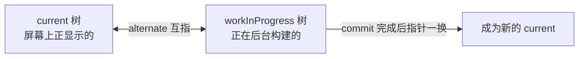

#React #Fiber #原理 #面试

# Fiber 架构

## TL;DR

**Fiber 解决的问题：老架构递归 diff 不可中断，大组件树一口气算完会占死主线程掉帧。Fiber 把「组件树」重构成「链表」，递归改循环，从而可以随时暂停、恢复、按优先级插队**——render 阶段可中断（纯计算无副作用），commit 阶段一次性同步完成（操作真实 DOM 不能撕裂）。

> render/commit 两阶段的执行顺序（父先子后 vs 子先父后）见 [[React 渲染机制]]。

---

## 1. 为什么需要 Fiber

浏览器一帧约 16.7ms（60Hz），主线程要在这帧里完成 JS、样式、布局、绘制——留给 React 的预算大约只有 5ms。React 15 的 Stack Reconciler 用**递归**协调组件树：调用栈一旦展开就停不下来，几千个组件的 diff 可能占用主线程上百毫秒 → 输入无响应、动画掉帧。

破题思路：**把一次大计算切成许多小单元，每做完一个单元看看「时间片用完没、有没有更高优任务」，让得出主线程**。递归做不到（栈状态没法保存恢复），所以需要新的数据结构。

---

## 2. Fiber 节点与链表化

每个组件/元素对应一个 Fiber 节点（一个普通对象），它既是「工作单元」也是「新的虚拟 DOM 载体」：

```js
{
  type, key,            // 对应 Element
  stateNode,            // 宿主实例（DOM 节点）或类实例
  child, sibling, return,  // ★ 链表三指针：第一个孩子、下一个兄弟、父节点
  pendingProps, memoizedProps, memoizedState,  // 新旧数据
  lanes,                // 优先级（见 1.05）
  flags,                // 副作用标记（增/删/改）
  alternate,            // 指向另一棵树上的「自己」（双缓冲）
}
```

`child/sibling/return` 三个指针把树变成了**可以用循环遍历的链表**——workLoop 的骨架：

```js
function workLoopConcurrent() {
  while (workInProgress !== null && !shouldYield()) {  // ★ 每个单元后检查是否让出
    performUnitOfWork(workInProgress);  // 处理当前 fiber，返回下一个
  }
}
```

中断后只要记住当前指向的 fiber，下个时间片接着走——这就是「可中断可恢复」的全部秘密。时间切片的调度由 Scheduler 包实现（基于 MessageChannel 的宏任务，每片约 5ms）。

---

## 3. 双缓冲：current 与 workInProgress



更新时不在 current 上原地改，而是基于它构建 workInProgress 树（节点尽量复用 alternate）；render 全部完成后 commit 阶段把根指针一换。好处：**构建过程中断、丢弃都不影响屏幕上的 UI**，永远不会展示「算到一半」的画面。

---

## 4. 两大阶段

| | render 阶段（Reconciliation） | commit 阶段 |
|---|---|---|
| 干什么 | beginWork 向下构建 fiber、diff 打 flags；completeWork 向上归并 | 按副作用列表操作真实 DOM，跑生命周期/effect |
| 可中断？ | **可**（纯计算，无副作用） | **不可**（同步一口气完成，防 UI 撕裂） |
| 输出 | 打好 flags 的 workInProgress 树 | 屏幕更新 + 树指针切换 |

commit 再细分三步：before mutation（getSnapshotBeforeUpdate）→ mutation（增删改 DOM，卸载执行 cleanup）→ layout（componentDidMount/Update、**useLayoutEffect**）；useEffect 则在 commit 完成后异步调度（见 [[2.02 useEffect 与 useLayoutEffect]]）。

推论（常考）：**render 阶段可能执行多次**（被打断重来、严格模式故意双调），所以组件函数体必须是纯的，副作用只能进 effect——这也是 StrictMode 双调用的用意。

---

## 5. 一句话回答的组装

「React 15 递归协调不可中断会卡帧 → Fiber 把树链表化（child/sibling/return），递归变循环，配合 Scheduler 时间切片实现可中断可恢复 → 双缓冲保证中断不影响已显示 UI → render 可中断、commit 同步 → 在此地基上才有了优先级调度和并发特性（[[1.05 并发特性与优先级调度]]）」。

---

## 面试问答

### Q: 什么是 Fiber？它解决了什么问题？

满分答案：Fiber 既指新的协调器架构，也指其核心数据结构——每个组件对应的工作单元对象。解决的问题：老递归协调器不可中断，大树 diff 长期占用主线程导致掉帧。Fiber 用 child/sibling/return 三指针把树链表化，workLoop 循环处理、每个单元后检查是否让出主线程（时间切片约 5ms，基于 MessageChannel 调度），实现可中断、可恢复、可插队；双缓冲的 workInProgress 树保证中断安全。它是并发特性（startTransition 等）的地基。

### Q: render 阶段和 commit 阶段的区别？

满分答案：render 阶段构建 workInProgress 树并 diff 打副作用标记，是纯计算、无副作用、可中断可重复执行；commit 阶段按标记同步操作真实 DOM，不可中断以避免 UI 撕裂，内部分 before mutation、mutation、layout 三步——useLayoutEffect 在 layout 同步执行，useEffect 在 commit 后异步执行。因为 render 可能重跑，组件函数必须保持纯，副作用只能写在 effect 或事件里，StrictMode 的双调用就是在帮你验证这一点。

### Q: 双缓冲机制是什么？

满分答案：内存里同时存在两棵 fiber 树——current 对应屏幕当前内容，workInProgress 是后台构建的新树，两者节点经 alternate 互指、尽量复用。render 全部完成后 commit 把根指针从 current 切到 workInProgress。价值：构建期间随时可中断或丢弃而不影响已显示画面，切换是 O(1) 的指针操作；节点复用也摊薄了对象创建成本。

### Q: 为什么 render 可以中断而 commit 不行？

满分答案：render 只在内存里算新树、不碰真实 DOM，中断后从记录的 fiber 继续即可，用户无感知；commit 直接修改 DOM，如果中途让出主线程，用户会看到「改了一半」的撕裂界面，事件也可能落在不一致的 DOM 上，所以必须同步一次性完成。React 的设计是把耗时都压到可中断的 render 阶段，commit 尽量薄。
