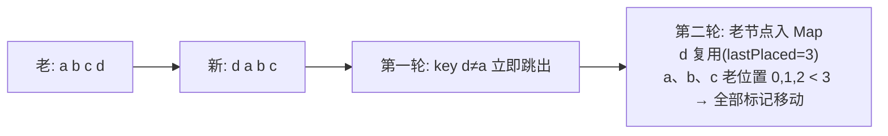

#React #Diff #key #原理 #面试

# Diff 算法与 key

## TL;DR

**通用树 diff 是 O(n³)，React 用三条假设砍到 O(n)：只比同层不跨层、type 不同直接换整棵子树、同层列表靠 key 识别复用**。多节点 diff 两轮遍历：第一轮线性对比处理「原地更新」，第二轮把剩余老节点建 Map 处理「增删移」。index 当 key 的问题：插入/删除/排序时 key 与内容错位，白白重渲染甚至状态串位。

---

## 1. 三条前提假设（先答这个）

React 在新 JSX（Element 树）与旧 Fiber 树之间做协调（见 [[1.02 Fiber 架构]]），依据三条经验假设放弃完美 diff：

1. **只比同层**：DOM 跨层级移动极少——真跨层了不复用，直接删旧建新；
2. **type 不同 = 结构不同**：`
` 换 `
`、组件 A 换组件 B，整棵子树拆掉重建（子树 state 全丢、组件走卸载流程）；
3. **key 标识同层节点身份**：让列表的复用与移动可判定。

推论即考点：条件渲染切换组件类型会导致下方整棵子树重建；「type 相同只更新属性、实例和 state 保留」——想强制重置一个组件的 state，**换个 key** 就行（官方推荐技巧）。

---

## 2. 多节点 diff：两轮遍历

新 children 是数组时（老节点为链表、新节点为数组，不能双端对比——这是与 Vue 双端 diff 的差异点）：

**第一轮：按序线性对比**，处理最常见的「原地更新」：

- key 同 type 同 → 复用，打更新标记，继续；
- key 同 type 异 → 删旧建新，继续；
- **key 不同 → 立刻跳出第一轮**（说明发生了位置变动）。

**第二轮：处理增删移**。把剩余老节点放进 `Map<key, fiber>`，继续遍历剩余新节点：

- Map 里找到同 key 同 type → 可复用但可能要移动。用 `lastPlacedIndex`（最后一个不需移动的老节点位置）判定：老位置 ≥ lastPlacedIndex → 不动，并更新 lastPlacedIndex；老位置 < lastPlacedIndex → 打**移动**标记；
- 找不到 → 打**插入**标记；
- 新节点遍历完，Map 里剩下的 → 打**删除**标记。

上图正是经典性能陷阱：**把末尾节点挪到最前，React 会移动其余所有节点**（abcd → dabc 移动了 a、b、c 三个）。diff 只打标记（flags），真实 DOM 操作在 commit 阶段统一执行。

---

## 3. key 的正确使用

**为什么不能用 index**：列表头部插入一项后，「index=0」从旧内容 A 变成新内容 X——React 看 key 相同、type 相同，判定「还是原来那个节点，改改属性就行」：

- 轻则**全列表白白重渲染**（本可零更新的项都被更新）；
- 重则**状态串位**：非受控 input 的输入值、组件内部 state 跟着 index 留在原位置，删除第一行后「第二行顶着第一行的输入值」——这是必讲的事故案例。

规范：**key 用数据的稳定唯一标识（id）**；纯静态、永不重排增删的列表用 index 才无害；不要用 `Math.random()`（每次都变=全部重建）。key 只需**兄弟间唯一**，且它不是 prop，组件里读不到。

---

## 面试问答

### Q: React 的 diff 策略是什么？复杂度怎么降下来的？

满分答案：通用最小编辑距离树 diff 是 O(n³)，React 用三条启发式假设降到 O(n)——只做同层比较（跨层移动直接重建）、元素类型不同即认为子树不同整体替换、同层列表用 key 判定身份。多节点场景走两轮遍历：第一轮按序比 key/type 处理原地更新，遇到 key 不匹配跳出；第二轮把剩余老节点建 Map，判定复用/移动（lastPlacedIndex 规则）/插入，收尾把 Map 剩余项标记删除。diff 产物是 fiber 上的 flags，commit 阶段统一执行。

### Q: 为什么列表不能用 index 作 key？

满分答案：key 的职责是跨渲染标识「同一个节点」。用 index 时，插入、删除、排序都会让 key 与数据内容错位——React 据 key+type 判断可复用，于是把「内容变了的旧节点」原地更新：轻则整列表不必要的重渲染，重则组件 state 和非受控输入值串位（删第一行、第二行却顶着第一行的输入）。正确做法是用数据稳定唯一 id；只有纯展示且永不增删重排的列表用 index 才安全。

### Q: key 还有什么妙用？

满分答案：主动换 key 可以强制重建组件、重置其内部 state——比如「编辑不同用户时表单要清空」，给表单组件 key={userId}，切换用户即销毁重建，比在 effect 里手动清字段干净得多。这是官方推荐的模式，反向利用了「key 变化 = 不同节点」的 diff 规则。

### Q: React 和 Vue 的 diff 有什么区别？

满分答案：同层比较、key 复用的大原则一致。差异在列表算法：Vue2 双端指针四路对比，Vue3 再加最长递增子序列（LIS）求最小移动集；React 因老节点是单向链表、只能从左往右两轮遍历 + lastPlacedIndex 判移动，不回溯——所以「尾节点挪到头部」这类操作 React 会移动其余全部节点，Vue 只移动一个。整体权衡：React 把复杂度留给调度（可中断），Vue 把功夫下在编译期与 diff 算法本身（参见 [[React vs Vue 渲染对比]]）。
