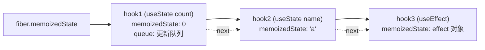

#React #Hooks #原理 #面试

# Hooks 原理与规则

## TL;DR

**Hooks 的状态存在 fiber 的 `memoizedState` 上，是一条按调用顺序串起来的链表——「第 N 次调用 hook 就取链表第 N 个节点」**。这就是「只能在顶层调用」的原因：条件/循环里调用会让顺序错位，状态张冠李戴。函数组件的另一半本质是「值捕获」：每次渲染拥有自己的 props、state 快照。

---

## 1. 为什么要 Hooks

类组件的三宗罪：**逻辑复用难**（HOC/renderProps 造成嵌套地狱与来源不清）、**关联逻辑被生命周期切碎**（订阅在 didMount、清理在 willUnmount、修正在 didUpdate，三处维护同一件事）、**this 与模板代码负担**。Hooks 让「一段有状态的逻辑」收敛为一个可组合的函数。

对比 HOC 的具体优势（高频追问）：来源清晰（值就在解构处，不像 HOC 隐式注入 props）、无额外组件层级、无命名冲突、依赖显式。代价：useEffect 依赖链的心智负担与闭包陷阱（见 [[2.03 Hooks 闭包陷阱]]）。

---

## 2. 存储原理：fiber 上的 hook 链表



- **首次渲染（mount）**：每个 hook 调用创建一个 hook 节点，依序挂到链表尾；
- **更新渲染（update）**：按调用顺序**依次移动链表指针**，第 N 次调用取第 N 个节点的状态；
- hook 节点不知道自己叫什么，**只认位置**——所以：

```jsx
if (cond) {
  const [a] = useState(1);   // 🔴 cond 变化时，后面所有 hook 全部错位
}
```

这就是两条规则的全部原理：**只在顶层调用**（保证每次渲染顺序一致）、**只在 React 函数中调用**（组件/自定义 Hook 之外没有 fiber 上下文，mount 与 update 阶段其实是两套实现——dispatcher 在 render 前切换，这也是「在类组件/普通函数里调 hook 报错」的机制）。例外补充：React 19 的 `use` 被设计为可条件调用。

**简版 useState 实现**（面试手写，用数组+游标表达同一思想）：

```js
let states = [], cursor = 0;

function useState(initial) {
  const i = cursor++;
  if (states[i] === undefined) states[i] = initial;
  const setState = (v) => {
    states[i] = typeof v === 'function' ? v(states[i]) : v;
    rerender();               // 触发重渲染
  };
  return [states[i], setState];
}
function rerender() { cursor = 0; render(<App />); }  // 每次渲染前游标归零
```

真实实现的差异点：状态在 fiber 上而非模块变量；setState 是把 update 对象（带 lane）挂到该 hook 的环形更新队列，render 时才依次计算（衔接 [[1.04 setState 与批量更新]]）。

---

## 3. 函数组件 vs 类组件：值捕获

```jsx
function Profile({ user }) {
  const handleClick = () => {
    setTimeout(() => alert(user.name), 3000);  // 捕获的是【本次渲染】的 user
  };
}
// 类组件版 alert(this.props.user.name) —— this 是可变的，3 秒后读到的是【最新】props
```

函数组件每次渲染是一次独立调用，props/state 是**那一帧的常量快照**（闭包捕获）；类组件的 this 是**同一个可变实例**。快照语义更可预测（异步回调不会「穿越」），但也正是闭包陷阱的来源——需要「永远最新值」时用 ref 逃生（见 [[2.05 Ref 体系]]）。

其余差异：函数组件无实例无 this、跳过更新用 React.memo（类用 shouldComponentUpdate/PureComponent）、错误边界仍只能类组件（见 [[1.06 生命周期与类组件遗产]]）。

---

## 4. 自定义 Hook 的三个常识

- 必须以 `use` 开头——不是风格问题，lint 与 React 依靠它识别「内部会调 hook 的函数」来校验规则；
- **逻辑复用，状态不复用**：两个组件用同一个自定义 Hook，各自拥有独立的 state（本质只是函数调用，hook 挂在各自 fiber 上）；
- 实战见 [[2.06 自定义 Hook 实战]]。

---

## 面试问答

### Q: Hooks 的实现原理？为什么不能在条件语句里调用？

满分答案：每个函数组件的 hook 状态以链表形式存在其 fiber 的 memoizedState 上，节点按首次渲染的调用顺序创建；更新时按调用顺序移动指针逐个取节点——hook 只认位置不认名字。条件/循环调用会改变顺序，指针错位后状态互相串用，所以规则要求只在顶层调用。补充：mount 和 update 是两套 dispatcher，render 前切换，这也是在非 React 函数里调用直接报错的原因；React 19 的 use 是官方例外，允许条件调用。

### Q: 手写一个简易 useState？

满分答案：模块级数组存状态、游标记位置——useState 取当前游标位置的值（首次用初始值），返回值和 setter；setter 支持函数式更新，写入后触发重渲染并把游标归零。讲完主动指出与真实实现的差距：状态挂 fiber 而非全局、setter 产生带优先级的 update 进环形队列、render 时才批量计算，从而自然引出批处理机制。

### Q: 函数组件和类组件的本质区别？

满分答案：核心是值捕获——函数组件每次渲染是独立调用，props/state 是该帧的闭包快照，异步回调读到的是「当时」的值；类组件共享一个可变 this，异步回调读到「最新」值。工程差异：复用逻辑靠自定义 Hook 而非 HOC（无嵌套、来源清晰）、跳过更新用 memo、无实例故 ref 需 useImperativeHandle 配合。错误边界目前仍是类组件独有。

### Q: 自定义 Hook 和 HOC 怎么选？

满分答案：默认自定义 Hook——逻辑与 UI 解耦、无组件层级开销、数据来源显式、无 props 命名冲突。HOC 残存的适用位：需要包裹/拦截渲染输出本身（如权限包装、错误边界注入）或兼容类组件的老代码。注意点反着说一遍：Hook 复用的是逻辑不是状态，每处调用状态独立。
