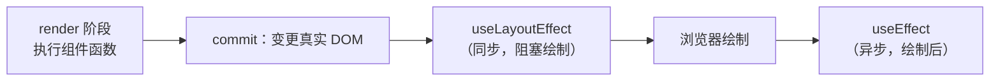

#React #useEffect #面试

# useEffect 与 useLayoutEffect

## TL;DR

**useEffect 在浏览器绘制之后异步执行，不阻塞画面；useLayoutEffect 在 DOM 变更后、绘制之前同步执行——要「先量再画」防闪烁时才用它**。清理函数的时机固定两条：卸载时执行一次；每次重跑 effect 前先清理上一轮。

---

## 1. 执行时机的完整时间线



- **useEffect**：commit 完成、屏幕绘制后调度执行——用户先看到画面，副作用随后跑，不卡渲染。适用绝大多数副作用：请求、订阅、日志、手动 DOM 之外的一切；
- **useLayoutEffect**：与类组件 componentDidMount/Update 同时机（commit 的 layout 步骤，见 [[1.02 Fiber 架构]]），**同步阻塞绘制**。适用：读布局再改样式（tooltip 定位、滚动位置恢复）——若用 useEffect，用户会先看到「错的那一帧」再跳到对的，闪一下；
- SSR 提示：useLayoutEffect 在服务端不执行且会警告（服务端没有布局可测）。

**依赖数组的三种形态**（判分基础）：不传 → 每次渲染后都执行；`[]` → 仅挂载后一次；`[a, b]` → 挂载后 + a/b 任一变化后（浅比较 Object.is）。

---

## 2. 清理函数

```jsx
useEffect(() => {
  const id = setInterval(tick, 1000);
  window.addEventListener('resize', onResize);
  return () => {                     // 清理函数
    clearInterval(id);
    window.removeEventListener('resize', onResize);
  };
}, [deps]);
```

执行时机就两条：**组件卸载时**；**下一次 effect 执行之前**（先清旧再跑新，保证同一时刻只有一份订阅）。心智模型：每一轮 effect 与它的清理是一对，属于「那一次渲染」——不是「卸载钩子」，而是「本轮副作用的撤销」。

请求场景的标准清理——**防竞态**：

```jsx
useEffect(() => {
  const controller = new AbortController();
  fetch(url, { signal: controller.signal }).then(setData).catch(() => {});
  return () => controller.abort();   // url 变了/卸载了，取消过期请求
}, [url]);
```

不清理的后果：慢的旧请求后到，覆盖新结果（竞态）；订阅堆积泄漏（见 [[2.06 垃圾回收机制]] 的泄漏源）。

---

## 3. effect 里的 async

```jsx
useEffect(async () => { ... }, []);   // 🔴 报警告
```

原因：effect 函数的返回值被约定为**清理函数**，而 async 函数返回 Promise——React 拿到一个「假清理」。正确姿势：内部定义 async 函数再调用（或 IIFE），清理照常返回：

```jsx
useEffect(() => {
  let cancelled = false;
  (async () => {
    const data = await fetchData();
    if (!cancelled) setData(data);   // 卸载/过期后不再 setState
  })();
  return () => { cancelled = true; };
}, []);
```

工程上直接用封装（ahooks 的 useRequest 等，见 [[2.06 自定义 Hook 实战]]）。

---

## 4. 现代口径：effect 是「同步外部系统」不是「生命周期」

官方现行心智模型：effect 描述「如何让外部系统（网络、订阅、DOM、第三方库）与当前 props/state 保持同步」，依赖数组是**同步所需的全部响应值**，不是「我想什么时候触发」的开关。两个推论：

- 靠删依赖来「只跑一次」是 bug 源头（引出闭包陷阱，见 [[2.03 Hooks 闭包陷阱]]）；lint 的 exhaustive-deps 该修代码而不是关规则；
- 「响应事件」的逻辑放事件处理器，不进 effect；能在渲染期间计算的派生值也不需要 effect + setState（常见反模式）。

---

## 面试问答

### Q: useEffect 和 useLayoutEffect 的区别？什么时候用后者？

满分答案：都在 commit 的 DOM 变更之后执行，区别在与绘制的相对时机——useLayoutEffect 同步执行、阻塞浏览器绘制，等价于类组件 componentDidMount/Update 的时机；useEffect 在绘制后异步执行、不阻塞画面。默认用 useEffect；只有「必须在用户看到画面前完成读布局 + 改样式」的场景（定位浮层、恢复滚动、测量尺寸防闪烁）才用 useLayoutEffect，滥用会拖慢首帧。SSR 下 useLayoutEffect 不执行且警告。

### Q: effect 的清理函数什么时候执行？为什么这么设计？

满分答案：两个时机——组件卸载时；每次依赖变化重新执行 effect 之前（先清上一轮再跑新一轮）。设计意图是把「建立副作用」和「撤销副作用」配成一对、共同属于某一次渲染，天然保证订阅不重复、旧状态不残留。典型应用：清定时器和事件监听、AbortController 取消过期请求防竞态、cancelled 标记防「卸载后 setState」。

### Q: 为什么 useEffect 的回调不能直接写 async？

满分答案：effect 返回值被 React 当作清理函数，async 函数必然返回 Promise，语义冲突所以报警告。解法：effect 内部定义 async 函数立即调用，配合 cancelled 标记或 AbortController 在清理时终止；或使用封装好的 useAsyncEffect/useRequest。顺带指出数据请求的完整关注点：竞态取消、卸载防护、加载与错误态——这也是为什么生产更倾向 React Query 这类方案。

### Q: 「setInterval 里 count 一直是 0」怎么回事？

满分答案：`useEffect(() => { setInterval(() => setCount(count + 1), 1000) }, [])` 只跑一次，定时器闭包捕获了首帧的 count=0，每秒都在算 0+1。这是闭包陷阱的典型题，最优解是函数式更新 `setCount(c => c + 1)`——不依赖外部快照；或把 count 加入依赖（每秒重建定时器，不优雅）、或用 ref 存最新值。完整解法族见闭包陷阱专题。
