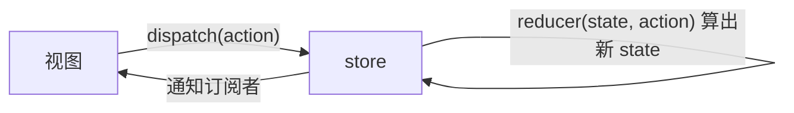

#React #Redux #状态管理 #面试

# Redux 原理与取舍

## TL;DR

**Redux 三原则：单一 store、state 只读（只能 dispatch action 改）、用纯函数 reducer 计算新状态**。核心实现就是发布订阅 + 纯函数：dispatch → reducer 算新 state → 通知订阅者。**reducer 必须纯**不是风格洁癖——Redux 用 `!==` 引用比较判断「变没变」，原地改对象等于没改。

---

## 1. 数据流与三原则



单向数据流的价值：**任何状态变化都有迹可循**（action 是变化日志），可预测、可回放、devtools 时间旅行都源于此。

**为什么 reducer 必须是纯函数**（高频，答到源码级）：combineReducers 里逐个子 reducer 执行后，用 `nextStateForKey !== previousStateForKey` **引用比较**判断是否变化——深比较太贵，Redux 选择了「不可变更新 + 引用比较」的契约。若 reducer 原地 mutate 再返回原对象，引用没变 → Redux 认为没变 → 订阅不通知、UI 不更新。同理 react-redux 的 useSelector 也靠引用/浅比较决定是否重渲染。纯函数还保证了同输入同输出，时间旅行与测试才可能。

---

## 2. 手写迷你 Redux（判分核心）

```js
function createStore(reducer, preloadedState) {
  let state = preloadedState;
  let listeners = [];

  const getState = () => state;
  const subscribe = (fn) => {
    listeners.push(fn);
    return () => { listeners = listeners.filter(l => l !== fn); };  // 退订
  };
  const dispatch = (action) => {
    state = reducer(state, action);          // 纯函数算新 state
    listeners.forEach(l => l());             // 发布
    return action;
  };

  dispatch({ type: '@@INIT' });   // ★ 初始 dispatch：用 reducer 的默认参数生成初始 state
  return { getState, subscribe, dispatch };
}

// combineReducers：按 key 分治（批次 1 移交题）
function combineReducers(reducers) {
  return (state = {}, action) => {
    let hasChanged = false;
    const next = {};
    for (const key in reducers) {
      next[key] = reducers[key](state[key], action);
      hasChanged = hasChanged || next[key] !== state[key];   // ★ 引用比较
    }
    return hasChanged ? next : state;    // 没变返回原对象，保住上层的引用判断
  };
}
```

中间件一句话：`applyMiddleware` 用 compose 把中间件包裹成增强版 dispatch（洋葱模型，实现见 [[3.03 柯里化、偏函数与 compose]]），redux-thunk 不过十行——dispatch 收到函数就先执行它。

---

## 3. react-redux：把 store 接进 React

- **注入**：Provider 用 Context 把 store 传下去（Context 只传「不变的 store 引用」，不传 state 本身——绕开了 Context 一变全更的问题，见 [[1.08 组件通信与 Context]]）；
- **订阅**：现代实现用 **useSyncExternalStore**（React 18 为外部 store 定制的 Hook，解决并发渲染下的撕裂问题）；18 之前的思路是 `useReducer(x => x + 1, 0)` 造 forceUpdate + subscribe；
- **useSelector**：选择 state 切片，**selector 结果用引用比较（默认 ===）决定是否重渲染**——所以 selector 里别每次返回新对象（要么拆成多个原子 selector，要么传 shallowEqual 作第二参）；对比老 connect 的 mapStateToProps 是浅比较。

---

## 4. 取舍与现状（体现工程判断）

**useReducer + Context 能取代 Redux 吗？**——小应用可以，规模化不行：没有 selector 级订阅（Context 一变全更）、没有中间件与 devtools、多 store 组合困难（三条硬伤同 Context 篇）。

**现代选型口径（截至 2026）**：

- Redux 直接手写已过时，官方标准是 **Redux Toolkit**（createSlice 内置 Immer，「写起来像 mutate、实际不可变」，样板代码砍掉大半）——immutable.js 那一代方案已被 Immer 取代；
- 轻量客户端状态：**zustand**（无 Provider、selector 订阅、几 KB）；
- **服务端状态交给 React Query/SWR**（缓存、重试、失效重拉——这部分本来就不该进 Redux）；
- 判断题式总结：全局客户端状态多且要审计 → RTK；少量共享状态 → zustand/Context；接口数据 → React Query。

---

## 面试问答

### Q: Redux 的核心原理？手写要点？

满分答案：三原则——单一 store、state 只读、纯函数 reducer。实现是发布订阅：createStore 闭包持有 state 和 listeners，dispatch 用 reducer 算新 state 后遍历通知，subscribe 返回退订函数，创建时先 dispatch 一次初始化 action 以取得 reducer 默认 state。combineReducers 按 key 分治子 reducer，并用引用比较聚合 hasChanged、无变化时返回原对象。中间件是 compose 出来的 dispatch 增强链。

### Q: 为什么 reducer 必须是纯函数？

满分答案：机制层面——Redux 及 react-redux 全链路用引用比较（!==、浅比较）判断状态是否变化，深比较太昂贵；reducer 原地修改并返回原引用会被判定「无变化」，UI 不更新，这在 combineReducers 源码的 hasChanged 判断里看得一清二楚。语义层面——纯函数保证同输入同输出，才有可预测性、可测试性和 devtools 时间旅行。工程配套：Redux Toolkit 用 Immer 让你以「可变写法」产出不可变更新，兼顾正确与体验。

### Q: react-redux 是怎么让组件更新的？

满分答案：Provider 通过 Context 注入不变的 store 引用（不是 state，避免 Context 全量更新问题）；组件用 useSelector 取切片并订阅 store，React 18 后底层是 useSyncExternalStore——专为外部 store 设计、并发渲染下防撕裂。更新判定：selector 新旧结果引用比较，不等才重渲染，所以 selector 要返回稳定引用或配 shallowEqual。这套「精准订阅」正是它优于裸 Context 的地方。

### Q: 现在做状态管理你怎么选型？

满分答案：先分类——服务端数据（接口结果）交给 React Query/SWR，缓存失效重拉是它们的主场，别塞进全局 store；客户端全局状态少量时用 zustand 或 Context + useReducer；规模大、要中间件和审计追踪用 Redux Toolkit（内置 Immer 和 devtools）。再点一句历史：手写 createStore + immutable.js 的组合已淘汰，面试写原理、生产用 RTK。
