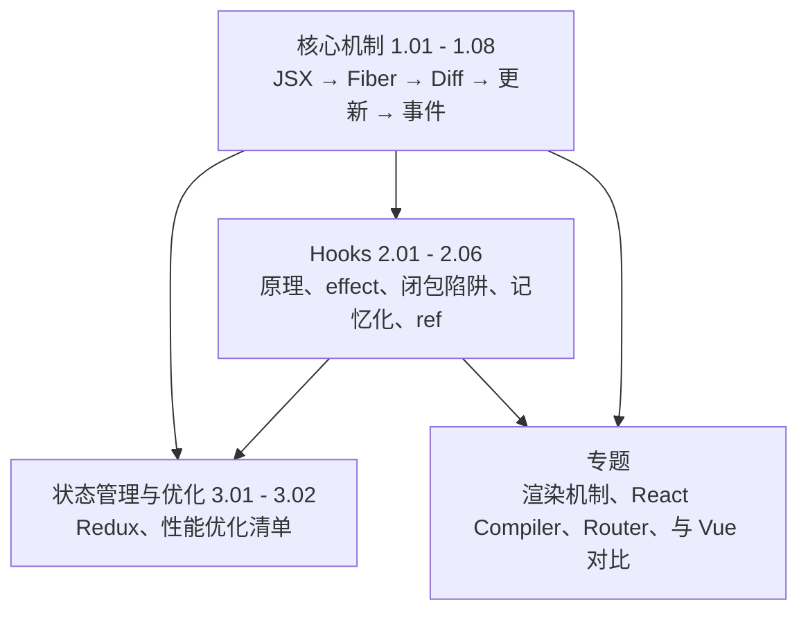

#React #index

# React 知识地图

> Library/React 总索引：阅读顺序、分组清单、概念速查

## 阅读顺序

先建立「渲染是怎么发生的」这条主干，Hooks 与优化都是挂在主干上的枝叶。

若只想弄懂「为什么我的组件多渲染了一次」，最短路径是 [[React 渲染机制]] → [[1.04 setState 与批量更新]] → [[2.04 记忆化：memo、useMemo 与 useCallback]]。

---

## 文章清单

### 核心机制

| 文章 | 一句话定位 |
|---|---|
| [[1.01 JSX、React Element 与 $$typeof]] | JSX 是创建描述对象的语法糖；`$$typeof` 是防注入的身份戳 |
| [[1.02 Fiber 架构]] | 把组件树重构成链表、递归改循环，于是可暂停、可恢复、可插队 |
| [[1.03 Diff 算法与 key]] | 三条假设把 O(n³) 砍到 O(n)；两轮遍历与 index 当 key 的代价 |
| [[1.04 setState 与批量更新]] | 调用同步、应用异步；React 18 起任何上下文都自动批处理 |
| [[1.05 并发特性与优先级调度]] | Fiber 可中断 + Lane 优先级 + 时间切片；入口是 transition/deferred/Suspense |
| [[1.06 生命周期与类组件遗产]] | 三个 `componentWill*` 为何被废，两个静态方法补在哪 |
| [[1.07 合成事件系统]] | 根容器统一委托 + 跨浏览器一致的 SyntheticEvent，React 17 的两处变化 |
| [[1.08 组件通信与 Context]] | 按关系选通道；Context 是低频全局数据，value 变化会穿透 memo |

### Hooks

| 文章 | 一句话定位 |
|---|---|
| [[2.01 Hooks 原理与规则]] | 状态是 fiber 上按调用顺序串起的链表——这就是「只能在顶层调用」的原因 |
| [[2.02 useEffect 与 useLayoutEffect]] | 绘制之后异步 vs 绘制之前同步；清理函数的两个固定时机 |
| [[2.03 Hooks 闭包陷阱]] | 回调里用的是旧渲染的快照；四种解法按优先级排 |
| [[2.04 记忆化：memo、useMemo 与 useCallback]] | 三件套各管一层；不包 memo 的子组件让 useCallback 白做 |
| [[2.05 Ref 体系]] | 渲染之外的口袋；ref 与 state 的分界是「变了要不要重画」 |
| [[2.06 自定义 Hook 实战]] | 复用逻辑而非状态；手写四大件 + useRequest 的插件化设计 |

### 状态管理与优化

| 文章 | 一句话定位 |
|---|---|
| [[3.01 Redux 原理与取舍]] | 发布订阅 + 纯函数；reducer 必须纯是因为用 `!==` 判断变没变 |
| [[3.02 React 性能优化清单]] | 先测量 → 结构优化 → 记忆化 → 加载优化，按这个顺序做 |

### 专题

| 文章 | 一句话定位 |
|---|---|
| [[React 渲染机制]] | render 父先子后、commit 子先父后；`<Child />` 只是描述对象 |
| [[React vs Vue 渲染对比]] | 显式 push + 子树重渲染 vs 自动 pull + 细粒度更新 |
| [[React Router v7 路由懒加载与切页 UI]] | 路由级 `lazy` 字段避免切页白屏，pending 态由 `useNavigation()` 驱动 |
| [[ReactCompiler]] | React Compiler 入口与官方资料索引 |
| [[ReactCompiler实现原理]] | Babel 插件在构建期编译出 `_c(n)` 缓存槽，而非插入 useMemo |
| [[ReactCompiler与useEffect依赖]] | 编译器优化的是渲染路径，effect 依赖仍值得手写记忆化 |

---

## 概念速查（这个词在哪篇里讲透了）

| 概念 | 所在笔记 |
|---|---|
| 虚拟 DOM、createElement、jsx-runtime、`$$typeof` | [[1.01 JSX、React Element 与 $$typeof]] |
| Fiber 节点、render/commit 两阶段、可中断 | [[1.02 Fiber 架构]]、[[React 渲染机制]] |
| key、同层比较、两轮遍历 | [[1.03 Diff 算法与 key]] |
| 批处理、flushSync、函数式更新 | [[1.04 setState 与批量更新]] |
| Lane、Scheduler、startTransition、useDeferredValue、Suspense | [[1.05 并发特性与优先级调度]] |
| getDerivedStateFromProps、getSnapshotBeforeUpdate、super(props) | [[1.06 生命周期与类组件遗产]] |
| SyntheticEvent、事件委托根节点、事件池 | [[1.07 合成事件系统]] |
| Context、Provider value 稳定化、状态提升 | [[1.08 组件通信与 Context]] |
| memoizedState、Hooks 链表、值捕获 | [[2.01 Hooks 原理与规则]] |
| 闭包陷阱、依赖数组、useEffectEvent | [[2.03 Hooks 闭包陷阱]] |
| React.memo、useMemo、useCallback、shallowEqual | [[2.04 记忆化：memo、useMemo 与 useCallback]] |
| useRef、forwardRef、命令式句柄 | [[2.05 Ref 体系]] |
| 单一 store、纯 reducer、combineReducers、immutable | [[3.01 Redux 原理与取舍]] |
| Profiler、状态下沉、children 提升、lazy 分包、KeepAlive | [[3.02 React 性能优化清单]] |

---

## 跨目录关联

- 同一问题的 Vue 解法 → [[Marauder'sMap/Library/Vue/Index|Vue 知识地图]]
- 事件系统的浏览器底座 → [[3.05 事件模型与事件委托]]
- 虚拟列表、懒加载等通用手段 → [[Marauder'sMap/Library/性能优化/Index|性能优化知识地图]]
- Next.js 的 App Router 与 RSC → [[Marauder'sMap/Library/Nextjs/Index|Next.js 知识地图]]

---

## 维护说明

新增 React 笔记时：挂进上面某张分组表并写一句定位。编号沿用 `1.x 核心机制 / 2.x Hooks / 3.x 状态与优化`；框架无关或版本特定的内容放「专题」，不占编号。
