#TypeScript #index

# TypeScript 知识地图

> Library/TypeScript 总索引：阅读顺序、分组清单、概念速查

## 阅读顺序

```mermaid
flowchart TD
  A["1.01 类型系统基础<br/>any/unknown/void/never、结构化类型"]
  B["1.02 interface 与 type<br/>能力差异与选用准则"]
  C["1.03 泛型与类型编程<br/>keyof / 条件类型 / infer / 映射类型"]
  D["1.04 类、枚举与装饰器<br/>extends vs implements、enum 产物"]
  E["1.05 模块、配置与工程实践<br/>ESM、tsconfig、声明文件"]
  F["satisfies 操作符<br/>既校验约束又保留字面量推断"]

  A --> B --> C
  A --> D
  C --> E
  B --> F
  C --> F
```

---

## 文章清单

| 文章 | 一句话定位 |
|---|---|
| [[1.01 类型系统基础]] | 编译期擦除、运行时零负担；any/unknown/void/never 四个特殊类型 + 结构化类型 |
| [[1.02 interface 与 type]] | type 是能力超集，interface 独有声明合并；描述形状用 interface，描述关系用 type |
| [[1.03 泛型与类型编程]] | keyof、条件类型、infer、映射类型四件套组合出全部内置工具类型 |
| [[1.04 类、枚举与装饰器]] | extends 是继承、implements 是契约；enum 的双向映射产物；装饰器 + Reflect Metadata |
| [[1.05 模块、配置与工程实践]] | namespace 只留在 `.d.ts`；tsconfig 关键项与 `declare` / `@types/*` |
| [[satisfies 操作符]] | 校验类型约束的同时保留字面量推断，`as` 与类型注解都做不到 |

---

## 概念速查（这个词在哪篇里讲透了）

| 概念 | 所在笔记 |
|---|---|
| any、unknown、void、never、类型断言、类型收窄、strictNullChecks | [[1.01 类型系统基础]] |
| 结构化类型（鸭子类型）、品牌类型 | [[1.01 类型系统基础]]、[[1.02 interface 与 type]] |
| 声明合并、联合/交叉类型、元组 | [[1.02 interface 与 type]] |
| 泛型约束、keyof、条件类型、infer、映射类型、Partial/Pick/Omit/ReturnType | [[1.03 泛型与类型编程]] |
| implements、abstract、enum / const enum、装饰器、Reflect Metadata | [[1.04 类、枚举与装饰器]] |
| namespace、tsconfig（strict / target / module / isolatedModules）、declare、`@types` | [[1.05 模块、配置与工程实践]] |
| satisfies、字面量类型推断 | [[satisfies 操作符]] |

---

## 跨目录关联

- 被类型化的那门语言 → [[Marauder'sMap/Library/JS/Index|JavaScript 知识索引]]
- 模块解析与产物形态 → [[1.01 JS 模块化演进：CommonJS 与 ESM]]、[[1.02 package.json 与依赖管理]]
- 编译体系的邻居 → [[2.07 Babel 与编译体系]]（Babel 只擦类型不做类型检查）

---

## 维护说明

新增 TypeScript 笔记时：挂进文章清单并写一句定位，编号沿用 `1.x`；语法糖或单点特性（如 `satisfies`）不占编号，直接以名称成篇。
