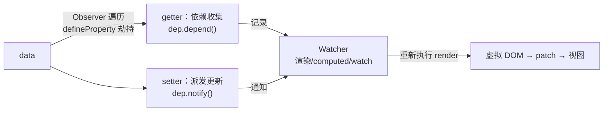

#Vue #响应式 #原理 #面试

# Vue 2 响应式原理

## TL;DR

**三个角色一句话：Observer 用 defineProperty 劫持数据，Dep 是每个属性的「订阅名单」，Watcher 是订阅者**。渲染时读到谁就被谁的 Dep 记下（依赖收集），数据变了 Dep 通知名单上的 Watcher 重新渲染（派发更新）。defineProperty 的四大局限（新增/删除属性、数组下标、全量递归）正是 Vue 3 换 Proxy 的理由。

---

## 1. 全景：数据 → 视图的闭环



核心机制拆成两步：

**依赖收集（get 时）**：组件挂载时创建渲染 Watcher 并执行 render；执行前把自己挂到全局 `Dep.target`，render 过程中**读到的每个属性**的 getter 被触发，属性的 dep 把当前 Watcher 收进名单。

**派发更新（set 时）**：属性赋值触发 setter → `dep.notify()` 遍历名单，触发每个 Watcher 的 update →（经异步队列，见 [[1.05 nextTick 与异步更新队列]]）重新 render → diff → patch。

```js
// 骨架版 defineReactive（判分核心）
function defineReactive(obj, key, value) {
  observe(value);                      // 递归劫持嵌套对象（初始化即全量深遍历）
  const dep = new Dep();               // 每个属性一个 dep
  Object.defineProperty(obj, key, {
    get() {
      if (Dep.target) dep.depend();    // 正在渲染的 Watcher 记下「我依赖这个属性」
      return value;
    },
    set(newVal) {
      if (newVal === value) return;
      observe(newVal);                 // 新值是对象也要劫持
      value = newVal;
      dep.notify();                    // 通知所有订阅的 Watcher
    },
  });
}
```

**Watcher 为什么也要反向收集 dep**（源码级追问）：Watcher 自己存一份 `deps` 列表，目的有二——① **去重**：一次 render 多次读同一属性，靠两边互查避免重复订阅；② **清理**：组件重新渲染后，用新旧 deps 对比把「这次没用到」的订阅退掉（v-if 切换后，隐藏分支的数据变化不该再触发渲染）——不清理就是无效更新与内存泄漏。双向记录 = 可增可删的多对多关系。

三类 Watcher 顺带答全：渲染 Watcher（一个组件一个）、computed Watcher（惰性，脏标记缓存，依赖变了先标脏、被读取才重算）、user Watcher（watch 选项）。

---

## 2. defineProperty 的四大局限（与补丁）

| 局限 | 原因 | Vue 2 的补丁 |
|---|---|---|
| 新增属性无响应 | 劫持发生在初始化，新 key 没有 getter/setter | `Vue.set(obj, key, val)` / `this.$set` |
| 删除属性无响应 | 同上 | `Vue.delete` |
| 数组下标 / length 赋值无响应 | 出于性能未对下标做劫持 | **重写 7 个变异方法**（push/pop/shift/unshift/splice/sort/reverse）：替换数组原型，调用时既干活又 notify，新增元素还要补 observe |
| 初始化全量递归 | 必须一次性深遍历整个 data | 无解，深对象初始化开销大 |

这张表反过来就是 [[1.02 Vue 3 响应式原理]] 的动机清单——Proxy 整对象代理，四条全部消解。

---

## 3. 与视图的最后一公里

数据变了不是直接改 DOM：Watcher 收到通知后进**异步更新队列**（同一 Watcher 去重），nextTick 时统一执行 render 生成新虚拟 DOM，patch 做最小化真实 DOM 更新（diff 见 [[1.04 Vue 的 Diff 算法与 key]]）。所以「响应式」负责**知道谁变了**，「虚拟 DOM + diff」负责**高效更新**，两套机制协作——Vue 2 的更新粒度是**组件级**（一个组件一个渲染 Watcher），组件内再靠 diff。

---

## 面试问答

### Q: 讲讲 Vue 2 响应式原理？

满分答案：初始化时 Observer 递归遍历 data，用 Object.defineProperty 把每个属性转成 getter/setter，每个属性配一个 Dep。渲染时渲染 Watcher 把自己挂到 Dep.target 再执行 render，读到的属性在 getter 里将该 Watcher 收进自己的 Dep（依赖收集）；数据修改触发 setter，dep.notify 通知订阅的 Watcher 进异步队列，nextTick 统一重新 render 并 patch（派发更新）。更新粒度是组件级，组件内部靠虚拟 DOM diff。补充三类 Watcher：渲染、computed（脏标记缓存）、user watch。

### Q: Vue 2 为什么检测不到数组下标赋值？怎么解决的？

满分答案：理论上 defineProperty 可以劫持下标，但数组元素多、代价高，Vue 2 主动放弃。解决方案是原型替换：让响应式数组的原型指向一份重写过的数组方法对象，push/splice 等 7 个变异方法执行原逻辑后手动 dep.notify，并对新插入元素补充 observe。所以 arr[0]=x 和 arr.length=0 不触发更新，要用 splice 或 Vue.set。

### Q: Watcher 里为什么还要存 dep 列表？（双向收集）

满分答案：两个目的——去重：模板多次读同一属性时，Watcher 与 Dep 双向查重避免重复订阅；动态清理：每轮渲染后对比新旧 deps，把本次渲染没再依赖的 dep 退订——典型场景是 v-if 切换后，另一分支的数据变化不应再触发本组件更新。没有反向记录就无法退订，会产生无效渲染和泄漏。这是「多对多关系需要双向维护」的工程体现。

### Q: computed 和 watch 的实现区别？

满分答案：都是 Watcher 的变体。computed 是惰性求值 + 脏标记缓存：依赖变化时只把 dirty 置 true 不立即计算，下次被读取才重算并缓存，多次读取共享结果——适合派生值；watch 是 user Watcher，依赖变化后在回调里执行副作用，支持 deep/immediate——适合异步或命令式逻辑。一句话：computed 产出值有缓存，watch 执行副作用无返回值。
