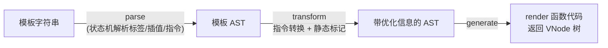

#Vue #编译 #原理 #面试

# 模板编译与静态优化

## TL;DR

**模板编译三段式：parse（模板→AST）→ transform（标记优化信息）→ generate（生成 render 函数）**。Vue 3 的性能故事发生在 transform：**静态提升**（不变节点只创建一次）、**patch flags**（动态节点标注「哪里会变」）、**block tree**（跳过静态层级直达动态节点）——「编译时喂信息给运行时」是 Vue 区别于 React 的核心策略。

> 与 React「运行时全量 diff + 手工/编译器记忆化」的路线对比见 [[React vs Vue 渲染对比]]。

---

## 1. 编译流水线



- **parse**：类 HTML 状态机把模板切成元素、属性、插值、指令节点（编译原理同款思路，见 [[2.07 Babel 与编译体系]]）；
- **transform**：v-if 转三元、v-for 转 renderList、v-model 展开为 value + 事件；同时做**静态分析打标记**——这是 Vue 3 优化的主场；
- **generate**：拼出 render 函数源码。运行时版本 Vue 只含 render 执行器；带编译器版本才能在浏览器里编译 template——**单文件组件的编译发生在构建期**（vue-loader / @vitejs/plugin-vue），线上零编译成本。

---

## 2. Vue 3 的三大编译优化（重点背）

**① 静态提升（hoistStatic）**：纯静态节点的 VNode 创建被提升到 render 函数**外面**，只执行一次，重渲染时直接复用引用——diff 见到同引用直接跳过：

```js
const _hoisted_1 = createVNode('div', { class: 'title' }, '不变的标题');
function render() {
  return (openBlock(), createBlock('div', null, [
    _hoisted_1,                                   // 复用，不再创建
    createVNode('p', null, ctx.msg, 1 /* TEXT */) // 动态节点带 patch flag
  ]));
}
```

**② patch flags**：编译器知道每个动态节点「会变什么」，用位标记告诉运行时：`1` TEXT 只有文本变、`2` CLASS、`8` PROPS（还附带具体 prop 名单）……diff 时**按 flag 精准比对**，跳过其余全部属性检查。位运算设计与 [[1.05 并发特性与优先级调度]] 的 Lane 异曲同工。

**③ block tree**：`openBlock/createBlock` 把一个「结构稳定区域」内的**动态节点收集成扁平数组**（dynamicChildren）。更新时不再递归整棵 VNode 树，**直接遍历动态节点数组**——静态层级再深也是零成本。结构可能变化的地方（v-if/v-for）各自成为新 block 断点。

配套小优化：**缓存事件处理函数**（cacheHandlers，内联箭头函数不再每次渲染生成新引用，子组件不会因此误更新）、静态属性合并、预字符串化（连续大段静态节点直接转 innerHTML 字符串）。

一句话总结这套哲学：**「模板的受限语法换来了编译期的完全可分析」**——Vue 用编译时信息把运行时 diff 从 O(整棵树) 降到 O(动态节点数)；而 JSX 太自由，React 只能在运行时全量协调（或靠 React Compiler 事后补课）。

---

## 3. 衍生题

**render 函数和 template 的关系**：template 只是 render 的语法糖，编译产物就是 render；手写 render/JSX 适合高度动态的场景（组件类型运行时才定），但放弃了上述所有编译优化。

**v-if vs v-show**（编译视角）：v-if 编译成三元表达式——false 分支压根不创建 VNode，切换有销毁/重建成本；v-show 编译成 display 样式绑定——节点常驻，切换零成本。频繁切换用 v-show，条件稳定用 v-if。

**为什么组件模板要求单根/多根的差异**：Vue 2 的 patch 假设单根；Vue 3 用 Fragment 支持多根——代价是多根组件的 attrs 透传需要显式 `$attrs` 指定落点。

---

## 面试问答

### Q: Vue 的模板编译过程？

满分答案：三阶段——parse 用状态机把模板解析成 AST；transform 做指令脱糖（v-if→三元、v-for→renderList、v-model→prop+事件）并进行静态分析标记；generate 生成 render 函数。SFC 的编译发生在构建期由 vue-loader/插件完成，线上只需运行时。价值在 transform 阶段注入的优化信息，让运行时 diff 能抄近路。

### Q: Vue 3 编译期做了哪些优化？

满分答案：三板斧——静态提升：不变节点的 VNode 创建移出 render 只做一次，diff 同引用直接跳过；patch flags：给动态节点打位标记（TEXT/CLASS/PROPS 等），更新时只比对标记的部分；block tree：以结构稳定区域为单位把动态节点收进扁平数组，更新遍历数组而非递归整树，静态层级零成本。再加事件处理缓存避免子组件无谓更新。综合效果是更新性能与动态内容量成正比、与模板大小无关。

### Q: 为什么 Vue 能做这些优化而 React 不能？

满分答案：输入的约束不同——Vue 模板是受限 DSL，v-if/v-for/插值结构编译期完全可静态分析，编译器能可靠判断「哪永远不变、哪只变文本」；JSX 是任意 JS 表达式，结构运行时才确定，编译期难以做同等假设，所以 React 走运行时协调 + memo 手工优化，直到 React Compiler 用更保守的分析自动插记忆化。这是「模板 vs JSX」表达力与可优化性的经典权衡。
