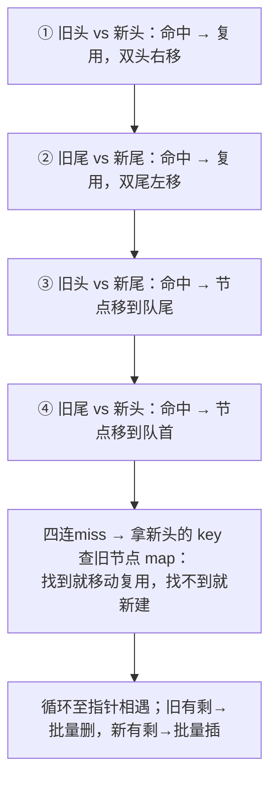

#Vue #Diff #key #原理 #面试

# Vue 的 Diff 算法与 key

## TL;DR

**Vue 2 双端对比：新旧列表头尾四指针互相试探，命中即复用/移动；Vue 3 改为「预处理掐头去尾 + 最长递增子序列（LIS）求最小移动集」**。key 的作用一句话：给节点稳定身份——没有 key 走「就地复用」策略，列表插入/删除时内容错位、状态串行。

> React 的两轮遍历 diff 与三大前提假设见 [[1.03 Diff 算法与 key]]（React 篇），两家对比是必考收尾题。

---

## 1. patch 的整体判定

新旧 VNode 对比（同层比较，不跨层）：不是同类节点（tag/key 不同）→ 整体替换；是同类 → 复用真实 DOM，更新属性，然后进入**子节点对比**——列表 diff 只发生在「新旧都有多个子节点」的分支。Vue 3 在此之前还有编译期加速：block 的 dynamicChildren 直接定点比对（见 [[1.03 模板编译与静态优化]]），**全量 diff 只是兜底路径**。

---

## 2. Vue 2：双端对比

四个指针：旧头 oldStart、旧尾 oldEnd、新头 newStart、新尾 newEnd，每轮做至多四次尝试：

双端设计的动机：**头尾互测能一步识别「倒序」「头插」「尾插」这些常见操作**——比如把尾节点挪到头部，第④步一次命中只移动一个节点（React 的单向两轮遍历在这个场景要移动 n-1 个，两家差异的经典例子）。

---

## 3. Vue 3：预处理 + 最长递增子序列

1. **掐头**：从头同步对比，相同的直接 patch，直到不同；
2. **去尾**：从尾同步，同理——前后缀处理掉大部分「中间插一段/删一段」的简单场景；
3. 剩余乱序区间：建「key → 新位置」映射，遍历旧节点：不在新列表 → 删除；在 → patch 并记录「新位置 ↔ 旧位置」的对应数组；
4. **对位置数组求 LIS（最长递增子序列）**：LIS 内的节点相对顺序已正确、**不用动**；只移动 LIS 之外的节点——数学上保证了**最小移动次数**。

例：旧 `a b c d e`、新 `a d b c e` → 掐头去尾剩 `b c d`→`d b c`，位置数组求 LIS 得 `[b, c]` 不动，只把 d 前移一步。

---

## 4. key：身份标识与「就地复用」

**没有 key 时** Vue 的策略是**就地更新（in-place patch）**：按索引位置直接改内容、不移动 DOM。纯展示列表这反而最快；但节点**有状态**（输入框、组件内部 state、过渡动画）时，插入/删除会让「位置上的旧状态」配上「新数据」——内容串位事故（与 React index-key 的病症同源，见 React 篇的事故案例）。

规范同 React：**用数据稳定唯一 id**；不用 index（等于退化回就地复用还多付出 diff 成本）；不用随机数（全部重建）。妙用也相同：**换 key 强制重建组件**重置状态；Vue 里还常用于强制重新触发 transition 动画。

---

## 面试问答

### Q: Vue 2 的 diff 算法是怎么工作的？

满分答案：同层比较 + 双端对比——新旧子节点列表各设头尾指针，每轮按「旧头新头、旧尾新尾、旧头新尾、旧尾新头」四步试探，命中即复用节点并移动指针（交叉命中意味着节点移动）；四连不中则拿新头 key 查旧节点索引表，找到移动复用、找不到新建；指针相遇后旧剩余批量删、新剩余批量插。双端的价值是对倒序、头插等常见变换一步命中，减少移动。

### Q: Vue 3 的 diff 相比 Vue 2 改进了什么？

满分答案：两层——编译期靠 block tree 和 patch flags 让多数更新直接定点比对，全量列表 diff 只是兜底；算法上改为「前后缀预处理 + 最长递增子序列」：掐头去尾消化简单场景后，乱序区间求 LIS，序列内节点不动、只移动其余节点，移动次数数学最优。对比双端：处理复杂乱序更聪明，且配合编译信息整体更新成本与动态节点数成正比。

### Q: Vue 里 key 的作用？没有 key 会怎样？

满分答案：key 是节点跨渲染的身份标识，diff 靠 key+tag 判断可否复用与是否移动。没有 key 走就地更新策略——按索引原地改内容不移动 DOM，纯静态列表最快，但有状态节点（表单、组件、过渡）会发生数据与状态错位：删第一行、第二行顶着第一行的输入值。规范：稳定唯一 id 作 key；index 仅限永不增删重排的展示列表；主动换 key 可强制重建组件或重触发动画。

### Q: Vue 和 React 的 diff 有何异同？

满分答案：同：都同层比较不跨层、都靠 key 识别身份、type 不同即重建。异在列表算法——React 受限于 fiber 单向链表，只能从左到右两轮遍历，用 lastPlacedIndex 判移动，「尾挪头」要动 n-1 个节点；Vue 2 双端四路试探一步识别常见变换；Vue 3 更进一步用 LIS 求最小移动集，还叠加编译期的 patch flags/block tree 让 diff 大多免于全量。根因是设计哲学：React 把复杂度交给运行时调度，Vue 把功夫下在编译期与算法。
