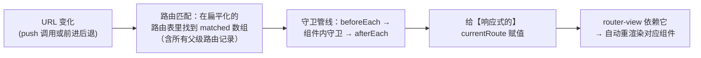

#Vue #VueRouter #路由 #面试

# Vue Router 原理

## TL;DR

**SPA 路由 = 无刷新改 URL + 监听变化 + 响应式驱动视图**：hash 模式靠 `location.hash` + hashchange，history 模式靠 `pushState` + popstate（需服务端兜底配置）。当前路由对象被做成**响应式数据**，URL 变化 → 路由匹配 → 赋值响应式 route → router-view 自动重渲染——「路由不过是响应式系统的又一个应用」。

---

## 1. 两种模式（必考对比）

| | hash | history |
|---|---|---|
| URL 形态 | `example.com/#/user/1` | `example.com/user/1` |
| 改 URL | `location.hash = …` | `history.pushState / replaceState` |
| 监听 | `hashchange` 事件 | `popstate` 事件（**只有前进后退触发，pushState 本身不触发**——所以主动跳转要自己「改 URL + 更新路由」两步都做） |
| 服务端要求 | 无（# 后内容不发给服务器） | **必须配置回退**：任意路径都返回 index.html（Nginx `try_files $uri /index.html`），否则刷新 404 |
| SEO/美观 | 差些 | 好，主流选择 |

Vue Router 4 的 API：`createWebHashHistory()` / `createWebHistory()`；还有给 SSR/测试用的 memory 模式。

「刷新 404」是 history 模式第一名的实战题：**刷新时浏览器真的向服务器请求了 /user/1**，服务器没这个文件——兜底返回入口 HTML，路由由前端接管后再恢复视图。

---

## 2. 从 URL 变化到视图更新（原理主线）

三个源码级要点：

1. **路由表预处理**：嵌套的 routes 配置被扁平化成便于查找的映射；匹配结果是 `matched` 数组——从根到叶的**整条路由记录链**（嵌套路由渲染的依据）；
2. **响应式桥接**：Vue 2 版用 `Vue.util.defineReactive` 把 `_route` 变成响应式（Vue Router 4 用 `shallowRef`）——**路由驱动视图更新完全复用响应式系统**（见 [[1.01 Vue 2 响应式原理]]），没有任何魔法；
3. **导航守卫**是一条 Promise 管线：全局 beforeEach → 路由独享 → 组件内 beforeRouteEnter 等依次执行，任何一环 return false / 重定向即中断——登录校验、权限、埋点的挂载点。

---

## 3. 三个「怎么实现的」小题

**router-link / router-view**：都是插件注册的全局组件。router-link 默认渲染 `<a>`，拦截 click（preventDefault 掉原生跳转）改调 `router.push`，并根据匹配状态挂 active class；**router-view 是无状态的占位组件**——渲染 `matched[depth]` 对应的组件，depth 通过「向上数有几个祖先 router-view」得出，**嵌套路由**因此天然支持（父 view 渲染 matched[0]，子 view 渲染 matched[1]）。

**为什么所有组件都能访问 $router**（Vue 2 版经典）：插件 install 时 `Vue.mixin` 在每个组件的 beforeCreate 注入——根组件从 `$options.router` 拿到实例存 `_routerRoot`，子组件沿 `$parent._routerRoot` 逐级继承；再用 defineProperty 把 `$router/$route` 代理到原型上。**Vuex 的 $store 注入是同一套路**。Vue Router 4 改用 `app.provide` + inject（`useRouter()/useRoute()` 就是 inject 的封装）——新旧两版都能讲最好。

**滚动行为**：`scrollBehavior(to, from, savedPosition)`——返回 `{ top: 0 }` 每次置顶；`savedPosition` 只在浏览器前进/后退时有值（history 自动保存），返回它即可**恢复来时的滚动位置**；配合路由 meta 可做「列表页保留、详情页置顶」的差异化策略。

---

## 面试问答

### Q: hash 和 history 模式的区别与原理？

满分答案：hash 用 location.hash 改 # 后内容、hashchange 监听，# 部分不发往服务器所以零配置；history 用 pushState/replaceState 改真实路径、popstate 监听——注意 pushState 不触发 popstate，主动导航由 router.push 内部同时改 URL 和更新路由状态。history 模式必须配服务端回退（任意路径返回 index.html），否则刷新 404——因为刷新是真实的服务器请求。选型上 history 更美观利于 SEO，是默认推荐。

### Q: Vue Router 是怎么做到 URL 变了视图就更新的？

满分答案：核心是把当前路由对象接入响应式系统——Vue 2 版用 defineReactive 定义 _route，Router 4 用 shallowRef 的 currentRoute。URL 变化后：在扁平化路由表中匹配出 matched 记录链，跑完导航守卫管线，把新路由赋给响应式对象；router-view 的渲染依赖它，响应式系统自动触发重渲染。一句话：路由驱动视图完全复用了数据驱动视图的机制。

### Q: router-view 嵌套路由是怎么渲染对的组件的？

满分答案：匹配结果 matched 是从根到叶的完整记录数组；router-view 渲染时向上遍历父链、统计祖先中 router-view 的个数得到自己的 depth，然后渲染 matched[depth] 的组件——最外层 view 渲染父路由组件，其内部的 view 渲染子路由组件，层层对应。这也解释了为什么嵌套路由的父组件模板里必须再放一个 router-view 占位。

### Q: 为什么每个组件里都能 this.$router？

满分答案：Vue 2 版——插件 install 里 Vue.mixin 全局混入 beforeCreate：根实例持有用户传入的 router 存为 _routerRoot，子组件沿 $parent 链继承该引用，再把 $router/$route 用 defineProperty 代理到 Vue.prototype，实现处处可访问且 $route 是响应式的。Vuex 的 $store 同款套路。Vue 3/Router 4 改为 app.provide 注入，组合式的 useRouter/useRoute 就是对 inject 的封装——顺带说明这也是 mixin 到 provide/inject 的时代变迁。
