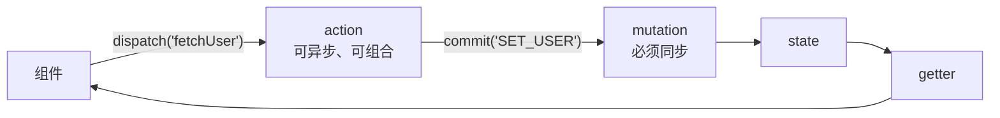

#Vue #Vuex #Pinia #状态管理 #面试

# Vuex 与 Pinia

## TL;DR

**Vuex 的机密：state 就是塞进一个隐藏 Vue 实例 data 里的响应式数据——「store 变了视图更新」不过是响应式系统的复用**。单向流：组件 dispatch(action，可异步) → commit(mutation，必须同步) → state → getter → 视图。**Pinia 是现任标准**：多 store 扁平化、去掉 mutation、完整 TS 推导、天然组合式。

---

## 1. Vuex 核心原理（源码三问）

**① state 为什么是响应式的**：Store 构造时内部 `new Vue({ data: { $$state: state } })`——借宿主 Vue 的响应式初始化（无 el 不挂载，只走 initState），`store.state` 的 getter 返回 `_vm._data.$$state`。组件模板读 state 时照常依赖收集（见 [[1.01 Vue 2 响应式原理]]）。Vuex 4（对 Vue 3）改用 `reactive()` 包装，思路不变。

**② getter 怎么实现缓存**：本质是把用户函数挂到 `store.getters` 的属性 get 描述符上（defineProperty），并桥接到那个内部 Vue 实例的 **computed** 上——所以 getter 有 computed 同款的惰性缓存。

**③ $store 注入**：与 Vue Router 同套路——install 里 Vue.mixin 的 beforeCreate 从根实例向子组件传递 store 引用（Vuex 4 用 app.provide，`useStore()` 是 inject 封装）。详见 [[1.08 Vue Router 原理]] 的注入一节。

**插件机制**：纯发布订阅（机制见 [[3.04 发布订阅与观察者模式]]）——实例化时依次执行 plugins 数组里的函数并传入 store；插件用 `store.subscribe(fn)` 订阅，每次 **commit** 都会带着 `(mutation, state)` 通知全部订阅者。持久化插件（vuex-persistedstate）、logger、devtools 全是这个接口的消费者。

**模块与 namespace**：modules 递归格式化成树，子模块 state 按路径挂载；`namespaced: true` 时，注册 getters/mutations/actions 的 key 统一加 `路径/` 前缀（`user/login`），查找时拼前缀定位——「命名空间」就是**key 前缀约定**，没有更多魔法。

---

## 2. 数据流与 mutation/action 之辨



**mutation 为什么必须同步**：mutation 是「状态变更的记账点」——devtools 在每次 commit 前后拍快照做时间旅行；若 mutation 里有异步，提交时状态还没变完，快照与回放全部失真、变更不可追踪。异步统统放 action，落账时机由同步的 commit 精确界定。

---

## 3. Pinia：现任官方标准

```ts
export const useUserStore = defineStore('user', () => {   // setup 风格
  const user = ref(null);                    // state
  const isLoggedIn = computed(() => !!user.value);   // getter
  async function login(form) {               // action（同步异步随意）
    user.value = await api.login(form);
  }
  return { user, isLoggedIn, login };
});
```

对 Vuex 的改进四条（面试主答）：

1. **去掉 mutation**：action 直接改 state（devtools 依然可追踪），二选一的心智负担消失；
2. **多 store 扁平化**：按领域 defineStore，天然代替 modules + namespace 的整棵配置树，store 间可互相引用；
3. **完整 TS 推导**：state/getter/action 全自动推导，告别 Vuex 的字符串 key 与类型体操；
4. **组合式亲和**：setup 语法定义 store（就是一个 composable，见 [[1.07 Composition API 与 setup]]），支持插件、SSR、代码分割。

配套细节：组件里解构 store 要用 `storeToRefs`（直接解构丢响应式，同 reactive 的坑，见 [[1.02 Vue 3 响应式原理]]）；`$patch` 批量变更；`$subscribe` 对应持久化需求。

---

## 面试问答

### Q: Vuex 为什么 state 变了视图会更新？

满分答案：Store 内部把用户的 state 放进一个隐藏 Vue 实例的 data（new Vue({data:{$$state}})，无 el 不挂载只做响应式初始化），store.state 的 getter 返回它——组件模板读取时正常进行依赖收集，state 变更走派发更新，完全复用响应式系统。getter 则桥接到该实例的 computed 获得缓存。Vuex 4 面向 Vue 3 改用 reactive 包装，原理同构。

### Q: mutation 和 action 的区别？为什么 mutation 必须同步？

满分答案：mutation 是唯一直接修改 state 的入口且必须同步；action 处理异步与业务编排，最终 commit mutation 落账。同步的原因是可追踪性：devtools 以 commit 为界拍快照做时间旅行，mutation 若含异步，提交时刻的状态不确定，快照、日志、回放全部失真。这套约束的收益是「每次变更有名有据」；Pinia 认为成本大于收益，砍掉了 mutation 由 action 直改，配合新 devtools 依然可追踪。

### Q: Vuex 的 namespace 和插件机制是怎么实现的？

满分答案：namespace 是 key 前缀约定——modules 树递归注册时，namespaced 模块的 getters/mutations/actions 统一加「路径/」前缀存进扁平映射，dispatch('user/login') 按前缀查找。插件机制是发布订阅：实例化时依次调用插件函数并传 store，插件通过 store.subscribe 注册回调，每次 commit 后带 (mutation, state) 通知——logger、持久化、devtools 都挂在这里。

### Q: Pinia 相比 Vuex 好在哪？现在怎么选？

满分答案：四点——去 mutation，action 直改 state，心智减半；多 store 扁平化取代 modules+namespace 配置树，store 间可互引；TS 全自动推导；定义方式就是组合式函数，与 Vue 3 生态无缝。注意坑：解构要 storeToRefs 否则丢响应。选型：新项目一律 Pinia（官方推荐），Vuex 只出现在存量维护中——但其源码问题（响应式复用、注入套路、插件订阅）仍是面试考察原理的载体。
