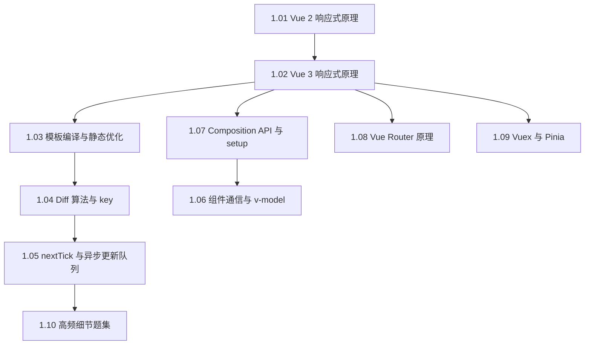

#Vue #index

# Vue 知识地图

> Library/Vue 总索引：阅读顺序、分组清单、概念速查

## 阅读顺序

Vue 的所有机制都从「响应式」长出来：编译优化是喂信息给它，路由和状态库是复用它。

面试前只有一小时，就看 1.02 → 1.03 → 1.04 → 1.10。

---

## 文章清单

### 响应式与渲染

| 文章 | 一句话定位 |
|---|---|
| [[1.01 Vue 2 响应式原理]] | Observer 劫持、Dep 订阅名单、Watcher 订阅者；defineProperty 的四大局限 |
| [[1.02 Vue 3 响应式原理]] | Proxy 整对象代理 + track/trigger；依赖结构 `WeakMap<target, Map<key, Set<effect>>>` |
| [[1.03 模板编译与静态优化]] | parse → transform → generate；静态提升、patch flags、block tree |
| [[1.04 Vue 的 Diff 算法与 key]] | Vue 2 双端对比 → Vue 3 掐头去尾 + 最长递增子序列求最小移动 |
| [[1.05 nextTick 与异步更新队列]] | 变更进去重队列、微任务里一次性 flush，所以要用 `nextTick` 读 DOM |

### 组件与应用层

| 文章 | 一句话定位 |
|---|---|
| [[1.06 组件通信与 v-model]] | 通道按关系记；v-model 是 `:modelValue + @update:modelValue` 的糖 |
| [[1.07 Composition API 与 setup]] | 按关注点组织代码；`<script setup>` 是零运行时的编译期语法糖 |
| [[1.08 Vue Router 原理]] | 无刷新改 URL + 监听变化 + 响应式驱动视图，hash 与 history 两种模式 |
| [[1.09 Vuex 与 Pinia]] | state 就是藏在 Vue 实例里的响应式数据；Pinia 是现任标准 |
| [[1.10 Vue 高频细节题集]] | v-if/v-for 优先级、data 为何是函数、箭头函数丢 this、SSR 概览 |

---

## 概念速查（这个词在哪篇里讲透了）

| 概念 | 所在笔记 |
|---|---|
| defineProperty、Observer、Dep、Watcher、依赖收集、派发更新 | [[1.01 Vue 2 响应式原理]] |
| Proxy、track/trigger、effect、ref vs reactive、解构丢响应 | [[1.02 Vue 3 响应式原理]] |
| AST、静态提升、patch flag、block tree、编译时优化 | [[1.03 模板编译与静态优化]] |
| 双端对比、最长递增子序列、就地复用、key | [[1.04 Vue 的 Diff 算法与 key]] |
| 异步更新队列、nextTick、微任务时机 | [[1.05 nextTick 与异步更新队列]] |
| props/emit、provide/inject、`$attrs`、defineExpose、v-model 修饰符 | [[1.06 组件通信与 v-model]] |
| setup、composable、defineProps/defineEmits/defineModel | [[1.07 Composition API 与 setup]] |
| hash 模式、history 模式、router-link/router-view、`$route` 注入 | [[1.08 Vue Router 原理]] |
| mutation/action、namespace、Pinia store、插件机制 | [[1.09 Vuex 与 Pinia]] |
| v-if 与 v-for 优先级、强制刷新、errorCaptured、SSR | [[1.10 Vue 高频细节题集]] |

---

## 跨目录关联

- Proxy/Reflect 的语言层原理 → [[1.08 Proxy 与 Reflect]]
- 与 React 的范式差异（push vs pull）→ [[React vs Vue 渲染对比]]
- 微任务时机的底座 → [[2.01 事件循环与宏微任务]]
- 构建侧（Vite 出自 Vue 团队）→ [[2.05 Vite 原理]]

---

## 维护说明

新增 Vue 笔记时：挂进「响应式与渲染」或「组件与应用层」，写一句定位并补概念速查。Vue 2 与 Vue 3 的差异统一在同一篇里对比，不另开版本目录。
