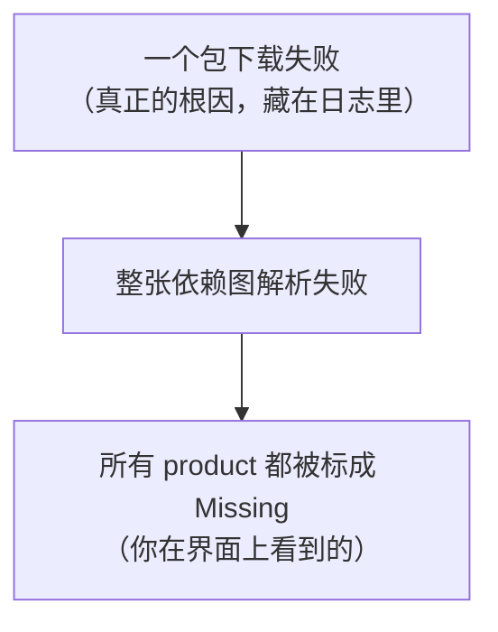

#iOS #Xcode #SPM #故障排查 #依赖管理

# Xcode SPM 依赖解析失败排查

## TL;DR

**一次性冒出几十个 `Missing package product`，几乎从来不是项目配置坏了，而是某一个依赖没下全——SPM 的依赖解析是「全有或全无」的。**

- 只要有**一个**包下载失败，整张依赖图判定失败，于是 target 里挂的**每一个** product 都被标成 Missing
- Xcode 界面上只显示这些连带的结果，真正的原因藏在 DerivedData 的 Package 日志里
- 修复用 `xcodebuild -resolvePackageDependencies`，它是增量的，只补缺的那部分，缓存全命中时几秒钟
- **不要条件反射去点 Reset Package Caches**——那是清空重下，反而更容易再次踩到网络中断
- 提供 xcframework 的二进制依赖（Sentry、Firebase、WebRTC 等）体积可达 GB 级，是最常见的失败点

---

## 1. 典型症状

Xcode 打开项目，Issue Navigator 里一整屏红色：

```text
Missing package product 'GoogleSignInSwift'
Missing package product 'FirebaseAuth'
Missing package product 'FirebaseCore'
Missing package product 'GRDB'
Missing package product 'Sentry'
Missing package product 'WebRTC'
...（十几到几十条）
```

每条后面还跟着一句提示：

```text
note: Package resolution errors must be fixed before building
```

第一反应通常是「项目文件坏了」或「谁改了 pbxproj」。**大概率不是。**

一个强信号：连**本地包**（`XCLocalSwiftPackageReference`，代码就在硬盘上、根本不需要下载）也一起报 Missing。本地文件不可能「丢失」，这说明问题出在解析阶段，而不是某个具体依赖。

---

## 2. 关键认知：解析是原子的

SPM 的依赖解析是一次**全有或全无**的操作。

它要先解出一张完整的依赖图（包括依赖的依赖，比如 Firebase 会牵出 nanopb、abseil、gRPC），确认每一个节点都就位，才算成功。只要有一个节点缺失，整次解析失败。

失败之后，Xcode 无法确定任何 product 是否可用，于是**全部标记为 Missing**：



所以那几十条报错**是同一个原因的连带结果，不是几十个独立问题**。别一条条去查，要往上游找那个唯一的根因。

---

## 3. 定位真正的错误

界面上看不到根因，得去翻构建日志。日志在 DerivedData 里：

```text
~/Library/Developer/Xcode/DerivedData/<项目名>-<哈希>/Logs/
├── Build/      ← 构建日志
└── Package/    ← 依赖解析日志（重点看这里）
```

日志是 `.xcactivitylog` 格式（本质是 gzip 压缩的二进制），直接 `cat` 是乱码，要先解压再抽字符串：

```bash
cd ~/Library/Developer/Xcode/DerivedData/<项目名>-<哈希>/Logs/Build && ls -lt *.xcactivitylog | head -3
```

```bash
gunzip -c <最新的日志>.xcactivitylog | strings | grep -iE "error|failed|download"
```

一次真实排查挖出来的根因：

```text
Failed to resolve package dependencies
failed downloading
  'https://github.com/getsentry/sentry-cocoa/releases/download/9.19.1/
   Sentry-Dynamic-WithARM64e.xcframework.zip'
  which is required by binary target 'Sentry-Dynamic-WithARM64e':
  downloadError("The network connection was lost.")
```

一句话：网络断了，Sentry 的三个 xcframework 没下完。16 条 Missing 全从这里来。

---

## 4. 为什么总是二进制依赖出事

SPM 的依赖分两类，失败风险差很多：

| 类型 | 获取方式 | 体积 | 风险 |
| --- | --- | --- | --- |
| 源码包 | `git clone` | 通常几 MB | 低，git 可断点续传 |
| 二进制包（binaryTarget） | 下载 `.xcframework.zip` | 单个可达数百 MB | **高**，纯 HTTP 下载，断了就得重来 |

Sentry 是典型例子：它提供 7 个 xcframework 变体（Dynamic、WithARM64e、WithoutUIKitOrAppKit 等组合），解压后总计接近 **2.9 GB**，全部走 GitHub Releases 下载。网络稍有抖动就断。

Firebase、WebRTC、AppsFlyer、gRPC 也都有二进制分发，属于同类高风险项。

---

## 5. 修复：resolvePackageDependencies

```bash
xcodebuild -resolvePackageDependencies -project YourApp.xcodeproj
```

### 命令拆解

| 部分 | 含义 |
| --- | --- |
| `xcodebuild` | Xcode 的命令行工具，和界面共用同一套逻辑、同一份缓存 |
| `-resolvePackageDependencies` | 一个 **action**（和 `build` / `test` / `clean` 同级），只解析依赖、不编译 |
| `-project` | 指定项目文件；如果项目用 workspace 组织，换成 `-workspace` |
| `-scheme`（可选） | 把范围收窄到该 scheme 会构建的 target，多数项目里加不加结果一样 |

### 它做了什么

读 `project.pbxproj` 里的 package references 和 `Package.resolved` 里锁定的版本，解出完整依赖图，然后往 DerivedData 里填三样东西：

```text
DerivedData/<项目>/SourcePackages/
├── checkouts/            ← 远程 git 仓 clone 到这里
├── artifacts/            ← binaryTarget 的 xcframework 下载解压到这里（大头）
└── workspace-state.json  ← 解析结果记录
```

### 为什么能修好

两个性质凑在一起：

1. **增量且幂等** —— 已在本地的包跳过，只补缺的。不是把几个 GB 重下一遍。缓存全命中时**只要 4 秒左右**
2. **和 Xcode 界面共享同一个 DerivedData** —— 命令行补下来的东西，Xcode 重开后直接能用

修完之后 Xcode 进程里还缓存着旧的失败状态，**关掉重新打开项目**即可。还有残留就走一次 File → Packages → Resolve Package Versions。

---

## 6. resolve 与 Reset Package Caches 的区别

这点最容易踩坑。遇到依赖问题很多人条件反射去点 Reset，方向恰恰相反：

| | `-resolvePackageDependencies` | Reset Package Caches |
| --- | --- | --- |
| 行为 | **补齐**，保留已有缓存 | **清空重来**，删掉所有 checkouts 和 artifacts |
| 耗时 | 缓存命中时几秒 | 重新下载全部依赖，可能几十分钟 |
| 风险 | 无 | 大体积项目里**极易再次触发网络中断**，把问题放大 |
| npm 类比 | 类似 `npm install` | 类似 `rm -rf node_modules && npm ci` |

**正确顺序**：先试 resolve；只有在怀疑缓存本身损坏（比如解压到一半的残缺文件）时，才动 Reset。

---

## 7. 排查清单

按顺序走，多数情况第 2 步就结束了：

1. **看报错范围** —— 如果连本地包也报 Missing，基本可以排除「某个依赖配置错了」，直奔解析失败
2. **命令行重跑解析** —— `xcodebuild -resolvePackageDependencies -project X.xcodeproj`，几秒钟，无副作用。成功了就重开 Xcode，结束
3. **还失败就翻日志** —— 去 `DerivedData/.../Logs/Package/` 和 `Logs/Build/` 找真正的错误信息
4. **按根因处理**：
   - `downloadError` / 网络类 → 换网络环境重试，二进制依赖大时尤其需要稳定连接
   - 私有仓 `Authentication failed` → 检查 SSH key 或 GitLab/GitHub 访问权限
   - 版本冲突 `because ... requires` → 看 `Package.resolved` 和 pbxproj 里的版本约束是否打架
5. **最后才考虑 Reset Package Caches**

### 一个副产品观察

`xcodebuild -list`（只是列 scheme）的输出开头也会出现 `Resolve Package Graph`。任何需要读懂项目结构的 xcodebuild 操作，都会先确保依赖图完整——这也是为什么依赖没下全时，几乎所有 Xcode 操作都会卡住。

---

## 相关文章

- [[iOS 依赖管理：SPM 与 CocoaPods]] - 两套依赖管理器的机制对比
- [[1.02 package.json 与依赖管理]] - `Package.resolved` 的同类概念
- [[语义版本控制 SemVer]] - 版本冲突时要读懂的约束语义

---

## 参考资料

- `man xcodebuild`（`-resolvePackageDependencies` action 说明）
- Apple Developer: Swift Packages in Xcode
- 实践来源：公司 iOS 项目一次 16 条 `Missing package product` 的完整排查（Xcode 26.2，根因为 Sentry 9.19.1 的 xcframework 下载中断）
