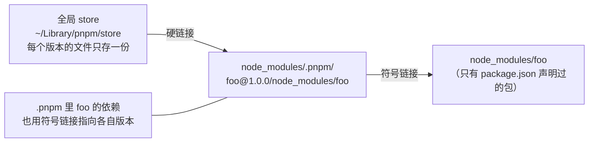

#工程化 #npm #pnpm #面试

# npm、yarn 与 pnpm

## TL;DR

**node_modules 结构三代演进：npm2 嵌套（路径爆炸、重复安装）→ npm3/yarn 扁平化（引入幽灵依赖与分身问题）→ pnpm 全局 store 硬链接 + 符号链接（省磁盘、无幽灵依赖、安装最快）**。「pnpm 为什么快、为什么严格」是本主题的核心叙事。

---

## 1. 三代 node_modules 结构

**第一代 · 嵌套**（npm 2）：每个包的依赖装进自己的 node_modules——结构干净但**同一个包被复制无数遍**，Windows 上路径过长直接报错。

**第二代 · 扁平化**（npm 3+ / yarn）：所有依赖尽量提升（hoist）到顶层 node_modules。副作用两枚：

- **幽灵依赖（Phantom Dependencies）**：没写进 package.json 的包因为被提升了也能 require——某天上游不再依赖它，你的代码直接崩，且崩得莫名其妙；
- **分身（Doppelgänger）**：同名包只能提升一个版本，其余版本仍要在各依赖者内部重复安装；提升哪个版本取决于安装顺序，**不确定性**由此而来。

**第三代 · pnpm**：



两层链接各司其职：**硬链接**把磁盘文件全局去重（装一百个项目，同版本的 lodash 只占一份磁盘）；**符号链接**组织依赖关系——顶层 node_modules 只出现你声明过的包，**幽灵依赖从结构上被消灭**；不同版本在 .pnpm 里天然共存，无分身问题。速度收益：无需复制文件（链接是 O(1)），缓存命中时安装接近瞬时。

pnpm 的注意点：符号链接对个别老工具/React Native 有兼容性问题（`node-linker=hoisted` 可退回扁平结构）；严格性会暴露此前「白嫖」幽灵依赖的代码——这是好事。

---

## 2. 实用机制问答素材

**npm 缓存在哪**：`~/.npm/_cacache`（macOS/Linux），按内容哈希（integrity）组织，同一包不同版本各自缓存；`npm ci` 也吃这个缓存。pnpm 的对应物就是全局 store（`pnpm store path` 查看）。

**多版本共存与版本收敛**：

```bash
pnpm add lodash1@npm:lodash@1    # 别名安装，两个大版本并存
```

- 强制统一版本：pnpm 用 `pnpm.overrides`（package.json），yarn 用 `resolutions`，npm 用 `overrides`——处理安全漏洞版本收敛的标准手段；
- `.pnpmfile.cjs` 的 readPackage 钩子可在安装期改写依赖（替换包、修补版本），是「不 fork 上游改依赖」的黑科技。

**私有仓库**：轻量选 **Verdaccio**（Node 实现的 npm proxy registry，公有包代理 + 私有包托管），重型选 Nexus（Java，多制品类型）。使用侧就是 `.npmrc` 指 registry + `npm publish`；scope 级配置（`@company:registry=…`）让私有 scope 走内网、其余走官方源。

**锁定包管理器**：`preinstall` 里 `npx only-allow pnpm`，或 package.json 的 `packageManager` 字段 + corepack——防止团队成员混用产生多份 lock。

---

## 3. 选型口径（2026 现状）

新项目默认 **pnpm**（速度、磁盘、严格性、workspace 成熟，见 [[1.04 Monorepo 与工作区]]）；yarn 的现代版（Berry/PnP）激进但生态兼容成本高，classic 已停止发展；npm 胜在零安装成本与最广兼容。团队迁移的主要工作量是清理幽灵依赖。

---

## 面试问答

### Q: pnpm 相比 npm/yarn 的优势？原理是什么？

满分答案：npm3/yarn 的扁平化带来幽灵依赖（未声明的包能 require）和分身问题（同名包多版本重复安装、提升结果不确定）。pnpm 用全局内容寻址 store 存每个版本的唯一副本，项目里以硬链接引入 .pnpm 目录、再用符号链接组织依赖树——顶层只暴露声明过的包。三个收益：磁盘全局去重、安装免复制所以快、结构上杜绝幽灵依赖且版本天然共存。代价是符号链接的个别兼容性问题，可用 node-linker 退化。

### Q: 什么是幽灵依赖？怎么治理？

满分答案：代码里 require 了 package.json 未声明、仅因扁平化提升而恰好存在的包——上游依赖结构一变就崩，且 lock 里查不到直接责任。治理：迁移 pnpm 从结构上杜绝；存量项目用 lint 规则（如 import/no-extraneous-dependencies）扫描，把实际用到的包补进声明；CI 里用干净安装验证。

### Q: 怎么把整个项目里某个依赖强制到指定版本？

满分答案：版本覆盖机制——pnpm 在 package.json 的 pnpm.overrides、yarn 的 resolutions、npm 8+ 的 overrides，把传递依赖也钉到指定版本，安全漏洞收敛（如 lodash 原型污染版本）就靠它。pnpm 还有 .pnpmfile.cjs 的 readPackage 钩子能在安装期改写任意包的依赖声明。改完检查 lock diff 确认生效范围。

### Q: 公司内部包怎么发布和使用？

满分答案：搭私有 registry——轻量用 Verdaccio（npm proxy：私有包托管 + 公有包代理缓存），企业级用 Nexus/Artifactory。发布侧规范：scope 命名（@company/xxx）、.npmrc 按 scope 指向内网源、CI 里用 token 发布、semver + dist-tag 管理版本节奏。好处顺带答：内网加速、审计可控、离线兜底。
