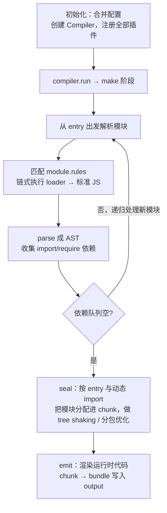

#工程化 #Webpack #原理 #面试

# Webpack 核心流程

## TL;DR

**Webpack 是「一切皆模块」的静态打包器：从 entry 出发递归解析依赖图，每个文件经 loader 转成 JS 模块，按引用关系组装成 chunk，最终产出 bundle**。流程三大段：初始化（读配置建 Compiler）→ 构建（make：loader 转换 + AST 收集依赖）→ 生成（seal/emit：chunk 组装与产物输出）。Compiler 全局唯一管生命周期，Compilation 每次编译新建一个。

---

## 1. 完整流程



面试口述版：「初始化读取配置创建 Compiler 并挂载插件（插件此刻开始监听各阶段钩子）→ make 阶段从入口递归：每个模块先过 loader 链转成 JS，再解析 AST 收集依赖加入队列，直到图闭合 → seal 阶段把模块按入口和动态 import 划分 chunk，执行 tree shaking、splitChunks 等优化 → emit 阶段注入 webpack 运行时（模块加载器 `__webpack_require__`）后输出 bundle 文件」。

---

## 2. module / chunk / bundle（一句话辨析）

**同一份代码在三个阶段的名字**：你写的每个文件是 **module**（ESM/CJS 都算，css/图片经 loader 后也是模块）；打包过程中按引用关系分组、在内存里被加工的单位是 **chunk**；最终写到磁盘、浏览器可直接运行的文件是 **bundle**。

chunk 的三个来源：每个 entry 一个、每个动态 `import()` 一个、splitChunks 拆出来的公共块（详见 [[2.04 代码分割与构建优化实战]]）。通常一个 chunk 产出一个 bundle，但如 MiniCssExtractPlugin 会从 chunk 里再抽出独立的 css 文件——不是严格一比一。

---

## 3. Compiler 与 Compilation

| | Compiler | Compilation |
|---|---|---|
| 生命周期 | 全局唯一，从启动到退出 | **每次构建新建一个**（watch 模式下每次文件变更） |
| 代表什么 | 不变的构建环境：完整配置、entry/output/loaders | 一次构建的全部现场：模块表、chunk、产物、文件依赖 |
| 典型钩子 | run、compile、**compilation**、emit、done | buildModule、optimizeChunks、processAssets |

两者都继承 **Tapable**（webpack 的钩子系统），插件的本质就是在这些钩子上注册回调（见 [[2.02 Loader 与 Plugin 开发]]）。惯用套路：先 `compiler.hooks.compilation.tap` 拿到每次新建的 compilation，再挂 compilation 级钩子——比如压缩插件工作在优化阶段的钩子上。

---

## 4. 产物长什么样（理解运行时）

打包产物的骨架：模块表（`{ 模块路径: 包裹函数 }`）+ 一个手写的 CommonJS 式加载器：

```js
// 极简 webpack 运行时
const modules = { './src/a.js': (module, exports, require) => { ... } };
const cache = {};
function __webpack_require__(id) {
  if (cache[id]) return cache[id].exports;
  const module = (cache[id] = { exports: {} });
  modules[id](module, module.exports, __webpack_require__);
  return module.exports;    // 带缓存的模块加载——与 Node require 同思路
}
__webpack_require__('./src/index.js');   // 从入口启动
```

「手写迷你打包器」题的三步答案：**入口出发用 Babel 解析 AST 收集 import → 递归构建依赖图 → 拼模块表 + 上面这个 require 运行时**。动态 import 的实现（JSONP 加载新 chunk）见 [[2.04 代码分割与构建优化实战]]。

---

## 面试问答

### Q: 说说 webpack 的打包流程？

满分答案：三段——初始化：合并 CLI 与配置文件，创建全局唯一的 Compiler，注册所有插件（开始监听钩子）；构建（make）：从 entry 递归，每个模块经 loader 链转成标准 JS、解析 AST 收集依赖入队，直到依赖图闭合；生成（seal + emit）：按 entry 和动态 import 把模块组装进 chunk，执行 tree shaking 与 splitChunks 优化，注入 __webpack_require__ 运行时后输出 bundle。插件全程通过 Tapable 钩子介入各阶段。

### Q: module、chunk、bundle 的区别？

满分答案：同一份代码在三个阶段的称呼——源码里的每个文件是 module（含经 loader 转换的 css/图片）；构建中按引用关系分组的内存单位是 chunk，来源有三：entry、动态 import()、splitChunks 拆分；输出到磁盘可直接运行的是 bundle。补充非一比一的例子：MiniCssExtractPlugin 从一个 chunk 抽出额外的 css 产物。

### Q: Compiler 和 Compilation 的区别？

满分答案：Compiler 全局唯一、代表不变的构建环境与完整生命周期（run/emit/done 等钩子）；Compilation 代表单次构建的现场——模块、chunk、assets 都挂在它上面，watch 模式每次变更重建一个（buildModule/processAssets 等钩子）。两者都基于 Tapable；插件常先 tap compiler 的 compilation 钩子拿到实例，再注册 compilation 级钩子做产物加工。

### Q: webpack 打包后的代码是怎么跑起来的？

满分答案：产物 = 模块表 + 自实现的加载器：每个模块被包成 (module, exports, require) 签名的函数存进对象，__webpack_require__ 按 id 取函数执行并缓存 exports——本质是把 CommonJS 语义在浏览器里模拟了一遍，ESM 语法在构建期已被转换成这套机制的调用。异步 chunk 则由运行时通过动态插入 script（JSONP 风格）加载后注册进模块表。
