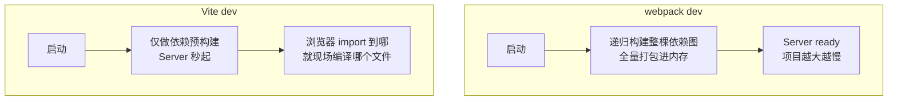

#工程化 #Vite #原理 #面试

# Vite 原理

## TL;DR

**Vite 开发时不打包：直接把源码按浏览器请求的原生 ESM 逐个「按需编译」返回，启动时间与项目大小无关**；依赖预构建用 esbuild（把 CJS 依赖转 ESM + 数百小文件合并）；HMR 精确到模块，速度不随规模衰减；生产环境用 Rollup 正经打包。这四句话就是 Vite 的全部骨架。

---

## 1. 与 webpack 的根本差异：Bundle vs No-bundle

webpack 的前提是「浏览器不认识模块」，所以先打包再服务；Vite 的前提是「现代浏览器原生支持 ESM」——`<script type="module">` 让浏览器自己解析 import 链，**dev server 退化成一个「按路径实时转换文件」的服务**。启动 O(1)、改动编译 O(改动文件)。

---

## 2. Dev Server 处理请求的流程

Vite 用 connect 起 HTTP 服务，请求穿过中间件链：

1. 浏览器请求 `/src/App.vue` → 中间件按扩展名分发对应插件转换（Vue SFC 编译、TS 用 **esbuild 转译**——只去类型不做检查，快在这里）；
2. **import 重写**：源码里的裸模块导入 `import vue from 'vue'` 浏览器不认识（不是相对路径），Vite 用 es-module-lexer 扫描 import 并改写为 `/node_modules/.vite/deps/vue.js`；
3. 返回的每个模块带 ETag/强缓存头——二次访问大量 304/缓存命中；
4. 源码模块按需编译**且缓存**，改动只失效对应模块。

**依赖预构建（esbuild）**解决两件事：① node_modules 里大量 CJS/UMD 包转成 ESM 才能被浏览器 import；② lodash-es 这类「一个包几百个小模块」合并成单文件——否则一次导入触发几百个 HTTP 请求。产物缓存在 `node_modules/.vite`，依赖变更（lock 文件变化）才重建。

---

## 3. HMR：为什么恒定的快

Vite 的热更新以 **ESM 模块为边界**：文件变更 → 服务端通过 WebSocket 推送失效模块 id → 浏览器重新 import 该模块（带时间戳查询串破缓存）→ 沿「HMR 边界」（如 Vue SFC、React Fast Refresh 注册的模块）局部替换。对比 webpack：不需要重建 bundle 的任何部分，**更新成本只与被改模块相关，与项目规模无关**。

---

## 4. 生产构建与浏览器兼容

**为什么生产用 Rollup 而不是继续 no-bundle**：真实网络下未打包的深层 import 链会产生请求瀑布（HTTP/2 也扛不住数千请求），且需要 Tree Shaking、压缩、分包这些 bundle 级优化——开发要快、生产要优，两个阶段目标不同。（Vite 官方正在推进 **Rolldown**——Rust 版 Rollup——统一双端，答出来是新知识加分。）

**兼容老浏览器：@vitejs/plugin-legacy** 的 module/nomodule 双构建：

- 现代浏览器：`<script type="module">` 加载 ES2017+ 小体积产物；
- 老浏览器：忽略 module、执行 `nomodule` 的 SystemJS 格式 legacy 产物 + 全量 polyfill；
- 精确探测：一段内联 module 脚本尝试 `import.meta`、动态 import、async generator，都成功才标记 `__vite_is_modern_browser`——因为**支持 ESM ≠ 支持这些更新语法**，探测失败则主动降级加载 legacy。已知代价：极端情况下文件可能重复加载（代码不会重复执行）。

其余生产优化沿用 Rollup 生态：手动分包 manualChunks、产物分析、CSS 代码分割（与 [[2.04 代码分割与构建优化实战]] 同一套心法）。

---

## 面试问答

### Q: Vite 为什么比 webpack 快？

满分答案：三个层面——启动：webpack 需全量打包，Vite 只做依赖预构建，源码交给浏览器按 ESM 拉取、请求到才编译，启动与项目规模无关；编译器：TS/JSX 用 esbuild（Go 编写、并行）转译，比 Babel 快一个数量级；热更新：以 ESM 模块为边界精确失效，通过 WebSocket 通知浏览器重新 import 单个模块，不重建 bundle，速度恒定。前提是现代浏览器原生支持 script type=module。

### Q: 什么是依赖预构建？为什么需要？

满分答案：启动时用 esbuild 把 node_modules 依赖统一处理并缓存到 .vite 目录，解决两个问题：CJS/UMD 包转成 ESM 才能被浏览器原生 import；把「几百个内部小模块」的包（如 lodash-es）合并成单文件，避免一次导入触发请求风暴。同时完成裸模块说明符的重写映射。缓存按 lock 文件失效，所以平时秒起、换依赖后首启稍慢。

### Q: Vite 开发和生产环境的差异？为什么生产还要打包？

满分答案：开发 no-bundle——connect 中间件按请求实时转换单文件，靠浏览器解析模块图；生产用 Rollup 完整打包。原因：真实网络下深层 import 链会形成请求瀑布，数千模块请求不可接受；且压缩、Tree Shaking、分包、长缓存哈希这些优化天然属于 bundle 阶段。注意点：dev 与 build 工具链不同可能有行为差异，Vite 正用 Rust 的 Rolldown 统一两端。

### Q: Vite 怎么兼容不支持 ESM 的老浏览器？

满分答案：plugin-legacy 做双构建 + module/nomodule 分发——现代浏览器执行 type=module 的 ES2017+ 产物、自动忽略 nomodule；老浏览器不执行 module、走 nomodule 的 SystemJS legacy 产物加 polyfill。亮点是精确探测：内联 module 脚本测试 import.meta、动态 import、async generator，因为支持 ESM 不代表支持这些语法，探测不过仍降级 legacy。机制上就是经典的差异化分发，代价是可能的重复下载。
