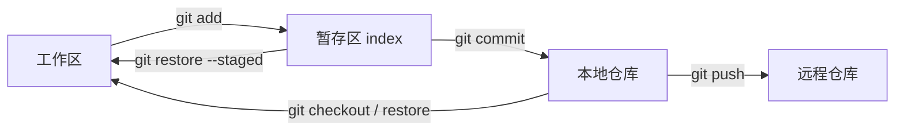

#工程化 #Git #面试

# Git 核心操作与撤销

## TL;DR

**Git 三区流转：工作区 → add → 暂存区 → commit → 本地仓库 → push → 远程**。撤销选型口诀：**未推的历史用 reset（移动指针，重写历史），已推的用 revert（新提交抵消旧提交，不动历史）**。提交错分支的自救按「commit/push 到哪一步」分三档处理。

---

## 1. 三区模型与常用操作



高频小操作（体现熟练度的细节）：

- `git add -p`：**按代码块交互式暂存**——一个文件里只提交部分改动，拆干净 commit 的利器；
- `git stash` / `stash pop`：暂存现场（切分支救急）；`stash -u` 连未跟踪文件一起存；
- `git cherry-pick <commit>`：把某个提交摘到当前分支；
- `git reflog`：**HEAD 的移动流水账**——reset 过头、分支删错，都从这里找回 commit（「Git 里几乎没有真正丢失的提交」）。

---

## 2. reset vs revert（必考）

| | `git reset` | `git revert` |
|---|---|---|
| 原理 | **移动分支指针**到目标提交，之后的提交脱离历史 | **创建一个内容相反的新提交**抵消目标提交 |
| 历史 | 被重写 | 完整保留（撤销行为本身可追溯） |
| 适用 | 本地未推送的整理 | **已推送到共享分支**的撤销 |
| 协作风险 | 已推分支上 reset + 强推会坑翻同事 | 无 |

reset 三档：`--soft`（只动指针，改动全回暂存区）、`--mixed` 默认（指针 + 暂存区回退，改动留工作区）、`--hard`（三区全回退，**工作区改动丢弃**——危险档，误用后靠 reflog 抢救）。

---

## 3. 场景题：提交错分支怎么办

按进度三档自救：

1. **改了未 commit**：`git stash` → 切/建正确分支 → `git stash pop`；
2. **commit 了未 push**：`git reset --soft HEAD~1` 撤掉提交保留改动 → 切到正确分支重新 commit（或直接在正确分支 `cherry-pick` 那个 commit，再回原分支 reset 掉）；
3. **已经 push**：共享分支通常有保护禁止强推——用 `git revert <commit>` 生成撤销提交推上去，再把原始改动 cherry-pick 到正确分支。

**fork 的仓库如何同步上游**：

```bash
git remote add upstream <原仓库地址>   # 一次性：添加上游源
git fetch upstream
git merge upstream/main               # 或 rebase upstream/main 保持线性
git push origin main
```

（GitHub 网页上的 Sync fork 按钮做的就是这件事。remote 别名的查看与修改见 [[3.04 Git 远程仓库管理]]。）

---

## 4. submodule vs subtree（多仓组合）

| | submodule | subtree |
|---|---|---|
| 形态 | 父仓库只记录**子仓 URL + commit 指针**（.gitmodules），内容独立 | 子项目代码**直接并入**父仓库目录，无 .git |
| clone 后 | 需 `git submodule update --init` 手动初始化 | 天然完整，无感 |
| 修改子项目 | 在子仓里提交，父仓再更新指针（双向都要手动同步） | 直接改直接提交；`git subtree push/pull` 与子仓双向同步 |
| 适用 | 强独立性：子项目有自己的发布节奏、权限边界 | 使用方无感优先：偶尔同步上游的内嵌依赖 |

一句话：**submodule 是「引用」，subtree 是「拷贝进来还能对账」**。现代替代思路：能用包管理就发包（npm 私有源），能同仓就 Monorepo（见 [[1.04 Monorepo 与工作区]]），这俩是中间态方案。

---

## 面试问答

### Q: git reset 和 revert 的区别？分别什么时候用？

满分答案：reset 移动分支指针重写历史，soft/mixed/hard 三档决定暂存区与工作区是否跟随回退，适合本地未推送的提交整理；revert 生成一个内容相反的新提交来抵消目标提交，历史完整保留，是共享分支上撤销的唯一正确姿势——已推送的历史 reset 后强推会让所有协作者的本地历史分叉。附一句安全网：reset --hard 误操作可通过 reflog 找回。

### Q: 提交到错误的分支了怎么处理？

满分答案：分三档——没 commit：stash 挪走改动、切正确分支 pop；commit 没 push：reset --soft HEAD~1 保留改动重新提交，或到正确分支 cherry-pick 后回来 reset；已 push：受保护分支不能强推，用 revert 抵消再把原提交 cherry-pick 到正确分支。答题时按「改动传播到了哪一层」组织，体现三区模型的理解。

### Q: submodule 和 subtree 怎么选？

满分答案：submodule 父仓只存子仓的 URL 和 commit 指针，子项目完全独立（自己的历史、权限、发布节奏），代价是 clone 要初始化、版本指针要手动同步，协作者心智负担重；subtree 把代码实际并入父仓、使用方完全无感，subtree push/pull 可与上游对账，代价是父仓历史变大。选型：强独立性选 submodule，使用体验优先选 subtree；同时指出现代替代——发私有包或 Monorepo 往往是更好的第三选项。

### Q: fork 的仓库怎么与上游保持同步？

满分答案：给本地加第二个 remote 指向原仓库（约定叫 upstream），fetch upstream 后把上游主分支 merge 或 rebase 进本地，再 push 回自己的 origin。rebase 可保持自己提交在上游之上的线性历史，便于后续发 PR。GitHub 的 Sync fork 按钮是同一操作的托管版。
