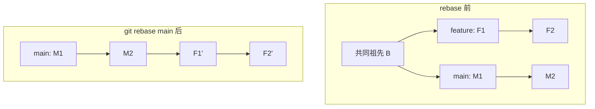

#工程化 #Git #rebase #工作流 #面试

# merge、rebase 与分支工作流

## TL;DR

**merge 保留分叉与合并痕迹（可能产生 merge commit），rebase 把你的提交「搬到」目标分支最新提交之后重放，历史成一条直线**。铁律一条：**rebase 只用在自己未共享的提交上，公共分支永远不 rebase**。工作流选型：小团队高频发布用 GitHub Flow / 主干开发，多版本并存才需要 GitFlow。

---

## 1. merge：合并的三种姿态

```bash
git merge feature            # ① fast-forward：主干无新提交时直接挪指针，无 merge commit
git merge --no-ff feature    # ② 强制产生 merge commit，保留「曾有过一个分支」的痕迹
git merge --squash feature   # ③ 压成一次提交进主干，丢弃分支的细碎历史
```

merge 的性格：**不改写任何已有提交**，冲突一次性集中解决；代价是分叉多时历史图变成「地铁线路图」。

---

## 2. rebase：变基的本质



字面意思「改变基底」：把 feature 从共同祖先之后的提交暂存起来，将分支起点挪到 main 最新提交，再**逐个重放**（每个提交单独解冲突）。重放出来的 F1'、F2' 是**内容相同但哈希全新的提交**——「改写历史」就是这个意思，也是一切纪律的来源。

**为什么公共分支不能 rebase**：你把大家都基于的提交换成了新哈希，其他人本地历史与远程分叉，pull 时一片混乱。**黄金法则：只 rebase 自己还没推送（或明确只有自己用）的提交**。

`rebase -i`（交互式整理，PR 前的礼仪）：pick 保留、**squash 合并进上一条（保留信息）、fixup 合并（丢弃信息）**、reword 改信息、drop 删除——把「修复 typo」「调试」这类碎提交整理成有语义的几条。rebase 炸了想反悔：`git reset --hard ORIG_HEAD` 一键回到 rebase 前（配合 [[3.01 Git 核心操作与撤销]] 的 reflog）。

---

## 3. 使用时机（把两者拼成日常流程）

| 场景 | 用法 |
|---|---|
| 同步主干最新代码到自己的 feature | `git rebase main`——历史保持线性，PR 干净 |
| PR 合入主干 | merge（squash 或 no-ff，团队约定）——保留合入记录 |
| PR 前整理提交 | `rebase -i` 压缩碎提交 |
| 公共分支之间 | 永远 merge |

日常节奏一句话：**「向下游同步用 rebase，向上游合入用 merge」**。`git pull --rebase`（或配置 `pull.rebase=true`）避免每次 pull 都长出无意义的 merge commit。

---

## 4. 分支工作流选型

**GitFlow**：master（发布）+ develop（集成）+ feature/release/hotfix 五类分支——结构严谨，适合**多版本并行维护**（toB 交付、客户端发版）；缺点是流程重、长寿分支合并痛苦，对持续部署的 Web 项目过度设计。

**GitHub Flow**：只有 main + 短命 feature 分支，PR 评审后合入即可部署——Web 应用主流。

**主干开发（Trunk-Based）**：所有人频繁（至少每天）合入主干，超短分支甚至直接提交，配合**特性开关**隐藏未完成功能——大厂持续部署的形态，对自动化测试和 CI 要求最高。

选型答法：看**发布模型**——持续部署选 GitHub Flow/主干开发，多版本长期维护选 GitFlow；团队规模与测试成熟度是修正项。

---

## 面试问答

### Q: merge 和 rebase 的区别？

满分答案：merge 不改写历史——把两条线合起来，必要时产生 merge commit，冲突一次性解决，历史保真但分叉多了图变乱；rebase 把当前分支提交搬到目标分支最新提交后逐个重放，历史变成直线、便于阅读和 bisect，但重放产生全新哈希、属于改写历史，且冲突要逐提交处理。使用纪律：只 rebase 未共享的提交，公共分支只 merge——违反会造成协作者历史分叉。

### Q: 什么时候用 rebase，什么时候用 merge？

满分答案：方向决定——把主干的新代码同步进自己的 feature 用 rebase，保持线性、PR 无噪音；把 feature 合回主干用 merge（团队按约定选 squash 或 no-ff），保留合入记录。配套习惯：pull 配 --rebase 避免无意义 merge commit；PR 前 rebase -i 用 squash/fixup 整理碎提交。一句话总结：向下游同步 rebase，向上游合入 merge。

### Q: rebase -i 都能做什么？操作失误怎么救？

满分答案：交互式重写一段历史——pick 保留、squash 并入上一条且保留信息、fixup 并入且丢信息、reword 改提交信息、edit 停下来改内容、drop 删除；典型用途是 PR 前把开发过程的碎提交整理成语义化的几条。失误恢复：rebase 前的位置记录在 ORIG_HEAD，reset --hard ORIG_HEAD 一步回滚；更早的操作用 reflog 找回。因为最终要 push -f（限自己的分支，且用 --force-with-lease 更安全），整理务必在本地完成后一次推送。

### Q: 了解哪些 Git 工作流？怎么选？

满分答案：GitFlow——五类分支结构化管理，适合多版本并行维护的交付型产品，代价是流程重；GitHub Flow——main 加短命分支加 PR，合入即部署，Web 应用主流；主干开发——超短分支高频合入主干、特性开关隐藏未完成功能，持续部署 + 强自动化测试团队的选择。选型看发布模型：需要同时维护多个已发布版本才上 GitFlow，否则从简。
