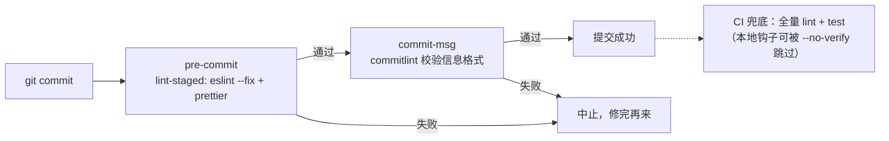

#工程化 #Git #husky #规范 #面试

# Git 钩子与工程规范

## TL;DR

**Git 钩子是仓库事件的拦截点（pre-commit、commit-msg、pre-push…），但 .git/hooks 不随 clone 分发——husky 用 `core.hooksPath` 指到仓库内受版本控制的 .husky/ 目录，让钩子团队共享**。标准流水线：**pre-commit 跑 lint-staged（只检查暂存文件），commit-msg 跑 commitlint（校验提交信息规范）**。

---

## 1. Git 钩子机制

钩子 = `.git/hooks/` 下按约定命名的可执行脚本，对应事件触发：

| 钩子 | 时机 | 典型用途 |
|---|---|---|
| `pre-commit` | 敲下 commit、进入编辑信息前 | lint、格式化、测试——**非零退出码即中止提交** |
| `commit-msg` | 提交信息写完后 | 校验信息格式（commitlint 的挂载点） |
| `pre-push` | push 前 | 跑测试、构建校验 |
| `post-merge` / `post-checkout` | 合并/切分支后 | 依赖变更提示、自动 install |

先天缺陷：**`.git` 目录不被版本控制，hooks 无法随 clone 分发**——每人手动装钩子必然烂尾。两个解法：Git 2.9+ 的 `core.hooksPath` 配置把钩子目录指向仓库内路径；husky 就是这个配置的自动化包装。

---

## 2. husky：让钩子进版本控制

```jsonc
// package.json
{ "scripts": { "prepare": "husky" } }   // install 后自动执行 husky（v9 写法）
```

```bash
echo "npx lint-staged" > .husky/pre-commit          # 添加钩子就是写文件
echo "npx --no -- commitlint --edit \$1" > .husky/commit-msg
```

原理拆解：`prepare` 脚本（npm 生命周期，见 [[1.02 package.json 与依赖管理]]）在装依赖后运行 `husky`，它执行 `git config core.hooksPath .husky`——**钩子脚本从此存放在仓库内、随代码分发**，新成员 clone + install 即生效。Monorepo 里在根 package.json 配置一次，全仓生效。

---

## 3. lint-staged：只检查改动的文件

全量 lint 大仓库要几分钟，提交会被憎恨。lint-staged 只把 **git 暂存区的文件**喂给检查器：

```jsonc
// package.json
"lint-staged": {
  "*.{ts,tsx}": ["eslint --fix", "prettier --write"],
  "*.{css,less}": "stylelint --fix"
}
```

细节：--fix 自动修复后 lint-staged 会把修复结果重新加入暂存区；只治「增量」，存量问题配合 CI 全量检查兜底。

---

## 4. commitlint：提交信息规范

约定式提交（Conventional Commits）格式：

```text
type(scope): subject
# feat(cart): 支持优惠券叠加
# fix(login): 修复验证码倒计时不重置
```

常用 type：`feat` / `fix` / `docs` / `style`（格式）/ `refactor` / `perf` / `test` / `chore` / `revert`。

规范不是洁癖，它是**下游自动化的输入**：CHANGELOG 自动生成、semver 版本推导（feat→minor，fix→patch，`BREAKING CHANGE:`→major，正是 [[语义版本控制 SemVer]] 的自动化）、按 type 过滤检索历史。配套工具：commitizen（交互式生成信息）、changesets（Monorepo 发版，见 [[1.04 Monorepo 与工作区]]）。

**完整流水线一图流**：



最后一格是面试加分点：**本地钩子是「体验优化」不是「安全边界」**——`git commit --no-verify` 可跳过，真正的强制卡口必须放在 CI/服务端钩子。

---

## 面试问答

### Q: husky 解决了什么问题？原理是什么？

满分答案：Git 钩子存在 .git/hooks 里、不随 clone 分发，团队规范无法落地。husky 利用 Git 2.9 的 core.hooksPath 配置，把钩子目录指向仓库内的 .husky/（受版本控制），并通过 package.json 的 prepare 生命周期在 install 时自动完成配置——新成员克隆装依赖即获得全套钩子。Monorepo 在根配置一次全仓生效。

### Q: 提交前的检查流水线是怎么搭的？

满分答案：husky 的 pre-commit 挂 lint-staged——只对暂存区文件跑 eslint --fix、prettier、stylelint，自动修复的结果重新入暂存区，速度与仓库规模无关；commit-msg 挂 commitlint 校验约定式提交格式。强调两点：增量检查治新账、CI 全量检查治旧账；本地钩子可被 --no-verify 绕过，强制性依赖 CI 卡口而非本地钩子。

### Q: 为什么要约定式提交（Conventional Commits）？

满分答案：统一格式 type(scope): subject 不只是可读性——它是自动化的数据源：按 feat/fix/BREAKING CHANGE 自动推导 semver 版本号、自动生成分组 CHANGELOG、按类型检索与统计。配套工具链：commitizen 交互式生成、commitlint 校验、release 工具（semantic-release/changesets）消费。一句话：把提交历史从「文本日志」升级成「结构化数据」。
